# GeneGenius Technical Architecture Document

> **Platform Version:** 2.9.0  
> **ACMG Rules Version:** 2015-v1.3  
> **Last Updated:** June 2026  
> **Status:** Living Document — updated section by section  
> **Maintainer:** Shrinjay (AI/ML Lead), GeneGenius Engineering Team  
> **Classification:** Internal + Partner Review (NVIDIA, a16z)

---

## Table of Contents

1. [Introduction & System Overview](#1-introduction--system-overview)
2. [High-Level Architecture](#2-high-level-architecture)
3. [Infrastructure & Deployment Layer](#3-infrastructure--deployment-layer)
4. [Middleware Layer](#4-middleware-layer)
5. [API Layer](#5-api-layer)
6. [Core Layer](#6-core-layer)
7. [Service Layer — Analysis Pipeline](#7-service-layer--analysis-pipeline)
8. [Annotation Services](#8-annotation-services)
9. [LLM & AI Services](#9-llm--ai-services)
10. [V2 Enhancement Modules (M1–M8)](#10-v2-enhancement-modules-m1m8)
11. [Knowledge Graph Layer](#11-knowledge-graph-layer)
12. [Data Layer](#12-data-layer)
13. [Security & Compliance Layer](#13-security--compliance-layer)
14. [FHIR & External Integrations](#14-fhir--external-integrations)
15. [Input Processing](#15-input-processing)
16. [Output & Report Layer](#16-output--report-layer)
17. [Performance & Observability](#17-performance--observability)
18. [Testing Architecture](#18-testing-architecture)
19. [CI/CD & GitHub Workflows](#19-cicd--github-workflows)
20. [Domain Data Reference](#20-domain-data-reference)
21. [Wearable Genomics Integration (v1.0)](#21-wearable-genomics-integration-v10)
22. [Phase II / Phase III Future Architecture](#22-phase-ii--phase-iii-future-architecture)
23. [Appendices](#23-appendices)        

---

## 1. Introduction & System Overview

### 1.1 What GeneGenius Is

GeneGenius is an AI-powered clinical genomics platform that ingests raw genomic data (VCF, FASTQ), runs it through a multi-model annotation and classification pipeline, and produces FDA-ready clinical interpretation reports with full audit trails.

The system is designed for three types of output consumers:
- **Patients** — plain-language summaries of genetic findings
- **Clinicians** — actionable variant classifications with ACMG evidence codes, drug response data, and treatment recommendations
- **Researchers** — full technical depth including AI model scores, protein structure analysis, population frequencies, literature mining, and knowledge graph reasoning

Key capabilities:

| Capability | Implementation |
|---|---|
| Variant classification | ACMG 2015 28-criteria classifier with trigger data audit trail |
| Pathogenicity prediction | AlphaMissense (71M variants local SQLite), EVO2 40B/7B via NVIDIA NIM |
| Protein structure analysis | AlphaFold (pLDDT, PAE, 3D backbone), ESM2 embeddings |
| Literature mining | BioBERT + PubMed (Entrez) |
| LLM synthesis | Google Gemini (temperature=0, seed=42, deterministic) |
| Drug response | DrugBank + PharmGKB, local eager-loaded datasets |
| Population frequencies | gnomAD v4.1 local tabix (~526GB EBS) + MongoDB cache |
| Knowledge graph | 10 node types, Neo4j or NetworkX backend |
| Regulatory compliance | HIPAA, ACMG, FDA LDT, CLIA/CAP, ETHOS |
| Wearable integration | WHOOP OAuth 2.0 + genotype-adjusted HRV/Recovery/Sleep (v1.0 in sprint) |

### 1.2 System Philosophy

Three architectural principles drive every design decision:

**1. Additive-only extensibility.** No existing interface, schema, or endpoint is ever modified — only new optional fields, new services, and new API versions are added. This is what allows Phase I → Phase III expansion with zero breaking changes.

**2. Interface segregation + dependency injection.** Every service implements `IService`. Every repository implements `IRepository`. Nothing depends on concrete implementations. This is enforced at `app/core/interfaces.py` and `app/core/di.py`.

**3. Feature-flagged everything.** All non-trivial capabilities (V2 modules, wearable integration, sharded processing, experimental AI models) are gated behind environment flags in `Settings`. No code runs by default that wasn't explicitly opted into.

### 1.3 Platform Version & Release History

| Version | Date | Highlights |
|---|---|---|
| 2.1.0 | 2025-11-11 | Initial production release — VCF upload, AlphaMissense, Gemini |
| 2.2.0 | 2026-01-11 | Three-tier reports, 3D protein visualization, clinical report type |
| 2.3.0 | 2026-04-13 | Pipeline optimization (3.64–4.32× VEP speedup), batched annotation |
| 2.9.0 | 2026 | Current — NVIDIA BioNeMo integration, V2 modules M1–M8, wearable sprint, SMART on FHIR, knowledge graph, hallucination mitigation, sharded WGS SLA engine |

### 1.4 Intended Audience

This document is written for all four audiences simultaneously:

- **New engineers onboarding** — follow sections 1 → 7 sequentially; each section tells you what a layer does, what goes in, what happens inside, and what comes out
- **NVIDIA/investor technical review** — sections 2, 8 (annotation services), 10 (V2 modules), and 17 (performance/SLA) are most relevant
- **Internal team reference** — all sections; use the ToC to jump to the component you're working on
- **Compliance/regulatory** — section 13 (security & compliance) and section 16 (output & reports)

### 1.5 Document Conventions

- **Input →** denotes what a component receives
- **→ Output** denotes what a component produces
- **Feature flag** labels indicate the env var that gates a capability
- `monospace` text refers to actual file paths, class names, method names, and config keys
- All sizes are approximate and represent EBS/disk footprint unless noted otherwise

---

## 2. High-Level Architecture

### 2.1 System Architecture Diagram

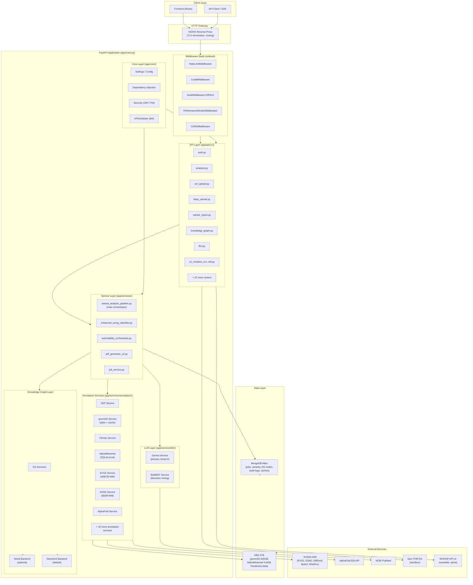
```mermaid
graph TB
    subgraph Client["Client Layer"]
        FE["Frontend (React)"]
        API_CLIENT["API Client / SDK"]
    end

    subgraph Gateway["HTTP Gateway"]
        NGINX["NGINX Reverse Proxy\n(TLS termination, routing)"]
    end

    subgraph App["FastAPI Application (app/main.py)"]
        subgraph MW["Middleware Stack (ordered)"]
            RL["RateLimitMiddleware"]
            CM["CreditMiddleware"]
            AM["AuditMiddleware (HIPAA)"]
            PM["PerformanceMonitorMiddleware"]
            CORS["CORSMiddleware"]
        end

        subgraph API["API Layer (app/api/v1/)"]
            AUTH["auth.py"]
            ANALYSIS["analysis.py"]
            VCF["vcf_upload.py"]
            FASTQ["fastq_upload.py"]
            REPORT["variant_report.py"]
            KG_API["knowledge_graph.py"]
            FHIR_API["fhir.py"]
            V2["v2_modules_m1..m8.py"]
            OTHER["+ 22 more routers"]
        end

        subgraph CORE["Core Layer (app/core/)"]
            CONFIG["Settings / Config"]
            DI["Dependency Injection"]
            SECURITY["Security (JWT, PHI)"]
            SCHED["APScheduler (M4)"]
        end

        subgraph SVC["Service Layer (app/services/)"]
            PIPELINE["variant_analysis_pipeline.py\n(main orchestrator)"]
            ACMG["enhanced_acmg_classifier.py"]
            ACTION["actionability_orchestrator.py"]
            PDF["pdf_generator_v2.py"]
            JOB["job_service.py"]
        end

        subgraph ANNOT["Annotation Services (app/services/annotation/)"]
            VEP["VEP Service"]
            GNOMAD["gnomAD Service\n(tabix + cache)"]
            CLINVAR["ClinVar Service"]
            AM_SVC["AlphaMissense\n(SQLite local)"]
            EVO2["EVO2 Service\n(40B/7B NIM)"]
            ESM2["ESM2 Service\n(650M NIM)"]
            AF["AlphaFold Service"]
            MORE_ANNOT["+ 18 more annotation\nservices"]
        end

        subgraph LLM_LAYER["LLM Layer (app/services/llm/)"]
            GEMINI["Gemini Service\n(primary, temp=0)"]
            BIOBERT["BioBERT Service\n(literature mining)"]
        end

        subgraph KG_LAYER["Knowledge Graph Layer"]
            KG_SVC["KG Services"]
            NEO4J["Neo4j Backend\n(optional)"]
            NX["NetworkX Backend\n(default)"]
        end
    end

    subgraph DB["Data Layer"]
        MONGO["MongoDB Atlas\n(jobs, variants, KG nodes,\naudit logs, caches)"]
        EBS["EBS 2TB\n(gnomAD 526GB,\nAlphaMissense 6.8GB,\nParabricks data)"]
    end

    subgraph EXTERNAL["External Services"]
        NVIDIA["NVIDIA NIM\n(EVO2, ESM2, DiffDock,\nBoltz2, RNAPro)"]
        ALPHAFOLD["AlphaFold EBI API"]
        PUBMED["NCBI PubMed"]
        EPIC["Epic FHIR R4\n(sandbox)"]
        WHOOP["WHOOP API v2\n(wearable, sprint)"]
    end

    FE --> NGINX
    API_CLIENT --> NGINX
    NGINX --> MW
    MW --> API
    API --> SVC
    SVC --> ANNOT
    SVC --> LLM_LAYER
    SVC --> KG_LAYER
    KG_LAYER --> NEO4J
    KG_LAYER --> NX
    SVC --> MONGO
    ANNOT --> EBS
    ANNOT --> NVIDIA
    ANNOT --> ALPHAFOLD
    LLM_LAYER --> PUBMED
    API --> EPIC
    API --> WHOOP
    MONGO --> DB
    EBS --> DB
    CORE --> SVC
    CORE --> API
```

### 2.2 Layer Summary Table

Every layer is described below with its primary responsibility, the files that implement it, and its approximate code size.

| Layer | Responsibility | Primary Files | Approx. Files |
|---|---|---|---|
| **Infrastructure** | Deployment, containers, GPU, NGINX, env config | `deploy/`, `Dockerfile`, `gunicorn.conf.py`, `app/core/config.py` | 20+ |
| **Middleware** | Request interception — rate limiting, credits, HIPAA audit, performance | `app/middleware/` | 5 |
| **API** | HTTP routing, request validation, response serialization | `app/api/v1/` | 34 routers |
| **Core** | Configuration, DI, interfaces, security primitives, scheduler | `app/core/` | 6 |
| **Service — Orchestration** | Job lifecycle, pipeline orchestration, ACMG, PDF, reports | `app/services/*.py` | ~40 |
| **Service — Annotation** | All variant annotation (gnomAD, ClinVar, AI models, protein) | `app/services/annotation/` | 33 |
| **Service — LLM** | Gemini synthesis, BioBERT mining, PubMed retrieval | `app/services/llm/` | ~5 |
| **Service — KG** | Knowledge graph build, query, export, visualization | `app/services/knowledge_graph/` | ~10 |
| **V2 Modules** | M1–M8 enhancement modules (structural, splicing, expression, VUS, phenotype, therapeutics, metabolomics, functional) | `app/services/v2_m*.py`, `app/api/v1/v2_modules_m*.py` | 16 |
| **Models** | Domain objects (Job, Variant, User, KG nodes) | `app/models/` | 12 |
| **Schemas** | Pydantic API contracts | `app/schemas/` | ~10 |
| **Data Layer** | MongoDB Atlas + local EBS reference data | `app/db/`, `app/data/`, `data/` | ~20 |

### 2.3 Request Lifecycle — End to End

This is the path every genomic analysis request takes from HTTP in to PDF out:

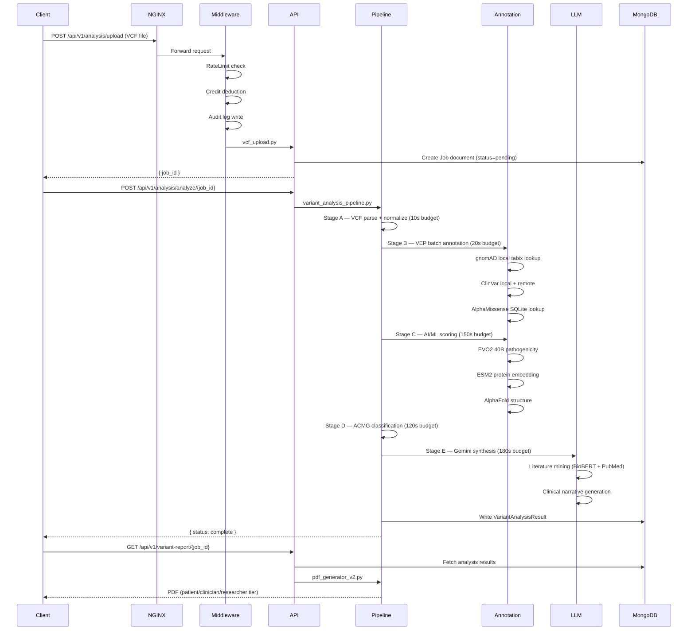
```mermaid
sequenceDiagram
    participant Client
    participant NGINX
    participant Middleware
    participant API
    participant Pipeline
    participant Annotation
    participant LLM
    participant MongoDB

    Client->>NGINX: POST /api/v1/analysis/upload (VCF file)
    NGINX->>Middleware: Forward request
    Middleware->>Middleware: RateLimit check
    Middleware->>Middleware: Credit deduction
    Middleware->>Middleware: Audit log write
    Middleware->>API: vcf_upload.py
    API->>MongoDB: Create Job document (status=pending)
    API-->>Client: { job_id }

    Client->>API: POST /api/v1/analysis/analyze/{job_id}
    API->>Pipeline: variant_analysis_pipeline.py
    Pipeline->>Pipeline: Stage A — VCF parse + normalize (10s budget)
    Pipeline->>Annotation: Stage B — VEP batch annotation (20s budget)
    Annotation->>Annotation: gnomAD local tabix lookup
    Annotation->>Annotation: ClinVar local + remote
    Annotation->>Annotation: AlphaMissense SQLite lookup
    Pipeline->>Annotation: Stage C — AI/ML scoring (150s budget)
    Annotation->>Annotation: EVO2 40B pathogenicity
    Annotation->>Annotation: ESM2 protein embedding
    Annotation->>Annotation: AlphaFold structure
    Pipeline->>Pipeline: Stage D — ACMG classification (120s budget)
    Pipeline->>LLM: Stage E — Gemini synthesis (180s budget)
    LLM->>LLM: Literature mining (BioBERT + PubMed)
    LLM->>LLM: Clinical narrative generation
    Pipeline->>MongoDB: Write VariantAnalysisResult
    Pipeline-->>Client: { status: complete }

    Client->>API: GET /api/v1/variant-report/{job_id}
    API->>MongoDB: Fetch analysis results
    API->>Pipeline: pdf_generator_v2.py
    Pipeline-->>Client: PDF (patient/clinician/researcher tier)
```

### 2.4 Data Flow — What Goes In, What Comes Out

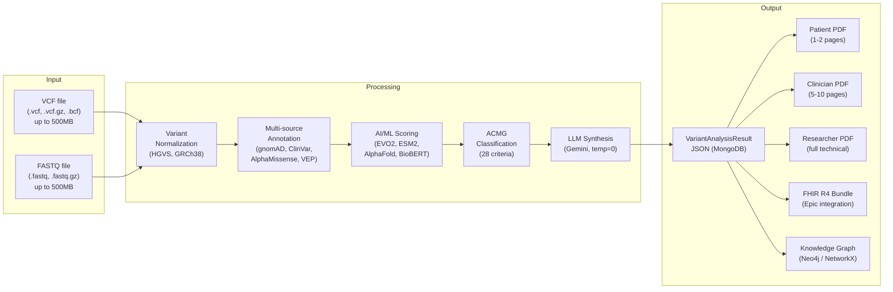
```mermaid
flowchart LR
    subgraph Input
        VCF["VCF file\n(.vcf, .vcf.gz, .bcf)\nup to 500MB"]
        FASTQ["FASTQ file\n(.fastq, .fastq.gz)\nup to 500MB"]
    end

    subgraph Processing
        NORM["Variant\nNormalization\n(HGVS, GRCh38)"]
        ANNOT2["Multi-source\nAnnotation\n(gnomAD, ClinVar,\nAlphaMissense, VEP)"]
        AI["AI/ML Scoring\n(EVO2, ESM2,\nAlphaFold, BioBERT)"]
        CLASS["ACMG\nClassification\n(28 criteria)"]
        LLM2["LLM Synthesis\n(Gemini, temp=0)"]
    end

    subgraph Output
        JSON["VariantAnalysisResult\nJSON (MongoDB)"]
        PDF_P["Patient PDF\n(1-2 pages)"]
        PDF_C["Clinician PDF\n(5-10 pages)"]
        PDF_R["Researcher PDF\n(full technical)"]
        FHIR_OUT["FHIR R4 Bundle\n(Epic integration)"]
        KG_OUT["Knowledge Graph\n(Neo4j / NetworkX)"]
    end

    VCF --> NORM
    FASTQ --> NORM
    NORM --> ANNOT2
    ANNOT2 --> AI
    AI --> CLASS
    CLASS --> LLM2
    LLM2 --> JSON
    JSON --> PDF_P
    JSON --> PDF_C
    JSON --> PDF_R
    JSON --> FHIR_OUT
    JSON --> KG_OUT
```

### 2.5 Technology Stack Summary

| Component | Technology | Version / Notes |
|---|---|---|
| Backend framework | FastAPI | Python 3.11, async-native |
| ASGI server | Uvicorn + Gunicorn | Multi-worker, 300s keep-alive |
| Database | MongoDB Atlas | Flexible schema, 8 collections |
| Graph DB | Neo4j (optional) / NetworkX (default) | Switchable via `KG_BACKEND` |
| Primary LLM | Google Gemini | `temperature=0`, `seed=42` |
| Literature AI | BioBERT | `dmis-lab/biobert-base-cased-v1.1` |
| Pathogenicity prediction | AlphaMissense | Local SQLite 6.8GB, 71M variants |
| Novel variant scoring | EVO2 40B / 7B | NVIDIA BioNeMo NIM |
| Protein embeddings | ESM2 650M | NVIDIA NIM (`esm2-650m` endpoint) |
| Protein structure | AlphaFold EBI | REST API + local PDB cache |
| Genome alignment | Parabricks (NVIDIA Clara) | `4.3.2-1`, GPU-accelerated |
| Population frequencies | gnomAD v4.1 | ~526GB local tabix on EBS |
| Drug interactions | DrugBank + PharmGKB | Local CSV, eager-loaded on startup |
| Validation | Pydantic 2.0 | All schemas |
| PDF reports | ReportLab | Tiered templates |
| Container | Docker | `Dockerfile` + `docker-compose.yml` |
| Cloud | AWS (EC2 + EBS + S3 + HealthOmics) | 2TB gp3 EBS |
| Reverse proxy | NGINX | TLS termination |
| Scheduling | APScheduler | M4 continuous reanalysis |
| Feature gating | Environment flags | All non-trivial features |

---

*[Section 1 and 2 complete — Section 3 (Infrastructure & Deployment) coming next]*

---

## 3. Infrastructure & Deployment Layer

### 3.1 Overview

GeneGenius runs on a single AWS EC2 instance with NGINX as the edge, Gunicorn as the ASGI process manager, and EBS as the high-throughput genomic data store. The architecture is deliberately vertically scaled rather than distributed — genomic data locality (sub-millisecond tabix reads) is the primary constraint, not request concurrency.

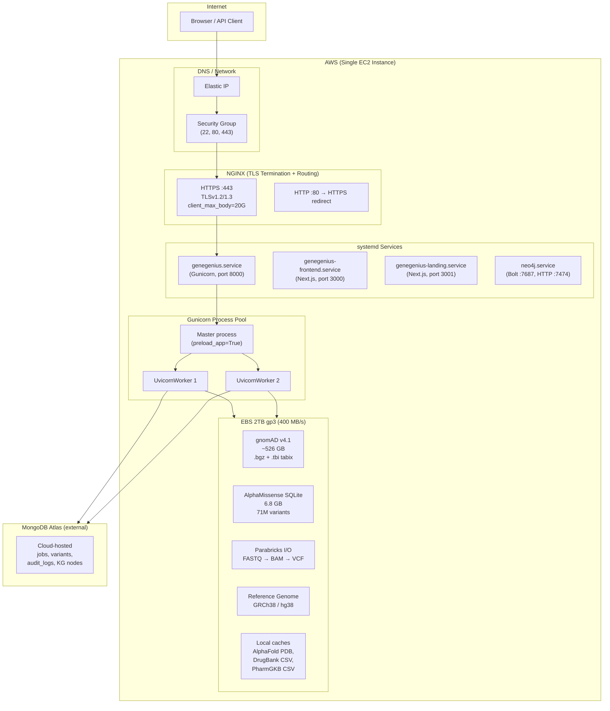
```mermaid
graph TB
    subgraph Internet
        USER["Browser / API Client"]
    end

    subgraph AWS["AWS (Single EC2 Instance)"]
        subgraph DNS["DNS / Network"]
            EIP["Elastic IP"]
            SG["Security Group\n(22, 80, 443)"]
        end

        subgraph NGINX_BLOCK["NGINX (TLS Termination + Routing)"]
            HTTPS["HTTPS :443\nTLSv1.2/1.3\nclient_max_body=20G"]
            REDIR["HTTP :80 → HTTPS redirect"]
        end

        subgraph SYSTEMD["systemd Services"]
            GG_SVC["genegenius.service\n(Gunicorn, port 8000)"]
            FE_SVC["genegenius-frontend.service\n(Next.js, port 3000)"]
            LAND_SVC["genegenius-landing.service\n(Next.js, port 3001)"]
            NEO4J_SVC["neo4j.service\n(Bolt :7687, HTTP :7474)"]
        end

        subgraph GUNICORN_BLOCK["Gunicorn Process Pool"]
            MASTER["Master process\n(preload_app=True)"]
            W1["UvicornWorker 1"]
            W2["UvicornWorker 2"]
        end

        subgraph EBS_BLOCK["EBS 2TB gp3 (400 MB/s)"]
            GNOMAD_DATA["gnomAD v4.1\n~526 GB\n.bgz + .tbi tabix"]
            AM_DATA["AlphaMissense SQLite\n6.8 GB\n71M variants"]
            PBRICKS_DATA["Parabricks I/O\nFASTQ → BAM → VCF"]
            REF_GENOME["Reference Genome\nGRCh38 / hg38"]
            CACHE_DATA["Local caches\nAlphaFold PDB,\nDrugBank CSV,\nPharmGKB CSV"]
        end
    end

    subgraph MONGO["MongoDB Atlas (external)"]
        ATLAS["Cloud-hosted\njobs, variants,\naudit_logs, KG nodes"]
    end

    USER --> EIP
    EIP --> SG
    SG --> HTTPS
    HTTPS --> GG_SVC
    GG_SVC --> MASTER
    MASTER --> W1
    MASTER --> W2
    W1 --> EBS_BLOCK
    W2 --> EBS_BLOCK
    W1 --> MONGO
    W2 --> MONGO
```

### 3.2 Runtime Stack

| Component | Technology | Version | Notes |
|---|---|---|---|
| Backend framework | FastAPI | — | Async-native, ASGI |
| ASGI server | Uvicorn | — | Worker class inside Gunicorn |
| Process manager | Gunicorn | — | Multi-worker, preload, worker recycling |
| Python | CPython | 3.11 (runtime), 3.13 (Docker builder) | |
| OS | Ubuntu 22.04 LTS | — | NVIDIA Deep Learning AMI for GPU instances |

**Entry point:** `app.main:app` — the `create_application()` factory in `app/main.py`.

The app is started in two modes:

```bash
# Development (single worker, hot reload)
uvicorn app.main:app --reload --host 0.0.0.0 --port 8000

# Production (Gunicorn multi-worker)
gunicorn app.main:app -c gunicorn.conf.py
```

### 3.3 Gunicorn Configuration

**File:** `gunicorn.conf.py`

| Setting | Value | Rationale |
|---|---|---|
| `bind` | `0.0.0.0:8000` | All interfaces, standard port |
| `workers` | `2` | Matches t3.medium 2 vCPU; fits comfortably in 4GB RAM |
| `worker_class` | `uvicorn.workers.UvicornWorker` | Async/ASGI support |
| `preload_app` | `True` | Fork-after-load — saves ~1.5GB RAM per worker via copy-on-write (critical for BioBERT + DrugBank in-memory datasets) |
| `timeout` | `1800` (30 min) | Covers large VCF background analysis jobs |
| `graceful_timeout` | `30s` | Clean shutdown window |
| `keepalive` | `5s` | Long-lived connections for progress polling |
| `max_requests` | `10000` | Worker recycling to prevent memory leaks |
| `max_requests_jitter` | `1000` | Prevents thundering herd on simultaneous recycling |
| `accesslog` | `stdout` | Captured by `journalctl` |
| `errorlog` | `stderr` | Captured by `journalctl` |

> **Note on `preload_app`:** This is the critical setting for memory efficiency. DrugBank and PharmGKB are eagerly loaded in `startup_event()` — with `preload_app=True`, both workers share the same memory pages via Linux CoW instead of each loading their own copy. On a 4GB instance this is the difference between the app running and OOM-killing.

### 3.4 NGINX Configuration

**File:** `deploy/nginx.conf`

NGINX sits in front of Gunicorn and handles:
- HTTP → HTTPS redirect (port 80 → 443)
- TLS termination (Let's Encrypt certificates via Certbot)
- Large file upload proxying (up to **20GB** — covers large FASTQ files)
- Long proxy timeouts (900s — matches analysis pipeline SLA)
- Gzip compression for JSON/JS/CSS responses

```
HTTP :80  ──► 301 redirect to HTTPS
HTTPS :443
  TLS: TLSv1.2 / TLSv1.3
  Ciphers: HIGH:!aNULL:!MD5
  client_max_body_size: 20G
  proxy_read_timeout: 900s
  proxy_send_timeout: 900s
  proxy_pass: http://127.0.0.1:8000
```

**Domain routing:**

| Domain | Backend | Port |
|---|---|---|
| `api.genegenius.ai` | Gunicorn (FastAPI) | 8000 |
| `app.genegenius.ai` | Next.js dashboard | 3000 |
| `genegenius.ai` / `www` | Landing page | 3001 |

### 3.5 Systemd Services

All processes run as long-lived systemd services, started in dependency order.

**`genegenius.service`** (Backend)
```
After=network.target neo4j.service
User=genegenius                      ← dedicated system user, no shell
WorkingDirectory=/opt/genegenius/backend
EnvironmentFile=.env.production
Environment=CUDA_VISIBLE_DEVICES=0   ← GPU device assignment
Environment=GNOMAD_DATA_DIR=/opt/genegenius/data/gnomad
Environment=GNOMAD_USE_LOCAL_TABIX=true
ExecStart=gunicorn app.main:app -c gunicorn.conf.py
Restart=on-failure
RestartSec=5
```

**`neo4j.service`** — started before `genegenius.service` (dependency declared in Unit)

**`genegenius-frontend.service`** — Next.js dashboard (independent, port 3000)

**`genegenius-landing.service`** — Landing page (independent, port 3001)

### 3.6 Containerization

**File:** `Dockerfile` — two-stage build

**Stage 1 (builder):** `python:3.13-slim`
- Installs build dependencies (`gcc`, `g++`, compression libs for tabix/cyvcf2)
- Runs `pip install --prefix=/install` — packages isolated from system Python
- Security: apt-upgrade on every build to patch base OS vulnerabilities

**Stage 2 (runtime):** `python:3.13-slim`
- Copies only installed packages from builder (no build tools in runtime image)
- Creates dedicated `genegenius` system user (no root process)
- **`/opt/genegenius/data` mounted as Docker VOLUME** — genomic reference data is never baked into the image (would be 500GB+)
- Exposes port 8000
- Entrypoint: `gunicorn app.main:app -c gunicorn.conf.py`

**`docker-compose.yml`** — provides:
- Neo4j 5.14.0 container with memory tuning:
  - `pagecache_size`: 512MB (dev) / 4GB (prod)
  - `heap_max_size`: 2GB (dev) / 8GB (prod)
- APOC + GDS plugins enabled (`procedures_unrestricted`)
- Health check: HTTP probe on port 7474 (90s start period)
- Persistent named volumes: `neo4j_data`, `neo4j_logs`, `neo4j_import`, `neo4j_plugins`

### 3.7 AWS Infrastructure

**Storage strategy — why EBS over S3:**

All genomic reference data lives on a **2TB gp3 EBS volume** (500 MB/s throughput, 3000 IOPS), not S3:

| Dataset | Size | Why EBS |
|---|---|---|
| gnomAD v4.1 (tabix) | ~526 GB | Tabix reads require sub-millisecond disk access per chromosome query; S3 adds 10-50ms network round-trip |
| AlphaMissense SQLite | 6.8 GB | SQLite requires <1ms random reads; S3 has ~10-50ms per lookup |
| Parabricks FASTQ/BAM I/O | Variable | GPU pipeline reads/writes at 400 MB/s; S3 throughput is 50-100 MB/s maximum |
| Reference genome (GRCh38) | ~3 GB | Parabricks `fasta` reference must be local |

**EC2 instance sizing:**

| Instance | GPUs | vCPU | RAM | Cost/hr | Status |
|---|---|---|---|---|---|
| `t3.medium` | None (CPU) | 2 | 4 GB | ~$0.047 | Current (CPU-only placeholder) |
| `g5.4xlarge` | 1× A10G (24 GB) | 16 | 64 GB | ~$1.62 | Dev/testing GPU tier |
| `g5.12xlarge` | 4× A10G (96 GB) | 48 | 192 GB | ~$7.09 | Demo / moderate GPU workloads |
| `p4d.24xlarge` | 8× A100 (320 GB) | 96 | 1.1 TB | ~$32.77 | Full NVIDIA pilot |

**In-place GPU migration** (no data loss, ~2-3 min downtime):
```bash
bash deploy/nvidia/migrate-to-gpu.sh g5.4xlarge   # or g5.12xlarge / p4d.24xlarge
```
All EBS data, Elastic IP, and security groups are preserved.

**Cost guardrails:**
- CloudWatch billing alarms at $1K / $5K / $10K
- GPU idle auto-stop after 30 min (CPUUtilization < 5%)
- Quick shutdown: `bash deploy/nvidia/gpu-shutdown.sh`
- Current cost on `t3.medium`: ~$115/mo

### 3.8 NVIDIA GPU Stack

Pending BioNeMo approval (application submitted March 15, 2026).

**Containers pulled via `deploy/nvidia/setup-ngc-containers.sh`:**

| Container | Version | Purpose |
|---|---|---|
| `nvcr.io/nvidia/clara/parabricks` | `4.3.1-1` | GPU-accelerated FASTQ → VCF pipeline (replaces BWA-MEM + GATK) |
| `nvcr.io/nvidia/tritonserver` | `24.01-py3` | Model serving for BioBERT + EVO2 inference |

**Triton model repository** (`/opt/genegenius/triton-models/`):
```
triton-models/
└── biobert_variant_classifier/
    ├── config.pbtxt         ← PyTorch backend, max_batch=32, dynamic batching
    └── 1/                   ← model weights (loaded at runtime)
```

Triton config:
- Platform: `pytorch_libtorch`
- Max batch size: 32
- Dynamic batching: preferred `[8, 16, 32]`, max queue delay 100ms
- Instance group: 1× KIND_GPU

**Clara Parabricks** (germline variant calling example):
```bash
docker run --rm --gpus all \
  -v /opt/genegenius/data:/data \
  nvcr.io/nvidia/clara/parabricks:4.3.1-1 \
  pbrun germline \
    --ref /data/reference/hg38.fa \
    --in-fq /data/input/R1.fastq.gz /data/input/R2.fastq.gz \
    --out-variants /data/output/variants.vcf
```

Parabricks configuration (`config.py`):
- `parabricks_image`: `nvcr.io/nvidia/clara/clara-parabricks:4.3.2-1`
- `parabricks_ref`: `/home/ubuntu/parabricks/ref/Homo_sapiens_assembly38.fasta`
- `parabricks_output_dir`: `/home/ubuntu/parabricks/out`
- `parabricks_low_memory`: `True` (conservative mode for smaller GPU instances)

### 3.9 Directory Structure on EC2

```
/opt/genegenius/
├── backend/                    ← FastAPI application
│   ├── app/                    ← Application code
│   ├── venv/                   ← Python virtualenv
│   ├── .env.production         ← Credentials (never committed)
│   ├── gunicorn.conf.py
│   └── deploy/
├── frontend/                   ← Next.js dashboard
│   └── .next/standalone/
├── landing/                    ← Landing page
│   └── .next/standalone/
├── triton-models/              ← Triton model repository (GPU only)
│   └── biobert_variant_classifier/
└── data/                       ← EBS-mounted genomic reference data
    ├── gnomad/                 ← ~526 GB .bgz + .tbi files (per chromosome)
    ├── alphafold/              ← AlphaFold PDB cache
    ├── drugbank/               ← DrugBank CSVs
    ├── pharmgkb/               ← PharmGKB CSVs
    ├── hla/                    ← HLA allele data
    ├── alpha/                  ← AlphaMissense SQLite (6.8 GB)
    └── cache/                  ← knowledge_graph.pkl (NetworkX), misc
```

### 3.10 Environment Configuration

All runtime behaviour is controlled through `app/core/config.py` (`Settings` class, Pydantic `BaseSettings`). The full environment variable reference is in [Appendix A](#appendix-a-full-environment-variable-reference).

Key groupings:

| Group | Env Prefix | Controls |
|---|---|---|
| Application | `APP_`, `DEBUG`, `HOST`, `PORT` | FastAPI debug mode, binding |
| Database | `MONGODB_URL`, `DATABASE_NAME` | MongoDB Atlas connection |
| Security | `SECRET_KEY`, `JWT_*`, `PHI_ENCRYPTION_KEY` | Auth + PHI encryption |
| File upload | `UPLOAD_DIR`, `MAX_FILE_SIZE` | Upload constraints (default 500MB) |
| gnomAD | `GNOMAD_*` | Local tabix path, version, toggle |
| WGS / SLA | `WGS_*`, `WHOLE_FILE_*` | Batch sizes, stage budgets, sharding |
| NVIDIA / BioNeMo | `NVIDIA_NIM_*`, `BIONEMO_*` | All NIM model endpoints + feature flags |
| AlphaFold | `ALPHAFOLD_*` | API URL, cache TTL, timeouts |
| LLM | `GEMINI_*` | API key, temperature, seed |
| V2 Modules | `V2_M1_*` through `V2_M8_*` | Per-module feature gates |
| Knowledge Graph | `KG_*`, `NEO4J_*`, `NETWORKX_*` | Backend choice, persistence |
| Compliance | `LAB_*`, `HALLUCINATION_*` | Lab info, hallucination gate mode |
| FHIR / Epic | `EPIC_*` | OAuth2 client, FHIR base URL |
| Wearable | `WHOOP_*`, `WEARABLE_*` | OAuth credentials, feature flag |

### 3.11 Feature Flags & Rollout Controls

Every non-trivial capability is gated behind an environment flag. Default is always the most conservative/safe value.

| Feature Flag | Default | What it controls |
|---|---|---|
| `DEBUG` | `False` | Auth bypass in dev mode |
| `ENABLE_AUTO_REFRESH` | `False` | ClinVar weekly background refresh |
| `WHOLE_FILE_SLA_MODE` | `False` | 10-minute whole-file SLA processing mode |
| `WHOLE_FILE_SLA_USE_SHARDED_ENGINE` | `False` | Sharded parallel VCF processing |
| `WHOLE_FILE_SHARDED_ROLLOUT_PCT` | `0` | Progressive rollout % (0–100), hash-based |
| `WHOLE_FILE_SHARDED_KILL_SWITCH` | `False` | Emergency: forces all jobs to batched engine |
| `V2_M1_STRUCTURAL_IMPACT_ENABLED` | `False` | M1 structural impact module |
| `V2_M2_SPLICING_VALIDATION_ENABLED` | `False` | M2 SpliceAI module |
| `V2_M3_EXPRESSION_OUTLIER_ENABLED` | `False` | M3 GTEx expression module |
| `V2_M4_CONTINUOUS_REANALYSIS_ENABLED` | `False` | M4 VUS monitoring scheduler |
| `VUS_MONITORING_ENROLLMENT_ENABLED` | `False` | M4 VUS enrollment (safe to enable independently) |
| `V2_M5_PHENOTYPE_INTEGRATION_ENABLED` | `False` | M5 HPO phenotype module |
| `V2_M6_THERAPEUTIC_SYNTHESIS_ENABLED` | `False` | M6 therapeutics module |
| `V2_M7_METABOLOMIC_OVERLAY_ENABLED` | `False` | M7 metabolomics module |
| `V2_M8_FUNCTIONAL_RECTIFICATION_ENABLED` | `False` | M8 functional module |
| `BIONEMO_SPRINT_ENABLED` | `True` | All BioNeMo model calls |
| `BIONEMO_RNAPRO_ENABLED` | `True` | RNAPro splice prediction |
| `BIONEMO_BOLTZ2_ENABLED` | `True` | Boltz2 binding affinity |
| `BIONEMO_DIFFDOCK_ENABLED` | `True` | DiffDock ligand docking |
| `BIONEMO_OPENFOLD3_ENABLED` | `False` | OpenFold3 structure prediction |
| `BIONEMO_RFDIFFUSION_ENABLED` | `False` | RFDiffusion protein binder design |
| `BIONEMO_PROTEINMPNN_ENABLED` | `False` | ProteinMPNN sequence design |
| `BIONEMO_MOLMIM_ENABLED` | `False` | MolMIM molecular optimization |
| `EPIC_SANDBOX_ENABLED` | `False` | SMART on FHIR Epic integration |
| `ALPHAGENOME_ENABLED` | `False` | AlphaGenome (research only, async-only) |
| `TRANSLATION_FORMATTER_ENABLED` | `False` | Multi-audience translation formatting |
| `HALLUCINATION_ALLOW_BLOCKING_MODES` | `False` | Enables soft_fail/hard_fail gate modes |
| `WEARABLE_INTEGRATION_ENABLED` | `False` | All wearable API endpoints |

> **Design principle:** Flags default to `False` for anything that touches external paid APIs, modifies the critical analysis path, or is not yet validated at production scale. Only the core pipeline (gnomAD, ClinVar, AlphaMissense, VEP, Gemini) runs by default.

### 3.12 CI/CD — GitHub Workflows

**Files:** `.github/workflows/`

| Workflow | Trigger | What it does |
|---|---|---|
| `aws.yml` | Push to `aws-prod` branch | SSH deploy to EC2: `git pull` → `systemctl restart genegenius` |
| `secret-scan.yml` | Every push/PR | Runs `gitleaks` against the commit diff to prevent secret leakage |

**Deploy secret requirements:**
- `EC2_DEPLOY` — SSH private key for the EC2 instance
- `EC2_HOST` — Elastic IP address

**Secret scanning config:** `.gitleaks.toml` — custom rules for genomics API key patterns on top of default gitleaks ruleset.

---

*[Section 3 complete — Section 4 (Middleware Layer) coming next]*

---

## 4. Middleware Layer

### 4.1 Overview & Execution Order

FastAPI/Starlette middleware runs as a **stack** — request flows inward through each layer in registration order, and the response flows back outward in reverse. The order is critical: outer middleware runs first on requests and last on responses.

Registration order in `app/main.py` (`create_application()`):

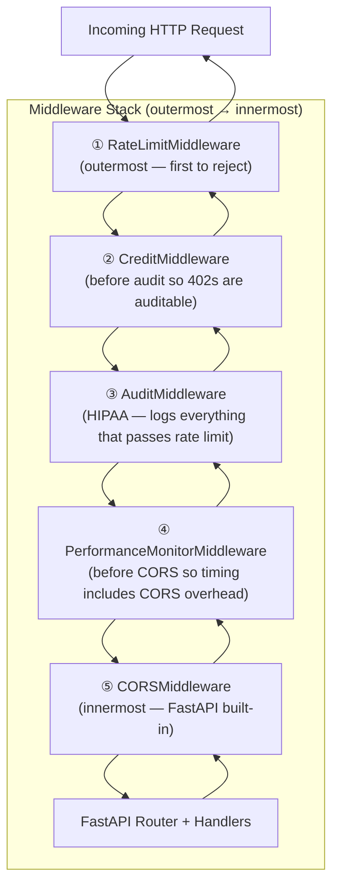
```mermaid
flowchart TB
    CLIENT["Incoming HTTP Request"]

    subgraph STACK["Middleware Stack (outermost → innermost)"]
        RL["① RateLimitMiddleware\n(outermost — first to reject)"]
        CM["② CreditMiddleware\n(before audit so 402s are auditable)"]
        AM["③ AuditMiddleware\n(HIPAA — logs everything that passes rate limit)"]
        PM["④ PerformanceMonitorMiddleware\n(before CORS so timing includes CORS overhead)"]
        CORS["⑤ CORSMiddleware\n(innermost — FastAPI built-in)"]
        APP["FastAPI Router + Handlers"]
    end

    CLIENT --> RL
    RL --> CM
    CM --> AM
    AM --> PM
    PM --> CORS
    CORS --> APP
    APP --> CORS
    CORS --> PM
    PM --> AM
    AM --> CM
    CM --> RL
    RL --> CLIENT
```

> **Why this order matters:**
> - Rate limiting is outermost so rejected requests never touch the database, incur credit costs, or generate audit log entries.
> - Credit tracking wraps the audit layer so even `402` responses (future) get an audit trail.
> - Performance monitoring wraps CORS so it captures the full request duration including CORS header processing.

**File:** `app/middleware/__init__.py` exports `PerformanceMonitorMiddleware` and `log_periodic_stats`.

---

### 4.2 RateLimitMiddleware

**File:** `app/middleware/rate_limiter.py`

**Algorithm:** Token bucket (in-memory, per IP address). No external dependencies — pure Python with automatic stale-bucket cleanup.

#### How the token bucket works

Each `(ip, tier)` pair gets its own `_TokenBucket`. When a request arrives:
1. Calculate elapsed time since last check → refill tokens at `refill_rate` tokens/second
2. Cap tokens at `capacity` (burst limit)
3. If `tokens >= 1.0` → consume one token, allow request
4. If `tokens < 1.0` → calculate `retry_after` seconds → return `429`

```
capacity = 5 (for "analysis" tier)
refill_rate = 5/60 = 0.0833 tokens/sec

After 60s: bucket fully refills regardless of how many requests were made.
A burst of 5 consecutive analysis requests is allowed;
the 6th within that minute is rejected with Retry-After.
```

#### Rate limit tiers

| Tier | Capacity | Limit | Applies to |
|---|---|---|---|
| `analysis` | 5 | 5 req/min | `/api/v1/analysis/analyze/*` — heavy pipeline |
| `upload` | 10 | 10 req/min | `/api/v1/analysis/upload`, `/api/v1/fastq/upload`, `/api/v1/core/upload` |
| `auth` | 20 | 20 req/min | `/api/v1/auth/login`, `/auth/register`, `/auth/signup` — brute-force protection |
| `report` | 10 | 10 req/min | `/api/v1/report/*`, `/api/v1/variant-report/*` — PDF generation is heavy |
| `default` | 60 | 60 req/min | All other endpoints |

#### Exempt paths (never rate limited)

```
/health, /healthz, /docs, /openapi.json, /redoc
/api/v1/analysis/progress   ← high-frequency polling by design
```

#### IP extraction

Respects `X-Forwarded-For` header set by NGINX/CloudFront — takes the first (leftmost) IP in the chain.

#### Stale bucket cleanup

Every 5 minutes, buckets idle for >10 minutes are evicted from the in-memory dict to prevent unbounded memory growth.

#### Input → Output

| | Detail |
|---|---|
| **Input** | Any HTTP request |
| **Checks** | Client IP (from `X-Forwarded-For` or `request.client.host`), path-to-tier mapping |
| **Allows** | Request passes through if bucket has tokens |
| **Rejects** | `HTTP 429 Too Many Requests` with `{"detail": "...", "retry_after_seconds": N}` + `Retry-After: N` header |
| **Side effects** | Updates in-memory token bucket; periodic cleanup of stale buckets |

---

### 4.3 CreditMiddleware

**File:** `app/middleware/credit_middleware.py`

**Purpose:** Record per-user API usage events for analytics/billing. Currently **analytics-only** — no balance checks, no `402` rejections. Every successful (`2xx`) call to a billable route writes a row to the `credit_events` MongoDB collection.

#### Decision flow

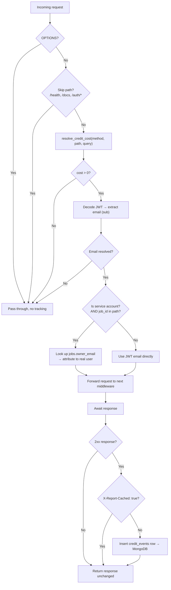
```mermaid
flowchart TD
    A["Incoming request"] --> B{OPTIONS?}
    B -->|Yes| SKIP["Pass through, no tracking"]
    B -->|No| C{Skip path?\n/health, /docs, /auth/*}
    C -->|Yes| SKIP
    C -->|No| D["resolve_credit_cost(method, path, query)"]
    D --> E{cost > 0?}
    E -->|No| SKIP
    E -->|Yes| F["Decode JWT → extract email (sub)"]
    F --> G{Email resolved?}
    G -->|No| SKIP
    G -->|Yes| H{Is service account?\nAND job_id in path?}
    H -->|Yes| I["Look up jobs.owner_email\n→ attribute to real user"]
    H -->|No| J["Use JWT email directly"]
    I --> K["Forward request to next middleware"]
    J --> K
    K --> L["Await response"]
    L --> M{2xx response?}
    M -->|No| END["Return response unchanged"]
    M -->|Yes| N{X-Report-Cached: true?}
    N -->|Yes| END
    N -->|No| O["Insert credit_events row → MongoDB"]
    O --> END
```

#### Service account attribution

Service accounts (configured via `CREDIT_SERVICE_EMAILS`, default `service@genegenius.ai`) act as BFF proxies. When a service account hits a route that includes a `job_id`, the middleware resolves `jobs.owner_email` from MongoDB and attributes the usage to the real user who owns that job — not the service account. This prevents all API usage collapsing onto one account in multi-tenant deployments.

#### Credit event document schema

```json
{
  "user_email": "user@example.com",
  "charged_via": "service@genegenius.ai",  // null if direct user call
  "usage_units": 5.0,
  "operation": "vcf_upload",
  "method": "POST",
  "path": "/api/v1/analysis/upload",
  "http_status": 200,
  "job_id": "abc-123",
  "timestamp": "2026-06-05T12:00:00Z"
}
```

#### Cost resolution

Costs are resolved by `app/utils/credit_cost_map.py` using `(method, path_contains, query)` matching. Override via `CREDIT_COSTS_JSON` env var (JSON array of cost rules).

Default user credits: `1000.0` units (`DEFAULT_USER_CREDITS`).

#### Input → Output

| | Detail |
|---|---|
| **Input** | Any `2xx` response to a billable route with a valid JWT |
| **Side effects** | Async insert into `credit_events` MongoDB collection |
| **Never rejects** | Does not block any request (analytics-only in current phase) |
| **Skips** | OPTIONS, health/docs paths, auth routes, cost = 0 routes, unauthenticated requests, cached report responses |

---

### 4.4 AuditMiddleware

**File:** `app/middleware/audit_middleware.py`

**Purpose:** HIPAA-compliant audit trail. Every HTTP request that passes rate limiting is logged to the `audit_logs` MongoDB collection with 7-year automatic retention.

**Compliance basis:** HIPAA 45 CFR §164.530(j) — 7-year retention for PHI-bearing records.

#### What gets logged

Every non-exempt request generates one `audit_logs` document:

```json
{
  "user": "user@example.com",           // or "anonymous" / "invalid_token"
  "endpoint": "/api/v1/analysis/analyze/abc-123",
  "method": "POST",
  "ip_address": "203.0.113.42",
  "timestamp": "2026-06-05T12:00:00Z",  // UTC
  "status_code": 200,
  "duration_ms": 4231.5,
  "query_params": "report_type=clinical",
  "user_agent": "Mozilla/5.0 ...",
  "data_classification": "PHI",         // or "non-PHI"
  "retention_days": 2555                // 7 years
}
```

#### PHI classification

Endpoints are automatically classified `"PHI"` or `"non-PHI"` based on path keywords:

```
PHI keywords: "upload", "analysis", "results", "report", "analytics"

/api/v1/analysis/analyze/abc-123  → PHI
/api/v1/variant-report/abc-123    → PHI
/api/v1/health                    → non-PHI (also exempt from logging)
/api/v1/knowledge-graph/stats     → non-PHI
```

#### 7-year TTL index

On first request after startup, the middleware creates a MongoDB TTL index:
```
db.audit_logs.createIndex("timestamp", { expireAfterSeconds: 220752000 })
// 2555 days × 86400 sec = 220,752,000 sec
```
This is idempotent — runs once per process, never re-creates if it already exists. MongoDB automatically expires documents after 7 years.

#### Exempt paths (not logged)

```
/health, /healthz, /favicon.ico, /docs, /openapi.json, /redoc
```

#### Error handling

Audit log failures are caught and logged at `DEBUG` level. They never surface as `500` errors to the client — audit logging is strictly fire-and-forget. The request completes regardless of whether the audit write succeeded.

#### Input → Output

| | Detail |
|---|---|
| **Input** | Every non-exempt request after rate limiting passes |
| **Extracts** | JWT `sub` claim (best-effort; records `"invalid_token"` on JWT parse failure) |
| **Side effects** | Async insert into `audit_logs` collection; TTL index creation (once per process) |
| **Never rejects** | Always calls `call_next(request)` and returns the response unchanged |
| **Adds to response** | Nothing (transparent pass-through) |

---

### 4.5 PerformanceMonitorMiddleware

**File:** `app/middleware/performance_monitor.py`

**Purpose:** In-memory request timing collection, slow query detection, and periodic log summaries. Adds an `X-Response-Time` header to every response.

#### In-memory metrics store (`PerformanceMetrics`)

One global `performance_metrics` singleton accumulates across all workers (note: per-worker, not cross-process):

| Metric | Storage | Description |
|---|---|---|
| `request_times` | `dict[endpoint → [float]]` | Full timing history per `"METHOD /path"` endpoint |
| `request_counts` | `dict[endpoint → int]` | Total request count per endpoint |
| `error_counts` | `dict[endpoint → int]` | 4xx/5xx count per endpoint |
| `slow_queries` | `list` (capped at 100) | Requests taking >1.0s, sorted by duration |
| `alphamissense_query_times` | `list` (capped at 1000) | AlphaMissense-specific query durations |
| `alphamissense_cache_hits/misses` | `int` | AlphaMissense cache effectiveness |

#### Percentile calculations

Per endpoint: p50, p95, p99 from the full timing history. p95/p99 only computed when `n > 20` / `n > 100` respectively.

#### Slow request threshold

Requests taking **>1.0 seconds** are:
1. `logger.warning`-logged immediately
2. Added to `slow_queries` circular buffer (last 100)
3. Classified as slow in endpoint stats

#### Alert thresholds

The `check_alerts()` method fires when:
- Any endpoint error rate **> 10%** (after ≥ 10 requests) → `severity: high`
- Any endpoint average response time **> 2.0s** (after ≥ 10 requests) → `severity: medium`
- AlphaMissense cache hit rate **< 50%** (after ≥ 100 queries) → `severity: medium`
- Slow query buffer exceeds 50 entries → `severity: medium`

Alerts are emitted as `logger.error` (high severity) or `logger.warning` (medium) during the periodic stats log cycle.

#### Periodic stats logging (`log_periodic_stats`)

A background `asyncio.Task` started in `startup_event()` logs a summary every **5 minutes**:
```
Performance Summary: 1247 requests, 0.42 req/s, avg response: 0.341s, p95: 2.1s, errors: 0.08%
AlphaMissense Stats: 892 queries, cache hit rate: 94.3%, avg query time: 0.001s
```

#### Response header

Every non-health-check response gets:
```
X-Response-Time: 0.341s
```

#### Input → Output

| | Detail |
|---|---|
| **Input** | Every non-health-check request |
| **Side effects** | Updates in-memory `performance_metrics` singleton; emits warning logs for slow requests |
| **Adds to response** | `X-Response-Time: {duration}s` header |
| **Never rejects** | Always passes through; re-raises exceptions after recording the 500 |

---

### 4.6 PHI Encryption (`phi_encryption.py`)

**File:** `app/middleware/phi_encryption.py`

> **Note:** This is not a Starlette middleware class — it is a utility module providing `encrypt_phi_fields()` / `decrypt_phi_fields()` functions called at the service layer before MongoDB writes and after MongoDB reads.

**Compliance basis:** HIPAA Safe Harbor de-identification standard, 45 CFR §164.514(b)(2).

**Algorithm:** Fernet symmetric encryption (AES-128-CBC + HMAC-SHA256) via `app/core/security.FieldEncryption`. Key configured via `PHI_ENCRYPTION_KEY` environment variable.

#### PHI fields encrypted

```python
PHI_FIELDS = {
    "patient_name", "date_of_birth", "mrn", "ssn",
    "clinical_indication", "diagnosis", "referring_physician",
    "patient_address", "patient_phone", "patient_email",
    "insurance_id", "emergency_contact"
}
```

#### Collections that may contain PHI

```python
PHI_COLLECTIONS = { "jobs", "variants", "feedback", "audit_logs" }
```

#### Encryption scope

Scans **top-level fields** and **one level of nesting** (e.g. `patient_info.patient_name`). Only encrypts non-empty `str` values. Sets `_phi_encrypted: True` flag on the document to prevent double-encryption on re-writes.

#### Passthrough behavior

If `PHI_ENCRYPTION_KEY` is not configured (`_fernet is None`), all encrypt/decrypt calls are no-ops — the document passes through unmodified. This allows the system to run without PHI encryption in dev environments without breaking anything.

#### Input → Output

| Function | Input | Output |
|---|---|---|
| `encrypt_phi_fields(doc)` | Raw document dict before MongoDB write | New dict with PHI fields Fernet-encrypted, `_phi_encrypted: True` set |
| `decrypt_phi_fields(doc)` | Document dict after MongoDB read | New dict with PHI fields decrypted (only if `_phi_encrypted: True`) |
| `encrypt_phi_in_list(docs)` | List of documents | List with each doc encrypted |
| `decrypt_phi_in_list(docs)` | List of documents | List with each doc decrypted |

---

### 4.7 CORS Configuration

**Configured in:** `app/main.py` via `CORSMiddleware`

| Setting | Value |
|---|---|
| `allow_origins` | Comma-separated list from `ALLOWED_ORIGINS` env var |
| `allow_credentials` | `True` |
| `allow_methods` | `["*"]` |
| `allow_headers` | `["*"]` |
| `expose_headers` | `["*"]` |

Default allowed origins (development):
```
http://localhost:3000   (frontend dashboard)
http://localhost:3001   (alternate)
http://localhost:3002   (alternate)
http://localhost:3007   (alternate)
http://127.0.0.1:3000  (same, loopback form)
... (and :3001, :3002, :3007 equivalents)
```

Production adds: `https://genegenius.ai`, `https://app.genegenius.ai`, `https://www.genegenius.ai`

---

### 4.8 Middleware Summary Table

| Middleware | Position | Rejects? | Side Effects | Adds to Response |
|---|---|---|---|---|
| `RateLimitMiddleware` | ① Outermost | `429` if bucket empty | Updates in-memory token buckets; periodic stale cleanup | `Retry-After` header on 429 |
| `CreditMiddleware` | ② | Never | Async `credit_events` insert on 2xx billable routes | None |
| `AuditMiddleware` | ③ | Never | Async `audit_logs` insert; TTL index creation (once) | None |
| `PerformanceMonitorMiddleware` | ④ | Never | Updates in-memory metrics; warning logs for slow requests | `X-Response-Time` header |
| `CORSMiddleware` | ⑤ Innermost | Rejects cross-origin preflight if origin not allowed | None | CORS headers |
| `phi_encryption.py` | Service layer (not middleware) | Never | Encrypt on write, decrypt on read (MongoDB) | N/A |

---

*[Section 4 complete — Section 5 (API Layer) coming next]*

---

## 5. API Layer

### 5.1 Overview

All HTTP endpoints live under `/api/v1/` (configurable via `API_V1_PREFIX`). The router is assembled in `app/api/v1/__init__.py` which imports 34 sub-routers and registers them on a single `APIRouter`. That router is then mounted on the FastAPI app with the `/api/v1` prefix.

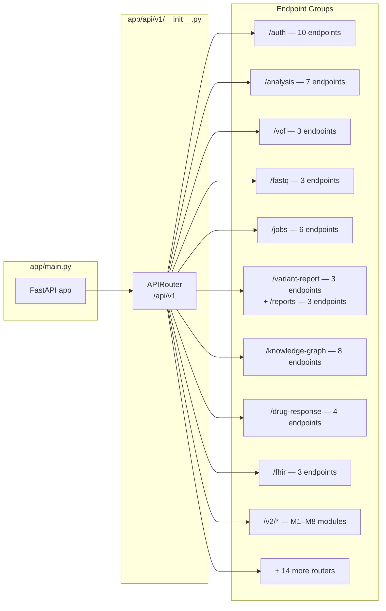
```mermaid
flowchart LR
    subgraph Entry["app/main.py"]
        APP["FastAPI app"]
    end

    subgraph Router["app/api/v1/__init__.py"]
        V1["APIRouter\n/api/v1"]
    end

    subgraph Groups["Endpoint Groups"]
        AUTH["/auth — 10 endpoints"]
        ANALYSIS["/analysis — 7 endpoints"]
        VCF["/vcf — 3 endpoints"]
        FASTQ["/fastq — 3 endpoints"]
        JOBS["/jobs — 6 endpoints"]
        REPORTS["/variant-report — 3 endpoints\n+ /reports — 3 endpoints"]
        KG["/knowledge-graph — 8 endpoints"]
        DRUG["/drug-response — 4 endpoints"]
        FHIR["/fhir — 3 endpoints"]
        V2["/v2/* — M1–M8 modules"]
        MISC["+ 14 more routers"]
    end

    APP --> V1
    V1 --> AUTH
    V1 --> ANALYSIS
    V1 --> VCF
    V1 --> FASTQ
    V1 --> JOBS
    V1 --> REPORTS
    V1 --> KG
    V1 --> DRUG
    V1 --> FHIR
    V1 --> V2
    V1 --> MISC
```

**Auth guard:** All endpoints use `Depends(get_current_user)` unless explicitly exempt. In `DEBUG=True` mode, `get_current_user()` short-circuits and returns a synthetic admin user (`dev@genegenius.local`) — no token needed. In production (`DEBUG=False`), a valid `Authorization: Bearer <JWT>` header is required on all protected endpoints.

**Rate limits** applied per-endpoint group are documented in Section 4.2.

**Interactive docs:** `http://localhost:8000/docs` (Swagger UI) and `/redoc` (ReDoc).

---

### 5.2 Authentication Endpoints (`/auth`)

**File:** `app/api/v1/auth.py` | **Prefix:** `/api/v1/auth` | **Rate tier:** `auth` (20 req/min)

| Method | Path | Auth Required | Description |
|---|---|---|---|
| `POST` | `/auth/register` | No | Create a new user account |
| `POST` | `/auth/login` | No | OAuth2 password login → JWT |
| `POST` | `/auth/refresh` | Yes | Refresh JWT, preserves `jti` |
| `POST` | `/auth/logout` | Yes | Close server-side session |
| `GET` | `/auth/me` | Yes | Current user profile |
| `GET` | `/auth/sessions` | Yes | Recent login sessions (max 100) |
| `GET` | `/auth/credits` | Yes | Usage summary + recent credit events |
| `POST` | `/auth/mfa/enroll` | Yes | Begin TOTP MFA enrollment |
| `POST` | `/auth/mfa/verify` | Yes | Verify TOTP code, complete enrollment |
| `POST` | `/auth/mfa/reset` | Yes | Disable MFA (self or admin) |

#### `POST /auth/register`

**Input:**
```json
{
  "email": "user@example.com",
  "password": "min8chars",
  "full_name": "Jane Smith",
  "role": "viewer"   // admin | analyst | viewer
}
```

**Logic:**
1. Checks email uniqueness in `users` collection
2. Validates role (`admin | analyst | viewer`)
3. **HIBP k-anonymity check** — sends SHA-1 prefix to `api.pwnedpasswords.com`, rejects if password hash suffix found in breach database
4. Hashes password with bcrypt
5. Sets consent defaults: `service_delivery: true`, `deidentified_research: false`, `third_party_sharing: false`
6. Sets initial credits: `DEFAULT_USER_CREDITS` (default 1000.0 units)

**Output (`201 Created`):** UserProfile (email, role, is_active, credits_balance, created_at)

**Errors:** `409` email exists | `400` invalid role or pwned password | `503` DB unavailable

---

#### `POST /auth/login`

**Input:** `OAuth2PasswordRequestForm` (form-encoded `username` + `password`)

**Logic:**
1. Looks up user by email, verifies bcrypt hash
2. Checks `is_active`
3. **MFA routing:**
   - `mfa_enabled=True` → issues short-lived "pre-MFA" token with `scope: mfa-pending`, returns `requires_mfa: true`
   - `role in {admin, analyst}` AND `mfa_enabled=False` → `403` (MFA mandatory for clinician roles, must enroll first)
   - `viewer` role + no MFA → issues full session JWT
4. Creates `user_sessions` document with `session_id` (UUID) stored as JWT `jti` claim
5. Updates `users.last_login`

**Output (`200`):**
```json
{
  "access_token": "eyJ...",
  "token_type": "bearer",
  "requires_mfa": false
}
```

**JWT payload:** `{ "sub": "email", "role": "viewer", "jti": "session-uuid", "exp": ... }`

**Token expiry:** `ACCESS_TOKEN_EXPIRE_MINUTES` (default 1440 = 24 hours)

**Algorithm:** `HS256`, signed with `SECRET_KEY`

---

#### MFA Flow

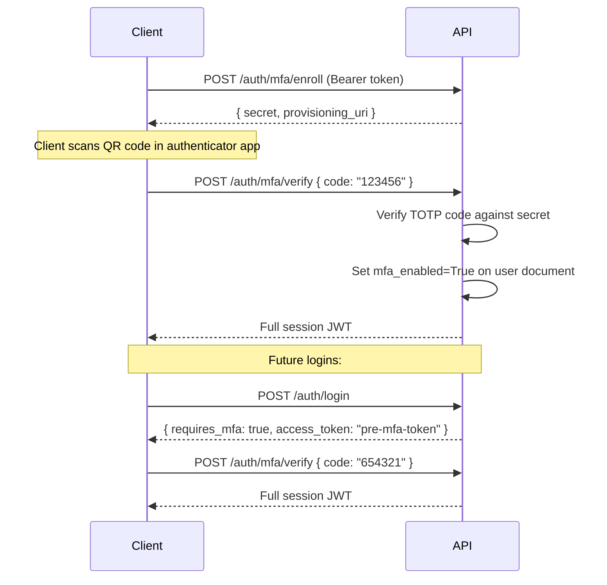
```mermaid
sequenceDiagram
    participant Client
    participant API

    Client->>API: POST /auth/mfa/enroll (Bearer token)
    API-->>Client: { secret, provisioning_uri }
    Note over Client: Client scans QR code in authenticator app

    Client->>API: POST /auth/mfa/verify { code: "123456" }
    API->>API: Verify TOTP code against secret
    API->>API: Set mfa_enabled=True on user document
    API-->>Client: Full session JWT

    Note over Client,API: Future logins:
    Client->>API: POST /auth/login
    API-->>Client: { requires_mfa: true, access_token: "pre-mfa-token" }
    Client->>API: POST /auth/mfa/verify { code: "654321" }
    API-->>Client: Full session JWT
```

**TOTP algorithm:** Standard TOTP (RFC 6238), 30s window, 6-digit codes via `pyotp`.

---

### 5.3 Analysis Pipeline Endpoints (`/analysis`)

**File:** `app/api/v1/analysis.py` | **Prefix:** `/api/v1/analysis` | **Rate tier:** `analysis` (5 req/min) for analyze endpoints, `upload` (10 req/min) for upload

| Method | Path | Auth | Description |
|---|---|---|---|
| `POST` | `/analysis/upload` | Yes | Upload VCF, create job → `job_id` |
| `POST` | `/analysis/analyze/{job_id}` | Yes | Run full pipeline (VEP+ACMG+AI) |
| `POST` | `/analysis/comprehensive/{job_id}` | Yes | Alias for analyze with Gemini toggle |
| `GET` | `/analysis/progress/{job_id}` | Yes | Poll progress (exempt from rate limit) |
| `GET` | `/analysis/status/{job_id}` | Yes | Job done? + variant count |
| `GET` | `/analysis/results/{job_id}` | Yes | Raw analysis results JSON |
| `GET` | `/analysis/report/{job_id}` | Yes | Generate PDF from stored results |

#### `POST /analysis/upload`

**Input:** `multipart/form-data` — `file` field (VCF/VCF.gz/BCF, up to 500MB)

**Logic:**
1. Creates `Job` document in MongoDB (status=`pending`)
2. Saves file to `uploads/{uuid}_{filename}`
3. Records `owner_email` from JWT sub

**Output:**
```json
{
  "success": true,
  "job_id": "abc-123",
  "filename": "variants.vcf",
  "status": "pending"
}
```

---

#### `POST /analysis/analyze/{job_id}`

This is the main analysis orchestration endpoint. It is the longest-running endpoint in the system (up to 30 min for large VCFs).

**Query params:**
| Param | Type | Default | Description |
|---|---|---|---|
| `max_variants` | `int` | `null` | Cap variants (testing only) |
| `include_gemini` | `bool` | `true` | Enable Gemini LLM synthesis |
| `run_alphagenome` | `bool` | `false` | Fire async AlphaGenome enrichment (research, opt-in) |

**Execution paths:**

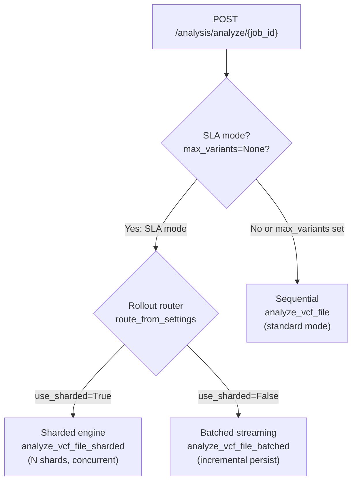
```mermaid
flowchart TD
    START["POST /analysis/analyze/{job_id}"]
    CHECK{SLA mode?\nmax_variants=None?}
    ROUTE{Rollout router\nroute_from_settings}
    SHARD["Sharded engine\nanalyze_vcf_file_sharded\n(N shards, concurrent)"]
    BATCH["Batched streaming\nanalyze_vcf_file_batched\n(incremental persist)"]
    SEQ["Sequential\nanalyze_vcf_file\n(standard mode)"]

    START --> CHECK
    CHECK -->|Yes: SLA mode| ROUTE
    CHECK -->|No or max_variants set| SEQ
    ROUTE -->|use_sharded=True| SHARD
    ROUTE -->|use_sharded=False| BATCH
```

**Pipeline stages executed (detail in Section 7):**
1. Stage A — VCF parse + normalize (10s budget)
2. Stage B — VEP batch annotation (20s budget)
3. Stage C — AI/ML scoring — EVO2, ESM2, AlphaFold, AlphaMissense (150s budget)
4. Stage D — ACMG classification, 28 criteria (120s budget)
5. Stage E — Gemini LLM synthesis + BioBERT literature (180s budget)
6. Finalize — QC metrics, KG ingestion, VUS enrollment (60s budget)

**What gets written to MongoDB after completion:**
- `variants` collection: compact variant documents (one per variant)
- `jobs` collection: `variant_summary`, `acceptance_gates`, `sla_stage_manifest`, `tier1_status`, `tier2_status`
- `benchmark_metrics` collection: timing + concordance data
- `vus_monitoring_queue`: VUS variants enrolled for M4 monitoring (if `VUS_MONITORING_ENROLLMENT_ENABLED`)

**Output:**
```json
{
  "success": true,
  "job_id": "abc-123",
  "processing_time": 142.3,
  "pipeline": "comprehensive_v2",
  "gemini_enabled": true,
  "execution_contract": {
    "analysis_mode": "standard",
    "analysis_engine": "sequential",
    "sla_budget_exhausted": false,
    "tier1_status": "not_applicable"
  },
  "summary": { "total_variants": 8, "pathogenic": 1, ... },
  "variants": [ ... ]
}
```

---

### 5.4 Variant Report Endpoints

**File:** `app/api/v1/variant_report.py` | **Prefix:** `/api/v1/variant-report` | **Rate tier:** `report`

| Method | Path | Auth | Description |
|---|---|---|---|
| `GET` | `/variant-report/{job_id}` | Yes | Generate PDF (or JSON) report |
| `GET` | `/variant-report/{job_id}/json` | Yes | Dashboard-ready JSON report |
| `GET` | `/variant-report/{job_id}/status` | Yes | Report status / cached PDF check |

#### `GET /variant-report/{job_id}/json`

The primary frontend data endpoint. Returns structured JSON suitable for dashboard cards, tables, and charts.

**Query params:** `report_type` (`patient | clinical | technical`, default `clinical`)

**Output structure:**
```json
{
  "success": true,
  "dashboard": {
    "job_id": "abc-123",
    "total_variants_analyzed": 8,
    "total_findings": 5,
    "primary_findings_count": 2,
    "secondary_findings_count": 1,
    "incidental_findings_count": 2,
    "classification_counts": { "Pathogenic": 1, "VUS": 3 },
    "genes_affected": ["BRCA1", "TP53"],
    "has_actionable_findings": true
  },
  "report": {
    "report_version": "2.9.0",
    "patient_info": { ... },
    "summary": { ... },
    "primary_findings": [
      {
        "variant_id": "7:117559593:CTT>C",
        "gene_symbol": "CFTR",
        "acmg_classification": "Pathogenic",
        "acmg_evidence": [ ... ],
        "moe_ensemble": { "final_score": 0.92, "experts": [...] },
        "kg_reasoning": { "direct_associations": [...] },
        "pathway_impact": { "affected_pathways": [...] },
        "pharmacogenomics": { "contraindicated_drugs": [...] }
      }
    ],
    "secondary_findings": [ ... ],
    "quality_metrics": { ... }
  }
}
```

**Report includes:**
- MoE ensemble (ClinVar 40% + AlphaMissense 20% + gnomAD 25% + BioBERT 15%)
- KG transitive reasoning (direct + pathway-mediated disease associations)
- KEGG pathway impact analysis
- Pharmacogenomics (DrugBank contraindications, CPIC guidelines, HLA associations)

#### `GET /variant-report/{job_id}?report_type=clinical`

Generates a PDF report. Three tiers:

| `report_type` | Audience | Pages | Content |
|---|---|---|---|
| `patient` | Patient | 1–2 | Plain-language findings, color-coded risk, no technical scores |
| `clinical` | Clinician | 5–10 | ACMG classifications, drug response, clinical recommendations |
| `technical` | Researcher | Full | All AI scores, protein structures, literature, pathway analysis |

**Response:** `StreamingResponse` with `Content-Type: application/pdf`

**Caching:** Checks for existing cached PDF; returns `X-Report-Cached: true` header on cache hit (credit middleware skips deduction on cached responses).

---

### 5.5 Jobs Endpoints

**File:** `app/api/v1/jobs.py` | **Prefix:** `/api/v1/jobs`

| Method | Path | Auth | Description |
|---|---|---|---|
| `POST` | `/jobs/upload` | No | Upload VCF, create job (legacy; prefer `/analysis/upload`) |
| `GET` | `/jobs/job/{job_id}` | No | Get job by ID |
| `GET` | `/jobs/jobs` | No | List jobs (paginated, filter by status) |
| `DELETE` | `/jobs/job/{job_id}` | No | Delete job + file |
| `PATCH` | `/jobs/job/{job_id}/status` | No | Update job status manually |
| `POST` | `/jobs/job/{job_id}/process-biobert` | No | Process with BioBERT interpretation |

**Job status enum:** `pending | processing | completed | failed`

**List params:** `page` (default 1), `page_size` (1–100, default 10), `status` filter

---

### 5.6 VCF Upload Endpoints

**File:** `app/api/v1/vcf_upload.py` | **Prefix:** `/api/v1/vcf` | **Rate tier:** `upload`

| Method | Path | Auth | Description |
|---|---|---|---|
| `POST` | `/vcf/upload-and-filter` | Yes | Upload + gnomAD annotate + filter in one call |
| `POST` | `/vcf/upload-simple` | Yes | Upload + basic rare/gene filters |
| `GET` | `/vcf/recent-uploads` | Yes | List recent uploads (default 10, max 50) |

#### `POST /vcf/upload-and-filter`

**Query params:**
- `filters` — JSON string of filter objects `[{"criteria": "population_frequency", "operator": "lt", "value": 0.01}]`
- `auto_annotate` (bool, default `true`) — annotate with gnomAD before filtering

**Filter criteria:** `population_frequency`, `gene_symbol`
**Filter operators:** `lt`, `gt`, `eq`, `in`

**Disconnect detection:** Spawns an async watcher task that polls `request.is_disconnected()` every 2s — if client drops, sets `cancel_event` to stop the gnomAD annotation batch loop cleanly rather than running for minutes on an abandoned request.

#### `POST /vcf/upload-simple`

**Query params:**
- `filter_rare` (bool, default `true`) — AF < 0.01
- `filter_genes` — comma-separated gene list e.g. `"BRCA1,BRCA2,TP53"`

---

### 5.7 FASTQ Upload Endpoints

**File:** `app/api/v1/fastq_upload.py` | **Rate tier:** `upload`

| Method | Path | Auth | Description |
|---|---|---|---|
| `POST` | `/fastq/upload-paired` | Yes | Upload paired FASTQ → Parabricks FASTQ→VCF pipeline |
| `GET` | `/fastq/pipeline-status` | Yes | Parabricks prerequisites check |
| `GET` | `/fastq/job/{job_id}/status` | Yes | FASTQ job status |

**Operational gate:** `FASTQ_OPERATIONAL_RETENTION_MIN` (0.01) and `FASTQ_OPERATIONAL_RETENTION_MAX` (0.90) define read retention thresholds. Jobs outside this range are rejected at ingestion.

---

### 5.8 Data Refresh Endpoints

**File:** `app/api/v1/data_refresh.py` | **Prefix:** `/api/v1/data`

| Method | Path | Auth | Description |
|---|---|---|---|
| `GET` | `/data/versions` | Yes | Current data source versions |
| `POST` | `/data/refresh/{source}` | Yes | Manual refresh trigger (ClinVar, gnomAD) |
| `GET` | `/data/freshness` | Yes | Hours since last refresh per source |

---

### 5.9 Report Versioning Endpoints

**File:** `app/api/v1/report_versions.py` | **Prefix:** `/api/v1/report-versions`

| Method | Path | Auth | Description |
|---|---|---|---|
| `GET` | `/report-versions/{job_id}` | Yes | All version snapshots for a job |
| `GET` | `/report-versions/compare/{hash1}/{hash2}` | Yes | Diff two report version hashes |

**Version hash formula:** `SHA256(platform_version + acmg_rules_version + sorted_variant_data)`

---

### 5.10 Knowledge Graph Endpoints

**File:** `app/api/v1/knowledge_graph.py` | **Prefix:** `/api/v1/knowledge-graph`

| Method | Path | Auth | Description |
|---|---|---|---|
| `POST` | `/knowledge-graph/ingest/job/{job_id}` | Yes | Ingest job variants into KG |
| `GET` | `/knowledge-graph/query/variant/{variant_id}` | Yes | Query variant context from KG |
| `GET` | `/knowledge-graph/impact-analysis/{variant_id}` | Yes | 4-layer impact analysis |
| `GET` | `/knowledge-graph/stats` | Yes | Graph statistics |
| `GET` | `/knowledge-graph/export` | Yes | Export KG (JSON/CSV) |
| `GET` | `/knowledge-graph/visualize/{variant_id}` | Yes | Visualization data for frontend |
| `GET` | `/knowledge-graph/gene/{gene_symbol}` | Yes | Gene-centric KG query |
| `GET` | `/knowledge-graph/disease/{disease_name}` | Yes | Disease-centric KG query |

---

### 5.11 Drug Response Endpoints

**File:** `app/api/v1/drug_response.py` | **Prefix:** `/api/v1/drug-response`

| Method | Path | Auth | Description |
|---|---|---|---|
| `GET` | `/drug-response/gene/{gene_symbol}` | Yes | Drug interactions for a gene |
| `GET` | `/drug-response/variant/{variant_id}` | Yes | Drug response for a specific variant |
| `GET` | `/drug-response/job/{job_id}` | Yes | All drug responses for a job |
| `POST` | `/drug-response/batch` | Yes | Batch drug response lookup |

---

### 5.12 FHIR / Epic Endpoints

**File:** `app/api/v1/fhir.py` | **Feature flag:** `EPIC_SANDBOX_ENABLED`

| Method | Path | Auth | Description |
|---|---|---|---|
| `GET` | `/fhir/authorize` | No | Initiate SMART on FHIR OAuth2 flow → redirect URL |
| `GET` | `/fhir/callback` | No | Handle Epic OAuth2 callback, exchange code → token |
| `GET` | `/fhir/patient/{patient_id}` | Yes | Fetch FHIR R4 Patient resource from Epic |

**OAuth2 redirect URI:** `EPIC_REDIRECT_URI` (default `http://localhost:8000/api/v1/fhir/callback`)

**FHIR base:** `https://fhir.epic.com/interconnect-fhir-oauth/api/FHIR/R4` (sandbox)

---

### 5.13 V2 Enhancement Module Endpoints

**Files:** `app/api/v1/v2_modules_m1.py` through `v2_modules_m8.py`

Each module has its own feature flag (see Section 3.11). All require auth.

| Module | Endpoint prefix | What it returns |
|---|---|---|
| M1 Structural Impact | `/v2/m1` | Site disruption classification, pLDDT scores, active/interface/allosteric site analysis |
| M2 Splicing Validation | `/v2/m2` | SpliceAI scores, GTEx PSI junction delta, splice impact tier |
| M3 Expression Outlier | `/v2/m3` | GTEx v8 tissue expression Z-scores, outlier classification |
| M4 Continuous Reanalysis | `/v2/m4` | VUS monitoring queue status, re-classification events |
| M5 Phenotype Integration | `/v2/m5` | HPO term matching, ICD-10→HPO mapping, phenotype-variant relevance |
| M6 Therapeutic Synthesis | `/v2/m6` | Ranked therapeutic options, CPIC guidelines, drug-gene interactions |
| M7 Metabolomic Overlay | `/v2/m7` | Metabolic pathway effects, metabolite level predictions |
| M8 Functional Rectification | `/v2/m8` | Functional correction scores, rescue variant analysis |

---

### 5.14 Remaining Routers

| Router | Prefix | Key endpoints |
|---|---|---|
| `health.py` | (root) | `GET /health`, `GET /healthz` — DB ping, exempt from all middleware |
| `variants.py` | (root) | `GET /variants` — paginated variant query |
| `clinvar.py` | (root) | `GET /clinvar/lookup` — ClinVar significance lookup |
| `alphamissense.py` | (root) | `GET /alphamissense/{variant}` — pathogenicity score |
| `protein.py` | (root) | `GET /protein/{gene}` — AlphaFold structure + UniProt data |
| `actionability_api.py` | (root) | `GET /actionability/{variant_id}` — clinical actionability tier |
| `monitoring.py` | (root) | `GET /monitoring/metrics` — system monitoring |
| `metrics.py` | (root) | `GET /metrics` — Prometheus-format metrics |
| `gpu_metrics.py` | (root) | `GET /gpu-metrics` — `nvidia-smi` GPU utilization |
| `reports.py` | (root) | `POST /reports/generate`, `GET /reports/{id}`, `GET /reports/list` |
| `analysis_kg_enhanced.py` | (root) | KG-enriched analysis endpoints |
| `feedback.py` | (root) | `POST /feedback` — user feedback submission |
| `ucsc.py` | (root) | `GET /ucsc/track/{chrom}/{pos}` — UCSC Genome Browser data |
| `benchmarks.py` | (root) | `POST /benchmarks/run` — internal benchmark runners |
| `core_endpoints.py` | `/core` | `POST /core/upload`, misc core operations |

---

### 5.15 API Design Conventions

| Convention | Implementation |
|---|---|
| All responses | `JSONResponse` with `{"success": true/false, ...}` envelope |
| NaN/Infinity floats | Sanitized to `null` by `_sanitize_floats()` before serialization |
| Auth | `Depends(get_current_user)` — bypass in DEBUG=True |
| File uploads | `UploadFile = File(...)` with 500MB limit enforced by Settings |
| Progress polling | `GET /analysis/progress/{job_id}` — exempt from rate limiting by design |
| Cached responses | `X-Report-Cached: true` header → CreditMiddleware skips deduction |
| Timing | `X-Response-Time` header added by PerformanceMonitorMiddleware |
| Error format | `{"detail": "message"}` — FastAPI standard HTTPException format |
| Roles | `admin`, `analyst`, `viewer` — MFA mandatory for first two |

---

*[Section 5 complete — Section 6 (Core Layer) coming next]*

---

## 6. Core Layer

### 6.1 Overview

The core layer (`app/core/`) provides the foundational primitives that every other layer depends on. Nothing in `app/core/` imports from `app/services/`, `app/api/`, or `app/db/` — it is the bottom of the dependency tree.

```
app/core/
├── config.py       — Settings class (Pydantic BaseSettings, 100+ env vars)
├── security.py     — JWT, bcrypt, RBAC, FieldEncryption
├── di.py           — Dependency injection container + ServiceContainer
├── interfaces.py   — Abstract base contracts (IService, IRepository, etc.)
├── scheduler.py    — APScheduler for M4 continuous reanalysis
└── logging.py      — Structured logger setup
```

---

### 6.2 Settings / Configuration (`config.py`)

**Class:** `Settings(BaseSettings)` — Pydantic v2 settings with full environment variable support.

**File:** `app/core/config.py`

**Pydantic config:**
```python
model_config = {
    "env_file": ".env",
    "env_file_encoding": "utf-8",
    "case_sensitive": False,
    "extra": "ignore",   # ignores unknown env vars silently
}
```

**Load order:** `.env` file → environment variables → field defaults. Environment variables always override the `.env` file.

**Singleton pattern:** A single `settings = Settings()` instance is created at module import time and shared across the entire application. All code imports `from app.core.config import settings`.

#### Config field groups

| Group | Fields | Key defaults |
|---|---|---|
| Application | `app_name`, `debug`, `host`, `port` | `GeneGenius Backend`, `False`, `0.0.0.0`, `8000` |
| Database | `mongodb_url` (**required**), `database_name` | — , `gene_genius` |
| Security | `secret_key` (**required**), `jwt_algorithm`, `access_token_expire_minutes`, `phi_encryption_key` | — , `HS256`, `1440`, `None` |
| File upload | `upload_dir`, `max_file_size`, `allowed_extensions` | `uploads`, `524288000` (500MB), `.vcf,.vcf.gz,.bcf,.fastq,.fastq.gz,.fq,.fq.gz` |
| gnomAD | `gnomad_data_dir`, `gnomad_source_version`, `gnomad_use_local_tabix` | `data/gnomad`, `v4.1`, `True` |
| Data refresh | `clinvar_refresh_interval_hours`, `enable_auto_refresh` | `168` (weekly), `False` |
| WGS / batching | `wgs_batch_size`, `wgs_max_concurrent`, `wgs_gnomad_pool_size`, `wgs_memory_limit_gb` | `500`, `10`, `48`, `8.0` |
| SLA mode | `whole_file_sla_mode`, `whole_file_sla_target_minutes`, + 20 budget/tier fields | `False`, `10` |
| Rollout | `whole_file_sharded_rollout_pct`, `whole_file_sharded_kill_switch` | `0`, `False` |
| Versioning | `PLATFORM_VERSION`, `ACMG_RULES_VERSION`, `gemini_temperature`, `gemini_seed` | `2.9.0`, `2015-v1.3`, `0.0`, `42` |
| Lab info | `lab_name`, `lab_clia_number`, `lab_cap_number`, `lab_medical_director`, + 3 more | defaults empty |
| Gemini | `gemini_api_key` | `None` (optional) |
| NVIDIA NIM | `nvidia_nim_bio_api_key`, `bionemo_api_base`, EVO2/ESM2/Geneformer URLs + 20 model flags | `https://health.api.nvidia.com/v1` |
| AlphaFold | `alphafold_api_url`, `alphafold_timeout`, `alphafold_cache_ttl`, + 3 more | EBI URL, 30s, 86400s |
| BioBERT | `biobert_required`, `biobert_model_name` | `False`, `dmis-lab/biobert-base-cased-v1.1` |
| ESM2 | `esm2_triton_url`, `esm2_model_name`, `model_request_timeout_seconds` | NIM 650M endpoint, 30s |
| Parabricks | `parabricks_image`, `parabricks_ref`, `parabricks_output_dir`, `parabricks_low_memory` | Clara 4.3.2-1 |
| FASTQ gates | `fastq_operational_retention_min`, `fastq_operational_retention_max` | `0.01`, `0.90` |
| External APIs | `cadd_api_url`, `hpo_api_url`, `uniprot_api_url`, `ncbi_email` | public endpoints |
| Local data | `drugbank_data_dir`, `pharmgkb_data_dir`, `alphamissense_sqlite_path` | `data/drugbank`, `data/pharmgkb`, `data/alpha/alphamissense.db` |
| V2 modules | `v2_m1_*` through `v2_m8_*` flags + M1 pLDDT thresholds | all `False` |
| KG | `kg_backend`, `enable_knowledge_graph`, `neo4j_uri`, `networkx_persist_path` | `networkx`, `True` |
| FHIR | `epic_client_id`, `epic_redirect_uri`, `epic_fhir_base`, `epic_sandbox_enabled` | sandbox URLs, `False` |
| AlphaGenome | `alphagenome_enabled`, `alphagenome_api_key`, `alphagenome_timeout_seconds` | `False`, `None`, `120` |
| Translation | `translation_formatter_enabled`, `translation_formatter_default_tier` | `False`, `2` |
| AlphaMissense | `alphamissense_api_url`, `alphamissense_sqlite_path`, `alphamissense_use_local_sqlite` | Hegelab API, local SQLite, `True` |
| Hallucination | `hallucination_mode`, `hallucination_max_critical`, + 4 threshold fields | `monitor`, `0` |
| CORS | `allowed_origins` | localhost:3000/3001/3002/3007 |
| Credits | `default_user_credits`, `credit_costs_json`, `credit_service_emails` | `1000.0`, `None`, `service@genegenius.ai` |

#### Computed properties

```python
settings.credit_service_email_set   # Set[str] — parsed from credit_service_emails CSV
settings.whole_file_tier1_field_set # Set[str] — required Tier 1 output fields
settings.whole_file_tier2_field_set # Set[str] — deferred Tier 2 AI score fields
```

**Tier 1 required fields** (always present in SLA mode output):
```
variant_id, gene_symbol, acmg_classification, clinical_significance, recommendations
```

**Tier 2 deferred fields** (async enrichment, not on critical path):
```
biobert_evidence, evo2_score, esm2_embedding_score, geneformer_tissue_context,
rnapro_splice_impact, boltz2_structural_impact, openfold3_structure,
diffdock_binding_score, molmim_alternatives, rfdiffusion_designs, proteinmpnn_sequences
```

---

### 6.3 Security Module (`security.py`)

**File:** `app/core/security.py`

This module provides all authentication, authorization, and encryption primitives for the application.

#### Password hashing

```python
pwd_context = CryptContext(schemes=["bcrypt"], deprecated="auto")

verify_password(plain, hashed)  # bcrypt.verify
get_password_hash(password)     # bcrypt.hash (auto work-factor)
```

**Library:** `passlib[bcrypt]`

#### JWT operations

```python
create_access_token(data: dict, expires_delta: timedelta | None) → str
decode_access_token(token: str) → dict
```

| Setting | Value |
|---|---|
| Algorithm | `HS256` (configurable via `JWT_ALGORITHM`) |
| Secret | `SECRET_KEY` environment variable (**required**, no default) |
| Expiry | `ACCESS_TOKEN_EXPIRE_MINUTES` (default 1440 = 24h) |
| Payload | `{"sub": email, "role": role, "jti": session_uuid, "exp": timestamp}` |

**Library:** `python-jose[cryptography]`

#### `get_current_user()` — the auth dependency

This is the `Depends(get_current_user)` function injected into every protected endpoint. It has three execution paths:

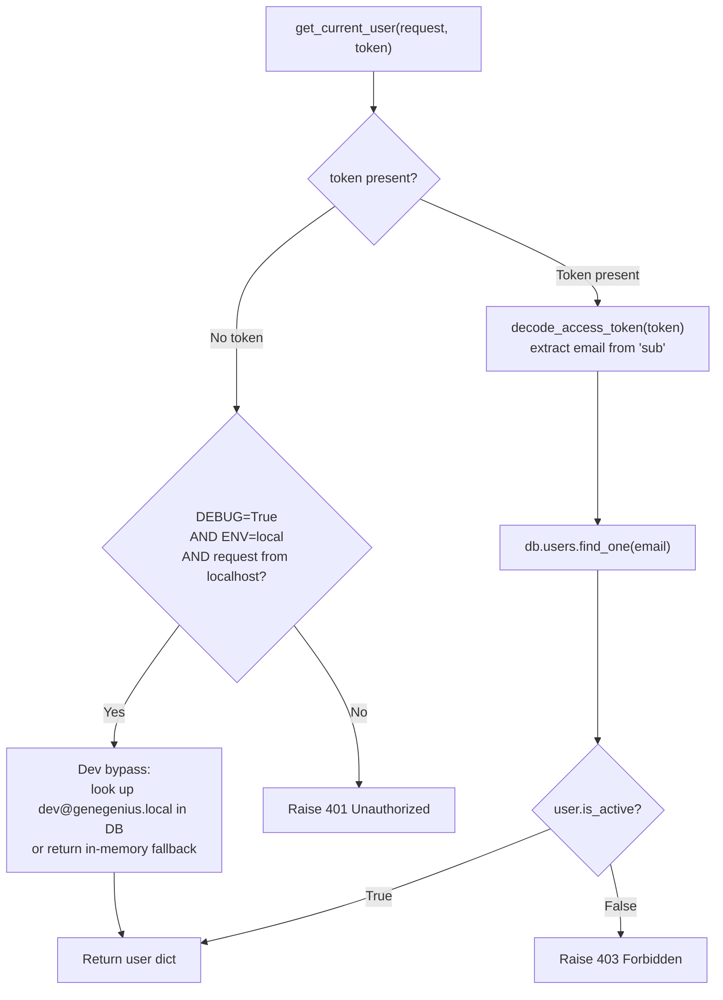
```mermaid
flowchart TD
    START["get_current_user(request, token)"]
    TOKEN{token present?}
    DEBUG{DEBUG=True\nAND ENV=local\nAND request from localhost?}
    BYPASS["Dev bypass:\nlook up dev@genegenius.local in DB\nor return in-memory fallback"]
    REJECT["Raise 401 Unauthorized"]
    DECODE["decode_access_token(token)\nextract email from 'sub'"]
    DB["db.users.find_one(email)"]
    ACTIVE{user.is_active?}
    RETURN["Return user dict"]
    DISABLED["Raise 403 Forbidden"]

    START --> TOKEN
    TOKEN -->|No token| DEBUG
    DEBUG -->|Yes| BYPASS --> RETURN
    DEBUG -->|No| REJECT
    TOKEN -->|Token present| DECODE
    DECODE --> DB
    DB --> ACTIVE
    ACTIVE -->|True| RETURN
    ACTIVE -->|False| DISABLED
```

**Debug bypass safety guards** — three conditions must ALL be true simultaneously:
1. `settings.debug == True`
2. `ENV` (or `APP_ENV`) env var == `"local"`
3. Request client host is `127.0.0.1`, `::1`, `localhost`, or `testclient`

This triple-guard prevents the dev bypass from activating on production instances even if `DEBUG=True` is accidentally set. The `assert_debug_mode_safety()` function (called in `startup_event`) raises `RuntimeError` at boot if `DEBUG=True` with a non-local `ENV`.

#### RBAC — `require_role()`

```python
# Dependency factory — returns a role-checking dependency
@router.get("/admin-only", dependencies=[Depends(require_role([UserRole.ADMIN]))])
async def admin_endpoint(): ...
```

**Roles:**
| Role | Value | MFA required |
|---|---|---|
| `UserRole.ADMIN` | `"admin"` | Yes (mandatory) |
| `UserRole.ANALYST` | `"analyst"` | Yes (mandatory) |
| `UserRole.VIEWER` | `"viewer"` | Optional |

#### `FieldEncryption` — PHI field encryption

```python
enc = FieldEncryption()   # reads PHI_ENCRYPTION_KEY from settings
enc.encrypt("SSN-123")    # Fernet encrypt → base64 ciphertext
enc.decrypt("gAAAAA...")  # Fernet decrypt → plaintext
```

**Algorithm:** Fernet (AES-128-CBC + HMAC-SHA256)
**Key format:** Base64-encoded 32-byte key in `PHI_ENCRYPTION_KEY`
**Passthrough:** If `PHI_ENCRYPTION_KEY` is `None`, both methods return input unchanged (logged as warning on init)
**Error handling:** On decrypt failure (wrong key, corrupted data), returns the ciphertext as-is rather than raising

---

### 6.4 Dependency Injection (`di.py`)

**File:** `app/core/di.py`

Two DI mechanisms exist in parallel:

#### A. `DIContainer` — generic IoC container

A lightweight reflection-based IoC container that resolves constructor dependencies automatically:

```python
container.register_singleton(IAlphaFoldService, AlphaFoldService)
container.register_factory(ILLMService, lambda: GeminiService())

svc = container.get(IAlphaFoldService)  # resolves + caches singleton
```

**Resolution order:**
1. Check `_singletons` cache (already-instantiated singletons)
2. Check `_factories` dict → call factory, cache if `__singleton__ = True`
3. Check `_services` dict → instantiate via reflection, cache if singleton
4. Fall back to direct instantiation with auto-resolved constructor params

**Constructor injection:** Uses `inspect.signature` to find constructor parameters, resolves each by type annotation via recursive `container.get()`. Falls back to default values if resolution fails.

**`@singleton` decorator:**
```python
@singleton
class MyService:
    pass
# Sets MyService.__singleton__ = True — container caches the instance
```

#### B. `ServiceContainer` — lazy property accessor

A simpler container used throughout the codebase for the core annotation services:

```python
svc = get_service_container()
svc.alphamissense_service   # lazy-imports alphamissense_service singleton
svc.gnomad_service          # lazy-imports gnomad_service singleton
svc.vep_service             # lazy-imports vep_service singleton
svc.clinvar_service         # lazy-imports clinvar_service singleton
svc.acmg_classifier         # lazy-imports enhanced_acmg_classifier singleton
svc.biobert_service         # lazy-imports biobert_service singleton
```

Each property does a lazy import on first access — avoids circular imports and defers heavy model loading (BioBERT, SQLite connections) until actually needed.

---

### 6.5 Interface Contracts (`interfaces.py`)

**File:** `app/core/interfaces.py`

All abstract base classes that define the contracts for the service and repository layers. New implementations must satisfy these contracts — no concrete class is imported directly in higher layers when an interface exists.

| Interface | Extends | Key abstract methods |
|---|---|---|
| `IRepository` | `ABC` | Base marker interface |
| `IJobRepository` | `IRepository` | `create`, `get_by_id`, `update`, `delete`, `list` |
| `IVariantRepository` | `IRepository` | `create`, `get_by_job_id`, `update`, `bulk_update` |
| `IService` | `ABC` | Base marker interface |
| `IJobService` | `IService` | `create_job`, `get_job`, `update_job_status`, `list_jobs` |
| `IVariantService` | `IService` | `process_vcf_variants`, `annotate_variants`, `filter_variants` |
| `IExternalService` | `ABC` | `is_available()` |
| `IAnnotationService` | `IExternalService` | `annotate_variants(variants)` |
| `IFileService` | `ABC` | `save_file`, `get_file`, `delete_file`, `validate_file` |
| `ILogger` | `ABC` | `info`, `error`, `warning`, `debug` |
| `IConfiguration` | `ABC` | `get`, `get_database_url`, `get_upload_dir` |

**Phase II/III extensibility:**

New service types for future phases are added here as new interfaces without modifying existing ones:

```python
# Phase II (example — not yet implemented)
class IDigitalTwinService(IService):
    @abstractmethod
    async def create_twin(self, patient_id: str) -> DigitalTwin: pass

class INanotechService(IService):                          # Phase III
    @abstractmethod
    async def design_nanoparticle(self, variant: str) -> NanoparticleDesign: pass
```

---

### 6.6 APScheduler — M4 Continuous Reanalysis (`scheduler.py`)

**File:** `app/core/scheduler.py`

**Library:** `APScheduler 3.x` with `AsyncIOScheduler` backend (non-blocking, runs inside the same event loop as FastAPI)

**Schedule:** Cron job at **02:00 UTC daily**

**Feature flag:** `V2_M4_CONTINUOUS_REANALYSIS_ENABLED` must be `True` for the M4 service to actually reanalyze (the scheduler always runs, but M4 service checks the flag internally)

#### What `process_m4_monitoring_queue()` does

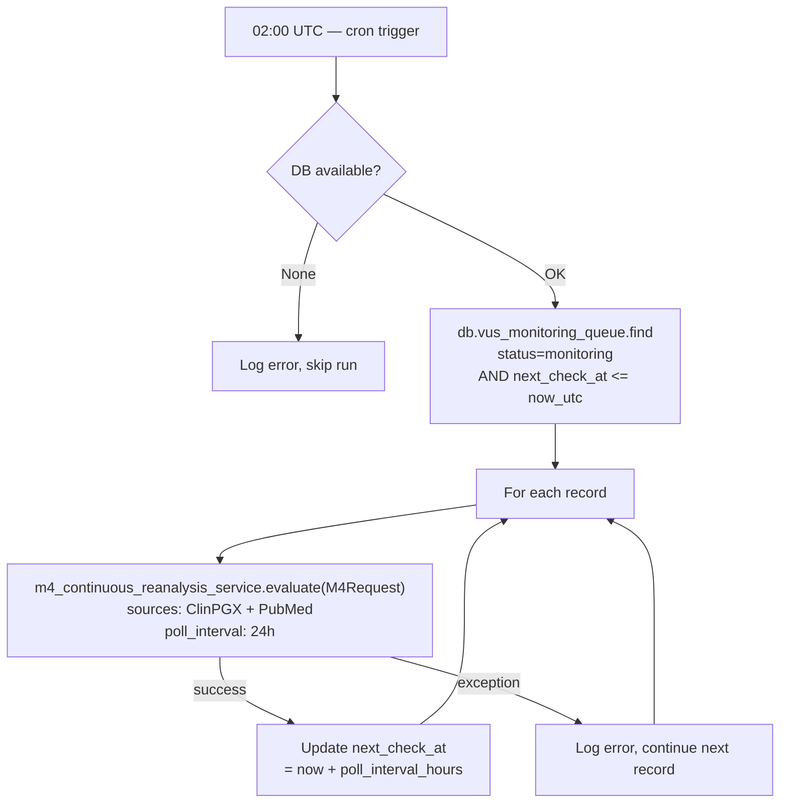
```mermaid
flowchart TD
    START["02:00 UTC — cron trigger"]
    DB{DB available?}
    SKIP["Log error, skip run"]
    QUERY["db.vus_monitoring_queue.find\nstatus=monitoring\nAND next_check_at <= now_utc"]
    FOREACH["For each record"]
    M4["m4_continuous_reanalysis_service.evaluate(M4Request)\nsources: ClinPGX + PubMed\npoll_interval: 24h"]
    ADVANCE["Update next_check_at\n= now + poll_interval_hours"]
    ERR["Log error, continue next record"]

    START --> DB
    DB -->|None| SKIP
    DB -->|OK| QUERY
    QUERY --> FOREACH
    FOREACH --> M4
    M4 -->|success| ADVANCE
    M4 -->|exception| ERR
    ADVANCE --> FOREACH
    ERR --> FOREACH
```

**`M4Request` schema:**
```python
M4Request(
    job_id="system-scheduled",
    unresolved_variant_id="7:117559593:CTT>C",
    monitor_sources=["ClinPGX", "PubMed"],
    poll_interval_hours=24        # configurable via VUS_MONITORING_POLL_INTERVAL_HOURS
)
```

**Lifecycle:**
- Started: `m4_scheduler.start()` in `startup_event()` — after MongoDB connects
- Stopped: `m4_scheduler.shutdown(wait=False)` in `shutdown_event()` — non-blocking, lets existing jobs complete

**VUS enrollment** (separate from the scheduler): When `VUS_MONITORING_ENROLLMENT_ENABLED=True`, the analysis pipeline's `enroll_vus_variants()` call inserts newly-classified VUS variants into `vus_monitoring_queue` with `status="monitoring"` and `next_check_at = now + poll_interval`. These are then picked up by the daily cron job. Enrollment is **idempotent** — re-enrolling an already-monitored variant is a no-op.

---

### 6.7 Logging (`logging.py`)

**File:** `app/core/logging.py`

**Logger name:** `genegenius`

**Format:**
```
2026-06-05 12:00:00 - genegenius - INFO - Starting COMPREHENSIVE analysis for job abc-123
```

**Handlers:**
- `StreamingHandler(sys.stdout)` — always present; captured by `journalctl` in production
- `FileHandler(log_file)` — optional, if `log_file` path provided at setup

**Usage across codebase:**
```python
from app.core.logging import logger
logger.info("...")
logger.warning("...")
logger.error("...")
```

**Third-party noise suppression** (in `app/main.py`):
```python
warnings.filterwarnings("ignore", category=FutureWarning, module=r"google\.")
warnings.filterwarnings("ignore", message=r".*urllib3.*OpenSSL.*", category=UserWarning)
```
Suppresses Python 3.9 EOL notices from Google libraries and LibreSSL warnings from urllib3.

---

### 6.8 Core Layer Dependency Map

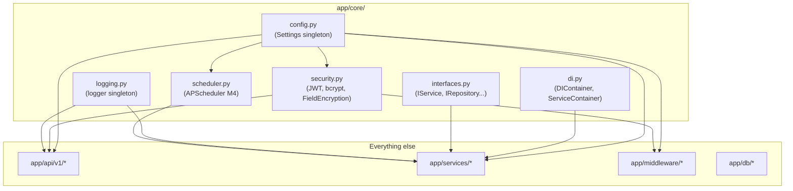
```mermaid
flowchart TD
    subgraph CORE["app/core/"]
        CONFIG["config.py\n(Settings singleton)"]
        SECURITY["security.py\n(JWT, bcrypt, FieldEncryption)"]
        DI["di.py\n(DIContainer, ServiceContainer)"]
        IFACE["interfaces.py\n(IService, IRepository...)"]
        SCHED["scheduler.py\n(APScheduler M4)"]
        LOG["logging.py\n(logger singleton)"]
    end

    subgraph CONSUMERS["Everything else"]
        API["app/api/v1/*"]
        SVC["app/services/*"]
        MW["app/middleware/*"]
        DB_MOD["app/db/*"]
    end

    CONFIG --> API
    CONFIG --> SVC
    CONFIG --> MW
    CONFIG --> SECURITY
    CONFIG --> SCHED
    SECURITY --> API
    SECURITY --> MW
    DI --> SVC
    IFACE --> SVC
    LOG --> API
    LOG --> SVC
    SCHED --> SVC
```

> **Key rule:** Nothing in `app/core/` imports from `app/services/`, `app/api/`, or `app/db/`. The only exception is `app/core/security.py` which imports `get_database` from `app/db/database.py` for user lookups — this is an intentional coupling to avoid circular imports through the DI layer.

---

*[Section 6 complete — Section 7 (Service Layer — Analysis Pipeline) coming next]*

---

## 7. Service Layer — Analysis Pipeline

### 7.1 Overview

The analysis pipeline is the heart of GeneGenius. All variant interpretation — from raw VCF coordinates to ACMG classification, AI scoring, and LLM narrative — flows through a single orchestrator class: `VariantAnalysisPipeline`.

**File:** `app/services/variant_analysis_pipeline.py`  
**Class:** `VariantAnalysisPipeline`  
**Singleton:** `variant_analysis_pipeline` (module-level instance)

**Assembly:** GRCh38 (default), configurable

#### Services wired at init

The pipeline holds direct references to every annotation service as instance variables — no runtime service resolution:

| Instance var | Service | Purpose |
|---|---|---|
| `self.hgvs_service` | `hgvs_generator` | HGVS nomenclature generation |
| `self.vep_service` | `vep_service` | VEP annotation |
| `self.alphamissense_service` | `alphamissense_service` | Pathogenicity scoring |
| `self.clinvar_service` | `clinvar_service` | ClinVar lookup |
| `self.gnomad_service` | `gnomad_service` | Population frequency |
| `self.acmg_classifier` | `enhanced_acmg_classifier` | 28-criteria ACMG |
| `self.biobert_service` | `biobert_service` | Literature mining |
| `self.evo2_service` | `evo2_service` | EVO2 40B/7B pathogenicity |
| `self.esm2_service` | `esm2_service` | ESM2 protein embedding |
| `self.geneformer_service` | `geneformer_service` | Tissue context |
| `self.boltz2_service` | `boltz2_service` | Binding affinity |
| `self.rnapro_service` | `rnapro_service` | Splice impact |
| `self.diffdock_service` | `diffdock_service` | Ligand docking |
| `self.openfold3_service` | `openfold3_service` | Structure prediction |
| `self.proteinmpnn_service` | `proteinmpnn_service` | Sequence design |
| `self.rfdiffusion_service` | `rfdiffusion_service` | Binder design |
| `self.molmim_service` | `molmim_service` | Molecular optimization |
| `self.literature_service` | `LiteratureService()` | PubMed + BioBERT synthesis |
| `self.ensemble_engine` | `ExpertEnsembleEngine()` | MoE weighted scoring |

---

### 7.2 Entry Points — Three Analysis Modes

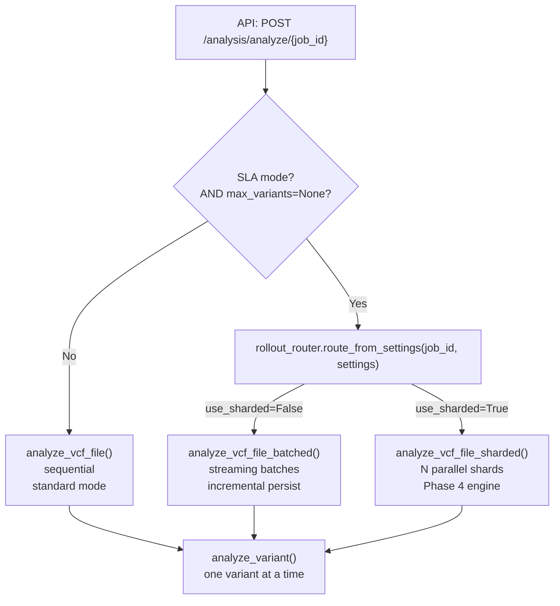
```mermaid
flowchart TD
    CALLER["API: POST /analysis/analyze/{job_id}"]
    CHECK{SLA mode?\nAND max_variants=None?}
    ROUTE["rollout_router.route_from_settings(job_id, settings)"]
    SHARDED["analyze_vcf_file_sharded()\nN parallel shards\nPhase 4 engine"]
    BATCHED["analyze_vcf_file_batched()\nstreaming batches\nincremental persist"]
    SEQ["analyze_vcf_file()\nsequential\nstandard mode"]
    SINGLE["analyze_variant()\none variant at a time"]

    CALLER --> CHECK
    CHECK -->|Yes| ROUTE
    CHECK -->|No| SEQ
    ROUTE -->|use_sharded=True| SHARDED
    ROUTE -->|use_sharded=False| BATCHED
    SEQ --> SINGLE
    BATCHED --> SINGLE
    SHARDED --> SINGLE
```

| Mode | Function | When used | Persist strategy |
|---|---|---|---|
| Sequential | `analyze_vcf_file()` | Standard mode, `max_variants` set, or SLA+test limit | Batch insert after full completion |
| Batched streaming | `analyze_vcf_file_batched()` | SLA mode, batched engine path | **Incremental persist** per batch during processing |
| Sharded | `analyze_vcf_file_sharded()` | SLA mode, sharded engine path | Per-shard results assembled and batch-inserted |

---

### 7.3 Rollout Router

**File:** `app/services/rollout_router.py`

Controls which engine processes each job in SLA mode. Uses **deterministic MD5 hash** of `job_id` for stable bucket assignment — the same `job_id` always routes the same way at a given percentage.

**Precedence (first match wins):**

```
1. kill_switch=True              → batched (emergency override)
2. WHOLE_FILE_SLA_USE_SHARDED_ENGINE=False → batched
3. whole_file_sla_num_shards <= 1          → batched
4. rollout_pct == 0                        → batched
5. rollout_pct >= 100                      → sharded (all traffic)
6. MD5(job_id) % 100 < rollout_pct        → sharded
7. else                                    → batched
```

**Routing decision record** (`RoutingDecision`) is immutable and serialized into the job document for full audit traceability:
```json
{
  "use_sharded": false,
  "reason": "rollout_bucket_47_above_25",
  "bucket": 47,
  "rollout_pct": 25,
  "kill_switch_active": false
}
```

---

### 7.4 SLA Budget Controller

**File:** `app/services/sla_budget_controller.py`

Tracks elapsed time against a per-job budget. Used by both the batched and sharded engines to bound individual operation timeouts.

```python
budget = SLABudgetController(total_budget_seconds=600.0)  # 10-minute SLA

budget.remaining_seconds()          # How much time is left
budget.is_exhausted()               # True when budget <= 0
budget.bounded_timeout(timeout=8.0) # min(8.0, remaining) — never exceeds remaining budget
```

**Stage budgets** (from `settings`):

| Stage | Config key | Default |
|---|---|---|
| Stage A — VCF parse | `whole_file_stage_a_budget_seconds` | 10s |
| Stage B — VEP annotation | `whole_file_stage_b_budget_seconds` | 20s |
| Stage C — AI/ML scoring | `whole_file_stage_c_budget_seconds` | 150s |
| Stage D — ACMG classification | `whole_file_stage_d_budget_seconds` | 120s |
| Stage E — LLM synthesis | `whole_file_stage_e_budget_seconds` | 180s |
| Finalize | `whole_file_finalize_budget_seconds` | 60s |
| **Total SLA target** | `whole_file_sla_target_minutes` × 60 | **600s (10 min)** |

**Fail-open behavior:** When `WHOLE_FILE_SLA_FAIL_OPEN_ON_TIMEOUT=True` (default), variants that hit the budget are **deferred** rather than failed — they produce a partial Tier 1 result instead of an error. Tracked in `PipelineSummary.variant_timeout_deferred` and `budget_deferred`.

---

### 7.5 Per-Variant Analysis — `analyze_variant()`

**Function:** `VariantAnalysisPipeline.analyze_variant()` (line ~1262)

This is the core analysis function called for every single variant. It runs sequentially through annotation, AI scoring, ACMG classification, and LLM synthesis.

**Input:**

| Param | Type | Description |
|---|---|---|
| `chromosome` | `str` | e.g., `"1"`, `"X"`, `"MT"` |
| `position` | `int` | 1-based genomic position |
| `reference` | `str` | Reference allele |
| `alternate` | `str` | Alternate allele |
| `dp` | `int?` | Read depth from VCF FORMAT |
| `qual` | `float?` | VCF QUAL score |
| `af` | `float?` | Allele frequency from VCF |
| `rsid` | `str?` | dbSNP rsID if present in VCF |
| `precomputed_vep_result` | `Any?` | Pre-fetched VEP annotation (from batch prefetch) |
| `precomputed_gnomad_result` | `Any?` | Pre-fetched gnomAD result |
| `precomputed_clinvar_data` | `dict?` | Pre-fetched ClinVar data |
| `tier2_enabled` | `bool` | Include AI model scoring (Tier 2 fields) |
| `tier2_policy` | `dict?` | Sampling policy for Tier 2 fields |

**Output:** `VariantAnalysisResult` dataclass

#### Step 0 — Pre-validation

`_pre_validate_variant()` applies biological sanity checks before any network calls:
- Reference/alternate allele format checks
- Chromosome format validation
- Position bounds check against `chromosome_lengths_GRCh38.json`

Fails fast with a `VALIDATION ERROR` recommendation if checks fail — no downstream calls made.

#### Step 1 — VEP Annotation

Priority order:
1. **Precomputed VEP** (from batch prefetch in `analyze_vcf_file_batched`) — reused if available
2. **VEP API call** (`vep_service.annotate_variant()`) — Ensembl REST API, GRCh38

**Mitochondrial fallback chain** (if VEP fails for MT variants):
```
VEP → MITOMAP (known pathogenic MT variants) → MT Gene Mapper (positional annotation)
```

**Non-MT fallback chain** (if VEP fails):
```
VEP → ClinVar-based enrichment (rsID + disease name) → Generic fallback annotator
```

If all methods fail and no gene symbol can be determined → returns empty `VariantAnalysisResult` early.

**Gene symbol assignment for non-coding:** If VEP succeeds but returns no gene symbol, consequence-based labels are assigned: `"Intergenic region"`, `"Upstream of gene"`, `"Downstream of gene"`, `"Intronic variant"`, `"Non-coding region"`.

#### Step 1.5 — HGVS Nomenclature

Generates three HGVS representations:
- `hgvs_g` — genomic (e.g., `NC_000007.14:g.117548628T>C`)
- `hgvs_c` — coding (e.g., `NM_000546.6:c.817C>T`)
- `hgvs_p` — protein (e.g., `NP_000537.3:p.Arg273Cys`)

Sources (priority order): VEP-provided HGVS → `hgvs_service` generator → canonical transcript lookup

#### Step 1.7 — Parallel External Lookups

gnomAD and ClinVar are fetched **concurrently** (both independent):

**gnomAD lookup order:**
1. `precomputed_gnomad_result` (from batch prefetch)
2. `gnomad_service.get_variant_annotation()` → local tabix first, API fallback

**ClinVar lookup order:**
1. `precomputed_clinvar_data` (from batch prefetch)
2. `clinvar_local_service.lookup_variant()` — local index
3. `clinvar_service.search_variant()` — remote API

gnomAD population data (sub-populations, popmax AF, popmax population) extracted and normalized from whichever source succeeds.

#### Step 2 — AlphaMissense Pathogenicity

```python
alphamissense_service.predict(chromosome, position, reference, alternate)
```

Returns: `score` (0–1), `classification` (`likely_benign | ambiguous | likely_pathogenic`), `confidence`, `protein_position`, `ref_aa`, `alt_aa`, `uniprot_id`

Source: Local SQLite (`data/alpha/alphamissense.db`, 6.8GB, 71M variants). <1ms per lookup.

#### Step 3 — BioNeMo AI Model Scoring (Tier 2)

All Tier 2 fields are skipped when `tier2_enabled=False` or budget is exhausted. Each call is individually try/caught — a failing model never aborts the pipeline.

| Model | Output field | Flag required | Notes |
|---|---|---|---|
| EVO2 40B (NVIDIA NIM) | `evo2_score`, `evo2_functional_class` | `BIONEMO_SPRINT_ENABLED` | Falls back to EVO2 7B if 40B fails |
| ESM2 650M (NVIDIA NIM) | `esm2_embedding_score` | `BIONEMO_SPRINT_ENABLED` | Protein sequence embedding |
| Geneformer 100M | `geneformer_tissue_context` | self-hosted Triton only | NOT a hosted NIM endpoint (verified 2026-04-18) |
| RNAPro | `rnapro_splice_impact` | `BIONEMO_RNAPRO_ENABLED` | Splice impact score |
| Boltz2 | `boltz2_structural_impact` | `BIONEMO_BOLTZ2_ENABLED` | Binding affinity |
| DiffDock | `diffdock_binding_score` | `BIONEMO_DIFFDOCK_ENABLED` | Ligand docking |
| OpenFold3 | `openfold3_structure` | `BIONEMO_OPENFOLD3_ENABLED` | Structure prediction |
| ProteinMPNN | `proteinmpnn_sequences` | `BIONEMO_PROTEINMPNN_ENABLED` | Sequence design |
| RFDiffusion | `rfdiffusion_designs` | `BIONEMO_RFDIFFUSION_ENABLED` | Binder design |
| MolMIM | `molmim_alternatives` | `BIONEMO_MOLMIM_ENABLED` | Molecular optimization |

#### Step 4 — V2 Enhancement Modules

Each module runs as an **additive enrichment** — failures are caught and logged, never abort the pipeline. Each checks its own feature flag:

| Module | Method | Input | Output field | Flag |
|---|---|---|---|---|
| M1 Structural Impact | `_run_v2_m1_structural_impact()` | variant_id, gene, hgvs_p, protein_seq | `m1_structural_impact` | `V2_M1_STRUCTURAL_IMPACT_ENABLED` |
| M2 Splicing Validation | `_run_v2_m2_splicing_validation()` | variant coords, precomputed splice | `m2_splicing_validation` | `V2_M2_SPLICING_VALIDATION_ENABLED` |
| M3 Expression Outlier | `_run_v2_m3_expression_outlier()` | gene_symbol, tissue context | `m3_expression_outlier` | `V2_M3_EXPRESSION_OUTLIER_ENABLED` |
| M4 Continuous Reanalysis | `_run_v2_m4_continuous_reanalysis()` | variant_id, job_id | `m4_continuous_reanalysis` | `V2_M4_CONTINUOUS_REANALYSIS_ENABLED` |
| M5 Phenotype Integration | `_run_v2_m5_phenotype_integration()` | gene, patient phenotype | `m5_phenotype_integration` | `V2_M5_PHENOTYPE_INTEGRATION_ENABLED` |
| M6 Therapeutic Synthesis | `_run_v2_m6_therapeutic_synthesis()` | variant, drug data | `m6_therapeutic_synthesis` | `V2_M6_THERAPEUTIC_SYNTHESIS_ENABLED` |
| M7 Metabolomic Overlay | `_run_v2_m7_metabolomic_overlay()` | gene, metabolite data | `m7_metabolomic_overlay` | `V2_M7_METABOLOMIC_OVERLAY_ENABLED` |
| M8 Functional Rectification | `_run_v2_m8_functional_rectification()` | variant, functional scores | `m8_functional_rectification` | `V2_M8_FUNCTIONAL_RECTIFICATION_ENABLED` |

#### Step 5 — ACMG Classification

```python
enhanced_acmg_classifier.classify(variant_data, evidence_data)
```

Output: `acmg_classification` (Pathogenic / Likely Pathogenic / VUS / Likely Benign / Benign), `evidence_codes` (e.g., `["PVS1", "PM2", "PP3"]`), `acmg_evidence` (full trigger data for audit trail), `confidence_score` (0–100).

Detail in Section 10.3.

#### Step 6 — Drug Response

```python
drugbank_service.get_drug_interactions(gene_symbol)
pharmgkb_service.get_annotations(gene_symbol, variant_id)
```

Both services are **eager-loaded at startup** (not lazy) to avoid multi-worker race conditions. Output fields: `drug_impacts`, `pharmgkb_annotations`.

#### Step 7 — MoE Ensemble

`_build_moe_ensemble_payload()` constructs the weighted expert ensemble:

| Expert | Weight | Data source |
|---|---|---|
| ClinVar | 40% | `clinvar_dict.significance` |
| AlphaMissense | 20% | `alphamissense_prediction.score` |
| gnomAD | 25% | `gnomad_af` → inverse AF scoring |
| BioBERT | 15% | `biobert_pathogenicity_score` |

Final score → category: ≥0.7 Pathogenic, 0.5–0.7 Likely Pathogenic, 0.3–0.5 VUS, 0.15–0.3 Likely Benign, <0.15 Benign.

Conflict detection: if max spread between expert scores >0.4 → `MoEConflictReport` with severity and resolution strategy.

#### Step 8 — LLM Synthesis (Gemini)

```python
gemini_service.generate_clinical_interpretation(variant_data, acmg_result, literature_data)
```

Runs only when `include_gemini=True` (default). Output: `gemini_interpretation` (clinical narrative, recommendations, significance summary).

**Deterministic settings:** `temperature=0.0`, `seed=42` — same input always produces same output.

#### Step 9 — Literature Mining

```python
literature_service.search_and_analyze(gene_symbol, variant_id)
```

BioBERT semantic search + PubMed Entrez retrieval. Output: `literature_data` (PMIDs, supporting publications, confidence boost, normalized score).

#### Step 10 — AlphaGenome (async, fire-and-forget)

Only runs when `run_alphagenome=True` AND `ALPHAGENOME_ENABLED=True` AND `RESEARCH_MODE_ONLY=True`. Fires asynchronously after the clinical report is assembled — **never blocks the critical path**. Output: `alphagenome_result` (attached post-analysis for non-coding variants).

---

### 7.6 VariantAnalysisResult Schema

The `VariantAnalysisResult` dataclass has two serialization modes:

| Method | Size | Use case |
|---|---|---|
| `to_json_dict()` | Full size (~5–10KB per variant) | API response body |
| `to_compact_dict()` | ~40–50% smaller | MongoDB storage |

**What `to_compact_dict()` drops** vs `to_json_dict()`:
- Full raw VEP annotation object (keeps 6 key fields)
- Full AlphaFold PDB/structure data (keeps pLDDT summary)
- Raw literature articles (keeps PMIDs, confidence boost, normalized score)

**What it always preserves** (required by frontend + PDF generator):
- All ACMG fields (`acmg_classification`, `evidence_codes`, `acmg_evidence`)
- All gnomAD fields (AF, popmax, population frequencies)
- All AI scores (evo2, esm2, alphamissense, boltz2, rnapro, diffdock)
- Drug response (`drug_impacts`, `pharmgkb_annotations`)
- HGVS notation (nested + flat top-level)
- Clinical significance + recommendations

---

### 7.7 PipelineSummary Schema

`PipelineSummary` is returned alongside the `List[VariantAnalysisResult]` and persisted to the `jobs` collection as `sla_stage_manifest`:

```python
@dataclass
class PipelineSummary:
    total_variants: int
    processed_variants: int
    failed_variants: int
    deferred_variants: int           # budget/timeout deferred
    variant_timeout_deferred: int    # hit per-variant timeout
    batch_timeout_deferred: int      # hit per-batch timeout
    budget_deferred: int             # hit total SLA budget
    stage_a_total_variants: int
    stage_b_survivors: int           # after known-benign filter
    stage_b_known_benign_filtered: int
    stage_c_survivors: int           # after common-AF filter
    stage_c_common_af_filtered: int
    stage_d_evaluated_variants: int
    stage_e_actionable_subset: int
    classification_distribution: Dict[str, int]
    avg_confidence_score: float
    concordance_with_clinvar: Optional[Dict]
    # SLA telemetry
    sla_budget_seconds: Optional[float]
    sla_elapsed_seconds: Optional[float]
    sla_remaining_seconds: Optional[float]
    sla_budget_exhausted: bool
    # Tier 2 telemetry
    tier2_selected_variants: int
    tier2_deferred_variants: int
    tier2_policy_distribution: Dict[str, int]
    # Sharding telemetry
    sharded_execution: bool
    shard_count: int
    shards_completed: int
    shards_failed: int
    shards_retried: int
    shard_manifest: Dict[str, Any]
    # Timing
    stage_timing_seconds: Dict[str, float]
    stage_latency_percentiles_seconds: Dict[str, Dict[str, Optional[float]]]
    end_to_end_latency_percentiles_seconds: Dict[str, Optional[float]]
```

---

### 7.8 VCF Parsing — `_parse_vcf()` and `_stream_vcf()`

**`_parse_vcf()`** — reads the full VCF into memory, returns `List[dict]`. Used for QC metric calculation and sequential mode.

**`_stream_vcf()`** — generator that yields one variant dict at a time. Used by batched mode to avoid loading the entire file into memory for large WGS VCFs.

Supported formats: `.vcf`, `.vcf.gz` (bgzipped), `.bcf`

Fields extracted per variant:
- `CHROM`, `POS`, `REF`, `ALT[0]` (first alt allele)
- `ID` (rsID if present)
- `QUAL`
- `INFO/CLNDN` (ClinVar disease name)
- `INFO/CLNSIG` (ClinVar significance)
- `FORMAT/DP` (read depth)
- `FORMAT/AF` (allele frequency)
- `INFO/HGVS_P`, `INFO/HGVS_C` (pre-computed HGVS if present)

---

### 7.9 Batched Processing — `analyze_vcf_file_batched()`

**Used in:** SLA mode, batched engine path

Key params:
- `batch_size`: variants per batch (default 500 from `WGS_BATCH_SIZE`)
- `max_concurrent`: parallel variant coroutines per batch (default 10 from `WGS_MAX_CONCURRENT`)
- `memory_limit_gb`: memory guard threshold (default 8.0 GB from `WGS_MEMORY_LIMIT_GB`)
- `variant_timeout_seconds`: per-variant asyncio timeout (default 8.0s)
- `batch_timeout_seconds`: per-batch asyncio timeout (default 120.0s)
- `total_timeout_seconds`: absolute job budget (SLA target × 60)

**VEP batch prefetch:** Before processing each batch, VEP is called in bulk for all variants in the batch (`vep_service.annotate_variants_batch()`). This is the key optimization that achieved the **3.64–4.32× speedup** (VEP batching benchmark: 15.4s → 4.2s for 12 variants, 59.9s → 13.8s for 50 variants).

**Incremental persist:** In SLA batched mode, each batch's results are written to `db.variants` immediately after processing (not waiting for full completion). The `batch_results_callback` handles this. Prevents data loss if the job is interrupted partway through a large WGS file.

**Memory guard:** `_check_memory_limit()` is called between batches. If RSS exceeds `memory_limit_gb`, processing stops and remaining variants are marked deferred.

**Semaphore concurrency:** Within each batch, variants are processed with `asyncio.Semaphore(max_concurrent)` — no more than 10 variants awaited simultaneously, preventing thundering herd on external APIs.

---

### 7.10 Sharded Processing — `analyze_vcf_file_sharded()`

**Used in:** SLA mode, sharded engine path (progressive rollout)

The VCF is split into N shards by variant index. Each shard is processed independently with its own batch engine and SLA budget. Shards run concurrently up to `shard_concurrency`.

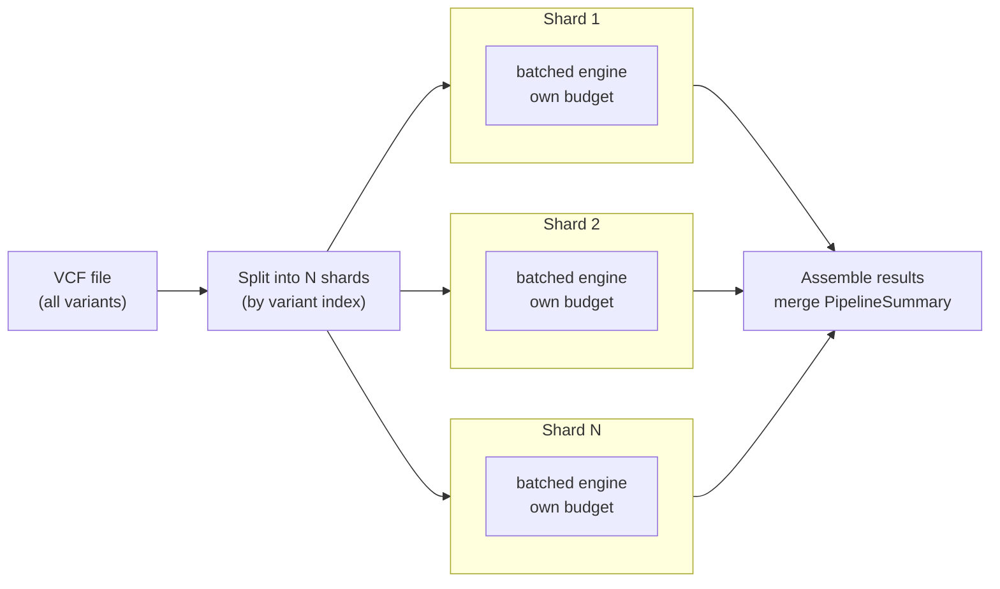
```mermaid
flowchart LR
    VCF["VCF file\n(all variants)"]
    SPLIT["Split into N shards\n(by variant index)"]

    subgraph S1["Shard 1"]
        B1["batched engine\nown budget"]
    end
    subgraph S2["Shard 2"]
        B2["batched engine\nown budget"]
    end
    subgraph SN["Shard N"]
        BN["batched engine\nown budget"]
    end

    ASSEMBLE["Assemble results\nmerge PipelineSummary"]

    VCF --> SPLIT
    SPLIT --> S1
    SPLIT --> S2
    SPLIT --> SN
    S1 --> ASSEMBLE
    S2 --> ASSEMBLE
    SN --> ASSEMBLE
```

**Shard config:**
- `num_shards`: `WHOLE_FILE_SLA_NUM_SHARDS` (default 4)
- `shard_concurrency`: `WHOLE_FILE_SLA_SHARD_CONCURRENCY` (default 4)
- `shard_max_retries`: `WHOLE_FILE_SLA_SHARD_MAX_RETRIES` (default 1)

**Retry behavior:** If a shard fails, it is retried up to `shard_max_retries` times. If still failing, its variants are counted in `shards_failed` and `deferred_variants`.

**Shard manifest:** Each shard's stats (variants processed, failed, timing) are recorded in `PipelineSummary.shard_manifest` and persisted to the job document for full audit visibility.

---

### 7.11 Full Pipeline Execution Flow


```mermaid
flowchart TD
    START["analyze_vcf_file_batched / _sharded / sequential"]

    subgraph STAGE_A["Stage A — VCF Parse (10s budget)"]
        PARSE["_stream_vcf() / _parse_vcf()\nExtract chrom/pos/ref/alt/qual/dp/af/rsid"]
        PREVALIDATE["_pre_validate_variant()\nBiological sanity checks"]
    end

    subgraph STAGE_B["Stage B — VEP Annotation (20s budget)"]
        VEP_BATCH["VEP batch prefetch\nEnsembl REST API GRCh38\n(all variants in batch)"]
        MT_FALLBACK["MT fallback chain\nMITOMAP → MT Gene Mapper"]
        CLINVAR_FALLBACK["Non-MT fallback\nClinVar enrichment → generic"]
    end

    subgraph STAGE_C["Stage C — AI/ML Scoring (150s budget)"]
        AM["AlphaMissense\nSQLite local (<1ms)"]
        GNOMAD["gnomAD\nlocal tabix → API"]
        CLINVAR["ClinVar\nlocal index → API"]
        EVO2["EVO2 40B/7B\nNVIDIA NIM"]
        ESM2["ESM2 650M\nNVIDIA NIM"]
        RNAPRO["RNAPro\nNVIDIA NIM"]
        BOLTZ2["Boltz2\nNVIDIA NIM"]
        DIFFDOCK["DiffDock\nNVIDIA NIM"]
        V2_MODS["V2 Modules M1-M8\n(feature-flagged)"]
    end

    subgraph STAGE_D["Stage D — ACMG Classification (120s budget)"]
        HGVS["HGVS generation\n(g., c., p.)"]
        ACMG["Enhanced ACMG classifier\n28 criteria\ntrigger_data audit trail"]
        DRUG["DrugBank + PharmGKB\n(eager-loaded)"]
        MOE["MoE Ensemble\nClinVar 40% + AM 20% +\ngnomAD 25% + BioBERT 15%"]
    end

    subgraph STAGE_E["Stage E — LLM Synthesis (180s budget)"]
        BIOBERT["BioBERT + PubMed\nliterature mining"]
        GEMINI["Gemini (temp=0, seed=42)\nclinical narrative"]
    end

    subgraph FINALIZE["Finalize (60s budget)"]
        QC["QC metrics\n(Ti/Tv, depth, quality)"]
        COMPACT["to_compact_dict()\n~40-50% size reduction"]
        MONGO["Insert to db.variants\n(incremental or batch)"]
        VUS["VUS enrollment\n→ vus_monitoring_queue"]
        SUMMARY["Generate PipelineSummary\nstage counts, timing, percentiles"]
    end

    START --> STAGE_A
    STAGE_A --> STAGE_B
    STAGE_B --> STAGE_C
    STAGE_C --> STAGE_D
    STAGE_D --> STAGE_E
    STAGE_E --> FINALIZE
```

---

*[Section 7 complete — Section 8 (Annotation Services) coming next]*

---

## 8. Annotation Services

### 8.1 Overview

All variant annotation services live in `app/services/annotation/`. There are 33 files covering VEP, gnomAD, ClinVar, AlphaMissense, all NVIDIA BioNeMo models, protein structure tools, and fallback annotators.

**Design principles common to all annotation services:**
- Every service is a singleton module-level instance
- Every call is wrapped in try/except — a failing service returns `None`, never crashes the pipeline
- Every service has an in-memory cache (TTL-based) to avoid redundant API calls within a job
- External API calls use `httpx.AsyncClient` with retry logic and connection pooling
- All services skip gracefully when their required feature flag is `False`

```
app/services/annotation/
├── vep_service.py              — Ensembl VEP (REST + local)
├── gnomad_service.py           — gnomAD v4.1 (tabix + GraphQL + MongoDB cache)
├── gnomad_local.py             — Local tabix reader
├── clinvar_service.py          — ClinVar remote API
├── clinvar_local_service.py    — ClinVar local index
├── alphamissense_service.py    — AlphaMissense (SQLite → MongoDB → Hegelab API)
├── alphamissense_local.py      — SQLite backend for AlphaMissense
├── hgvs_service.py             — HGVS nomenclature generation
├── hgvs_validator.py           — HGVS validation
├── evo2_service.py + evo2_adapter.py — EVO2 40B/7B via NVIDIA NIM
├── esm2_service.py             — ESM2 650M via NVIDIA NIM
├── geneformer_service.py       — Geneformer 100M (self-hosted Triton only)
├── rnapro_service.py           — RNAPro splice impact
├── boltz2_service.py           — Boltz2 binding affinity
├── diffdock_service.py         — DiffDock ligand docking
├── openfold3_service.py        — OpenFold3 structure prediction
├── proteinmpnn_service.py      — ProteinMPNN sequence design
├── rfdiffusion_service.py      — RFDiffusion protein binder design
├── molmim_service.py           — MolMIM molecular optimization
├── genmol_service.py           — GenMol
├── reasyn_service.py           — ReSyn
├── alphafold_service.py        — AlphaFold EBI (structure + pLDDT)
├── alphagenome_service.py      — AlphaGenome (research async)
├── mitomap_service.py          — MITOMAP mitochondrial variants
├── mt_gene_mapper.py           — MT chromosome positional mapping
├── genomic_enrichment_service.py — Pathway and gene enrichment
├── variant_normalizer.py       — Variant normalization
├── fallback_annotation.py      — ClinVar-based fallback enrichment
├── fallback_predictors.py      — Generic fallback pathogenicity
├── healthomics_deepvariant_client.py — AWS HealthOmics DeepVariant
├── mavedb_functional_service.py — MAVEdb functional scores
```

---

### 8.2 VEP Service (`vep_service.py`)

**Purpose:** Variant Effect Predictor — the primary annotation engine. Returns gene symbol, transcript, HGVS notation, consequence type, SIFT/PolyPhen, gnomAD AF, and ClinVar data for every variant.

**Modes:**
- REST API mode (default): Ensembl REST API `https://rest.ensembl.org`
- Local VEP mode (`use_local_vep=True`): subprocess call to local VEP installation

**Cache:** `TTLCache(maxsize=5000, ttl=86400)` — 24h TTL, up to 5000 entries. Key: `"{assembly}:{chrom}:{pos}:{ref}:{alt}"`

**HTTP client:** `httpx.AsyncClient` with:
- Connect timeout: 10s, Read timeout: 30s
- `retries=3` on `AsyncHTTPTransport`
- Connection pool: max 10 connections
- Auto-recreated on TLS/SSL EOF errors

#### Single variant annotation — `annotate_variant()`

**Input:** `(chromosome, position, reference, alternate, assembly="GRCh38")`

**Coordinate construction for VEP REST API:**
| Variant type | Region format |
|---|---|
| SNV | `chrom:pos-pos:1/alt` |
| Deletion | `chrom:del_start-del_end:1/remaining_alt` |
| Insertion | `chrom:ins_start-ins_end:1/inserted_bases` |
| MNV | `chrom:pos-pos+len-1:1/alt` |

**API parameters requested:** CADD, dbSNP rsIDs, variant class, HGVS, protein annotations, canonical transcript flag, SIFT (b = score + prediction), PolyPhen (b), gnomAD AF

**GRCh37 fallback:** Uses `https://grch37.rest.ensembl.org` when `assembly="GRCh37"`

**Error handling:**
- `429` → sleep 5s and retry
- `400 "matches reference"` → query Ensembl sequence API for actual reference allele, swap alleles, retry
- TLS/SSL EOF → recreate `httpx.AsyncClient`, retry once

**Transcript selection:** Prefers canonical transcript (`"canonical": 1` in response). Falls back to first available transcript. If VEP provides no `transcript_id`, uses `CANONICAL_TRANSCRIPTS` dict (24 common clinical genes: BRCA1, BRCA2, TP53, CFTR, EGFR, KRAS, BRAF, etc.).

#### Batch annotation — `batch_annotate_post()`

**Key optimization:** Uses the VEP POST endpoint to annotate up to 200 variants per HTTP request instead of one request per variant. This produced the **3.64–4.32× speedup** verified in benchmarks.

**Input:** `List[Dict]` of variants, `assembly`, `batch_size=200`

**Process:**
1. Checks in-memory cache for each variant — returns cached result immediately
2. Builds batch of uncached variants as VCF-format strings: `"chrom pos . ref alt . . ."`
3. POSTs to `https://rest.ensembl.org/vep/human/region` with JSON body `{"variants": [...]}`
4. On `429` → waits 10s and retries once
5. Parses response list in order, caches each result

**VEPAnnotation output fields:**

| Field | Type | Description |
|---|---|---|
| `gene_symbol` | `str?` | HGNC gene symbol |
| `transcript_id` | `str?` | Ensembl/RefSeq transcript |
| `most_severe_consequence` | `str` | Sequence Ontology consequence term |
| `impact` | `str?` | HIGH / MODERATE / LOW / MODIFIER |
| `hgvsc` | `str?` | HGVS coding notation |
| `hgvsp` | `str?` | HGVS protein notation |
| `protein_position` | `int?` | 1-based protein position |
| `amino_acids` | `str?` | ref/alt amino acids (e.g. `"R/C"`) |
| `codons` | `str?` | ref/alt codons |
| `sift_prediction` | `str?` | tolerated / deleterious |
| `sift_score` | `float?` | 0–1 |
| `polyphen_prediction` | `str?` | benign / possibly_damaging / probably_damaging |
| `polyphen_score` | `float?` | 0–1 |
| `gnomad_af` | `float?` | gnomAD global allele frequency |
| `cadd_phred` | `float?` | CADD Phred score |
| `clinvar_id` | `str?` | ClinVar variant ID |
| `clinvar_clnsig` | `str?` | ClinVar clinical significance |
| `existing_variation` | `list[str]` | dbSNP rsIDs |

**Rate limiting:** 1.0s between individual GET requests; POST batch overrides this (no per-variant delay)

---

### 8.3 gnomAD Service (`gnomad_service.py` + `gnomad_local.py`)

**Purpose:** Population allele frequency lookup. Critical for ACMG criteria BA1 (stand-alone benign), BS1 (strong benign), PM2 (moderate pathogenic).

**Lookup priority (first hit wins):**

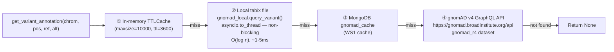
```mermaid
flowchart LR
    CALL["get_variant_annotation(chrom, pos, ref, alt)"]
    A["① In-memory TTLCache\n(maxsize=10000, ttl=3600)"]
    B["② Local tabix file\ngnomad_local.query_variant()\nasyncio.to_thread — non-blocking\nO(log n), ~1-5ms"]
    C["③ MongoDB gnomad_cache\n(WS1 cache)"]
    D["④ gnomAD v4 GraphQL API\nhttps://gnomad.broadinstitute.org/api\ngnomad_r4 dataset"]
    NONE["Return None"]

    CALL --> A
    A -->|miss| B
    B -->|miss| C
    C -->|miss| D
    D -->|not found| NONE
```

**Local tabix backend** (`gnomad_local.py`):
- File location: `GNOMAD_DATA_DIR` (default `data/gnomad/`)
- Format: bgzipped VCF + tabix index (`.bgz` + `.tbi`), one file per chromosome
- Discovery: auto-scans directory for `.bgz` files
- Thread safety: `asyncio.to_thread()` wraps synchronous tabix reads to avoid blocking the event loop
- Population data extracted: per-population AFs, FAF95 (popmax), sex-stratified AC/AN

**Remote GraphQL API:**
- Dataset: `gnomad_r4` (genome + exome combined)
- Fields returned: `ac`, `an`, `af`, `ac_hom`, `ac_hemi`, `faf95.popmax`, `faf95.popmax_population`
- Prefers genome data over exome data when both available
- Rate limiting: 0.5s between requests, semaphore of 3 concurrent requests
- Retry: exponential backoff, max 3 attempts, special handling for `429`

**Per-gene constraint** (`get_gene_constraint()`): fetches `pLI`, `oe_lof_upper` (LOEUF), `mis_z` from gnomAD v4 constraint track for ACMG PP2/BP1 criteria. Process-lifetime cache.

**Mitochondrial chromosomes:** Skipped entirely (`MT`, `chrMT`, `M`, `chrM` all rejected). gnomAD does not support MT variants.

**`gnomADVariant` output fields:**

| Field | Description |
|---|---|
| `allele_frequency` | Global AF |
| `allele_count` | AC |
| `allele_number` | AN |
| `homozygous_count` | AC hom |
| `popmax` / `popmax_frequency` | FAF95 popmax AF |
| `popmax_population` | FAF95 popmax population label |
| `population_data` | Dict with per-population AFs, dataset source |

**Batch annotation** (`batch_annotate_variants()`):
- Deduplicates identical variants before annotation
- Processes in batches of 5 with semaphore of 3 concurrent API calls
- 2.0s inter-batch delay (cancellable — stops cleanly on client disconnect)
- `cancel_event` support: disconnect detection in VCF upload flow

---

### 8.4 ClinVar Services

#### `clinvar_local_service.py` — Local Index

**Purpose:** In-process, near-zero-latency ClinVar lookup using a pre-built in-memory index.

**Index build** (`_build_index()`): Loads ClinVar VCF/TSV data from local files into a dict keyed by `(chrom, pos, ref, alt)`. Built once at first call, cached for process lifetime.

**`lookup_variant(chrom, pos, ref, alt)`** — returns `{"significance", "review_status", "confidence_score"}` or `None`

**Significance priority** (`_sig_priority()`): when multiple records exist for the same position, picks by priority: Pathogenic > Likely Pathogenic > VUS > Likely Benign > Benign > Conflicting

**Additional lookup functions:**
- `get_clinvar_classification(chrom, pos, ref, alt)` — returns classification string only
- `lookup_same_residue_pathogenic(chrom, pos, gene)` — finds other pathogenic variants at the same residue (used for PS1/PM5 ACMG criteria)

#### `clinvar_service.py` — Remote API

**Purpose:** ClinVar NCBI Entrez API fallback when local index misses.

**Classes:**
- `ClinVarSignificance` (enum): `PATHOGENIC`, `LIKELY_PATHOGENIC`, `VUS`, `LIKELY_BENIGN`, `BENIGN`, `CONFLICTING`, `UNKNOWN`
- `ClinVarReviewStatus` (enum): `REVIEWED_BY_EXPERT_PANEL`, `CRITERIA_PROVIDED_MULTIPLE_SUBMITTERS`, etc.
- `ClinVarVariant` (dataclass): `variant_id`, `clinical_significance`, `review_status`, `confidence_score`, `conditions`, `gene_symbol`

**Method:** `search_variant(chrom, pos, ref, alt)` — Entrez `esearch` + `efetch` pipeline. Parses XML response. Cache TTL: 7 days.

---

### 8.5 AlphaMissense Service (`alphamissense_service.py` + `alphamissense_local.py`)

**Purpose:** Missense variant pathogenicity prediction. Covers 71 million human missense variants.

**Classification thresholds** (from AlphaMissense paper, Cheng et al. 2023):

| Score range | Classification | ACMG mapping |
|---|---|---|
| ≥ 0.564 | `likely_pathogenic` | PP3 (≥0.8 → PP3_strong) |
| 0.34 – 0.564 | `ambiguous` | neutral (no ACMG evidence) |
| < 0.34 | `likely_benign` | BP4 (≤0.2 → BP4_strong) |

**Lookup priority:**


```mermaid
flowchart LR
    CALL["predict_pathogenicity(gene, pos, ref_aa, alt_aa)"]
    LRU["① LRU in-memory cache\n(maxsize=50000, ttl=3600)\nper-gene telemetry"]
    UNK["① b Short-TTL unknown cache\n(maxsize=10000, ttl=300)\nthundering herd prevention"]
    SQLITE["② Local SQLite\nalphamissense.db (6.8GB)\n71M variants, <1ms"]
    MONGO["③ MongoDB alphamissense_cache\n(previously API-fetched results)"]
    HEGELAB["④ Hegelab API\nhttps://alphamissense.hegelab.org/api\n/variant/{uniprot}/{pos}/{ref}/{alt}"]
    NONE["Return score=None\nclassification=UNKNOWN"]

    CALL --> LRU
    LRU -->|miss| UNK
    UNK -->|miss| SQLITE
    SQLITE -->|miss| MONGO
    MONGO -->|miss| HEGELAB
    HEGELAB -->|not found| NONE
```

**Local SQLite backend** (`alphamissense_local.py`):
- File: `data/alpha/alphamissense.db` (6.8GB)
- Lookup key: `(uniprot_id, protein_position, ref_aa, alt_aa)` — requires UniProt ID
- UniProt resolution: `_get_uniprot_id(gene_symbol)` → UniProt REST API with async lock (prevents concurrent duplicate lookups)
- UniProt results cached for process lifetime

**LRU cache design:**
- `maxsize=50000` entries, `ttl=3600` (1h)
- Per-gene hit/miss telemetry — `get_gene_telemetry()` returns top-N genes by query volume
- `evictions` counter — alerts if eviction rate is high
- Separate "unknown cache" (5-minute TTL) for variants not found — prevents repeated lookups for the same missing variant

**Confidence calculation:** Based on distance from nearest threshold. ≥0.1 away = `high_confidence`, 0.05–0.1 = `medium_confidence`, <0.05 = `low_confidence`.

**Startup pre-fetch:** `prefetch_cancer_genes()` warms the UniProt cache for 18 common cancer genes (BRCA1, BRCA2, TP53, EGFR, KRAS, etc.) on service startup.

**`AlphaMissensePrediction` output:**

| Field | Description |
|---|---|
| `score` | 0–1 float, `None` if not found |
| `classification` | `likely_pathogenic / ambiguous / likely_benign / unknown` |
| `confidence` | `high_confidence / medium_confidence / low_confidence / none` |
| `evidence_level` | ACMG mapping: `PP3 / PP3_strong / BP4 / BP4_strong / neutral / no_data` |
| `data_source` | `sqlite_local / mongodb / hegelab / unknown` |
| `uniprot_id` | UniProt accession |
| `protein_position` | 1-based position in protein |
| `ref_aa` / `alt_aa` | Reference / alternate amino acid (single letter) |

---

### 8.6 HGVS Services (`hgvs_service.py`, `hgvs_validator.py`)

**Purpose:** Generate and validate HGVS nomenclature for variants.

**`hgvs_service.py`** generates three representations:
- `hgvs_g`: Genomic — `NC_000007.14:g.117548628T>C`
- `hgvs_c`: Coding — `NM_000546.6:c.817C>T` (uses canonical transcript)
- `hgvs_p`: Protein — `NP_000537.3:p.Arg273Cys` (from amino acid data)

**`hgvs_validator.py`** validates format conformance and checks for biologically impossible changes.

---

### 8.7 EVO2 Service (`evo2_service.py`, `evo2_adapter.py`)

**Purpose:** Large-language-model-scale DNA sequence pathogenicity scoring. EVO2 is NVIDIA's foundation model for genomics — 40B and 7B parameter variants.

**Feature flag:** `BIONEMO_SPRINT_ENABLED=True`

**Model routing:**
- Primary: EVO2 40B (`evo2_primary_model = "evo2_40b"`, `BIONEMO_EVO2_40B_URL`)
- Fallback: EVO2 7B (`evo2_fallback_enabled=True`, `BIONEMO_EVO2_7B_URL`) — auto-activated if 40B returns error

**Output:**
```python
Evo2Prediction(
    score: float,              # pathogenicity likelihood
    functional_class: str,     # "loss_of_function" | "gain_of_function" | "neutral" | ...
    confidence: float,
    model_version: str,        # "evo2_40b" or "evo2_7b"
)
```

**Pipeline fields populated:** `evo2_score`, `evo2_functional_class`

---

### 8.8 ESM2 Service (`esm2_service.py`)

**Purpose:** Protein language model embeddings. ESM2 encodes protein sequences into high-dimensional vectors that capture evolutionary and structural information.

**Model:** ESM2 650M (`facebook/esm2_t33_650M_UR50D`)
**Endpoint:** `https://health.api.nvidia.com/v1/biology/meta/esm2-650m`

> Note: Only ESM2-650M is a hosted NIM endpoint. ESM2-3B returns 404 (verified 2026-04-18). Self-hosting required for larger variants.

**Input:** Protein amino acid sequence (string)
**Output:** Embedding vector → distilled to single `esm2_embedding_score` float

---

### 8.9 Geneformer Service (`geneformer_service.py`)

**Purpose:** Single-cell transcriptomics foundation model that predicts tissue-specific gene expression context.

**Important:** Geneformer is **NOT** a hosted NIM endpoint. It ships as part of the BioNeMo framework and requires self-hosted Triton. `GENEFORMER_TRITON_URL` must be set (defaults to empty string = disabled).

**Output:** `geneformer_tissue_context` dict — tissue-specific expression scores relevant to the variant's gene

---

### 8.10 RNAPro Service (`rnapro_service.py`)

**Purpose:** Predicts splice-site impact of variants using RNA language modeling.

**Feature flag:** `BIONEMO_RNAPRO_ENABLED=True`

**Output:** `rnapro_splice_impact` — float score (high = disrupts splicing)

**Relationship to M2:** M2 (Splicing Validation) uses SpliceAI scores and GTEx junction PSI data. RNAPro provides a complementary RNA-model-based splice prediction.

---

### 8.11 Boltz2 Service (`boltz2_service.py`)

**Purpose:** Molecular dynamics-based binding affinity prediction.

**Feature flag:** `BIONEMO_BOLTZ2_ENABLED=True`

**Output (`Boltz2ImpactResult`):**

| Field | Description |
|---|---|
| `binding_affinity_delta` | Change in binding affinity (kcal/mol) |
| `impact_classification` | `destabilizing / neutral / stabilizing` |
| `confidence` | Prediction confidence |
| `status` | `success / unavailable / failed` |

**Pipeline field:** `boltz2_structural_impact`

---

### 8.12 DiffDock Service (`diffdock_service.py`)

**Purpose:** Diffusion-based ligand docking prediction. Models how a small molecule docks to the mutant protein vs. wild-type.

**Feature flag:** `BIONEMO_DIFFDOCK_ENABLED=True`

**Probe routing:** `BIONEMO_DIFFDOCK_PROBE_ENABLED=True` — probes the DiffDock endpoint before each call to determine the correct schema version (`probe_route_cache_enabled` caches the result). Max probe attempts: `BIONEMO_DIFFDOCK_PROBE_MAX_ATTEMPTS=10`.

**Output (`DiffDockPrediction`):** `confidence_score`, `docking_pose_count`, `best_pose_rmsd`, `status`

**Pipeline field:** `diffdock_binding_score`

---

### 8.13 OpenFold3 Service (`openfold3_service.py`)

**Purpose:** Protein structure prediction (alternative to AlphaFold for de-novo mutant structures).

**Feature flag:** `BIONEMO_OPENFOLD3_ENABLED=False` (off by default)

**Contract versioning:** `BIONEMO_OPENFOLD3_CONTRACT_V2_ENABLED` — switches between v1 and v2 API schema. Schema probed before first call (max `BIONEMO_OPENFOLD3_CONTRACT_PROBE_MAX_ATTEMPTS=8` attempts).

**Pipeline field:** `openfold3_structure`

---

### 8.14 ProteinMPNN, RFDiffusion, MolMIM, GenMol, ReSyn Services

All five are off by default. All follow the same pattern: feature flag → NVIDIA NIM call → structured output → pipeline field.

| Service | Flag | Pipeline field | Purpose |
|---|---|---|---|
| ProteinMPNN | `BIONEMO_PROTEINMPNN_ENABLED` | `proteinmpnn_sequences` | Design protein sequences with desired properties |
| RFDiffusion | `BIONEMO_RFDIFFUSION_ENABLED` | `rfdiffusion_designs` | Design protein binders for variant targets |
| MolMIM | `BIONEMO_MOLMIM_ENABLED` | `molmim_alternatives` | Generate alternative molecular structures |
| GenMol | `BIONEMO_GENMOL_ENABLED` | — | Generative molecular design |
| ReSyn | `BIONEMO_REASYN_ENABLED` | — | Retrosynthesis planning |

---

### 8.15 AlphaFold Service (`alphafold_service.py`)

**Purpose:** Fetch protein 3D structure data from AlphaFold EBI database. Used for M1 structural impact analysis and PDF report 3D backbone images.

**API:** `https://alphafold.ebi.ac.uk/api` (configurable via `ALPHAFOLD_API_URL`)

**Cache:** TTL 24h (`ALPHAFOLD_CACHE_TTL=86400`), stored in MongoDB. Per-gene re-use within a job (`alphafold_cache` dict passed to `analyze_variant()`).

**Methods:**
- `get_alphafold_model(gene_symbol)` — fetches structure metadata (pLDDT per residue, PAE matrix URLs, PDB download URL)
- `get_uniprot_for_gene(gene_symbol)` — UniProt ID lookup
- `get_structure_image_urls(gene_symbol)` — PAE image URLs for embedding in reports
- `generate_structure_image(gene_symbol, variant_position)` — renders 3D backbone PNG using Biopython + matplotlib, highlights variant position in red

**Timeout:** `ALPHAFOLD_TIMEOUT=30s`, max retries: `ALPHAFOLD_MAX_RETRIES=3`

---

### 8.16 AlphaGenome Service (`alphagenome_service.py`)

**Purpose:** Research-only non-coding variant regulatory impact prediction. Fire-and-forget, never blocks the clinical path.

**Constraints (locked architecture decision 2026-04-20):**
- `ALPHAGENOME_ENABLED=False` by default
- `RESEARCH_MODE_ONLY=True` **must** be `True` (non-commercial license)
- Async-only: attaches to result **after** clinical report ships
- Soft timeout: `ALPHAGENOME_TIMEOUT_SECONDS=120`
- Cache TTL: `ALPHAGENOME_CACHE_TTL_SECONDS=86400` (24h, per `variant_id`)
- Only runs for non-coding variants when `run_alphagenome=True` query param set

**Cache:** Custom `_LRUCache(maxsize=10000, ttl=86400)` with TTL per entry

---

### 8.17 Mitochondrial Annotation (`mitomap_service.py`, `mt_gene_mapper.py`)

**`mitomap_service.py`** — looks up the local MITOMAP dataset (`app/data/mitomap_variants.csv`) for known pathogenic MT variants. Returns gene symbol, significance, and disease association.

**`mt_gene_mapper.py`** — position-to-gene mapper for the entire mitochondrial genome. Maps any MT position to the gene it falls in (protein-coding or rRNA/tRNA). Used when MITOMAP has no entry for the position.

**Both are used only in the VEP fallback chain for MT variants** (see Section 7.5).

---

### 8.18 Fallback Annotation (`fallback_annotation.py`, `fallback_predictors.py`)

**`fallback_annotation.py`** — `enrich_from_clinvar_info()`: when VEP fails for non-MT variants, builds a minimal annotation dict from the VCF's rsID, `CLNDN` (disease name), and `CLNSIG` (significance) INFO fields.

**`fallback_predictors.py`** — generic pathogenicity fallback used when both VEP and ClinVar enrichment fail. Applies heuristic rules (e.g., known loss-of-function consequence types, CADD-based scoring) to produce a minimal `vep_dict`.

---

### 8.19 Variant Normalizer (`variant_normalizer.py`)

**Purpose:** Normalizes variant representations to a canonical form before annotation. Handles:
- Left-alignment of indels
- Trimming of shared prefix/suffix bases
- Multi-allelic variant splitting (one alt allele per analysis call)
- Reference genome coordinate validation

---

### 8.20 Genomic Enrichment Service (`genomic_enrichment_service.py`)

**Purpose:** Gene-to-pathway mapping and enrichment scoring. Provides the `GENE_PATHWAY_CACHE` used by the variant report builder for KEGG pathway impact analysis.

**`GENE_PATHWAY_CACHE`** (static in-process dict): covers common clinical genes (BRCA1, BRCA2, TP53, CFTR, CYP2D6, CYP2C19, DPYD, TPMT, SLCO1B1) with their associated KEGG pathway IDs and names.

---

### 8.21 AWS HealthOmics DeepVariant Client (`healthomics_deepvariant_client.py`)

**Purpose:** Client for AWS HealthOmics variant calling pipeline using DeepVariant.

**Input:** FASTQ files submitted to AWS HealthOmics sequence store

**Output:** DeepVariant VCF file path for downstream analysis

Used as an alternative to the on-instance Parabricks pipeline when GPU compute is not available locally.

---

### 8.22 Annotation Service Summary Table

| Service | Data size | Latency | Cache | Primary source |
|---|---|---|---|---|
| VEP | — | 200ms–2s per variant | TTLCache 24h | Ensembl REST API |
| VEP batch | — | 4–14s per 50 variants | Same | Ensembl POST API |
| gnomAD local | ~526 GB tabix | ~1–5ms | TTLCache 1h + MongoDB | Local EBS |
| gnomAD remote | — | 500ms–2s | Same | gnomAD GraphQL |
| ClinVar local | — | <1ms | Process-lifetime index | Local VCF index |
| ClinVar remote | — | 200ms–1s | TTL 7d | NCBI Entrez |
| AlphaMissense local | 6.8 GB SQLite | <1ms | LRU 50k 1h | Local SQLite |
| AlphaMissense API | — | 300ms–1s | MongoDB | Hegelab API |
| AlphaFold | — | 300ms–2s | MongoDB 24h | EBI API |
| EVO2 40B | — | 1–5s | None | NVIDIA NIM |
| EVO2 7B | — | 500ms–2s | None | NVIDIA NIM |
| ESM2 650M | — | 500ms–1s | None | NVIDIA NIM |
| Geneformer | — | Variable | None | Self-hosted Triton |
| RNAPro | — | 1–3s | None | NVIDIA NIM |
| Boltz2 | — | 2–5s | None | NVIDIA NIM |
| DiffDock | — | 2–10s | None | NVIDIA NIM |

---

*[Section 8 complete — Section 9 (LLM & AI Services) coming next]*

---

## 9. LLM & AI Services

### 9.1 Overview

The LLM layer (`app/services/llm/`) provides all language model and literature intelligence capabilities. It sits above the annotation layer and below the final report assembly — every piece of clinical narrative text, literature evidence, and protein analysis in GeneGenius reports comes through here.

```
app/services/llm/
├── gemini_service.py      — Gemini 2.5 Flash (protein structure analysis, primary LLM)
├── llm_service.py         — Unified LLM service (PTCF prompting framework, NIM → Gemini fallback)
├── ai_literature.py       — LiteratureService (PubMed search + BioBERT synthesis, MoE integration)
├── pubmed_service.py      — PubMedService + LiteratureEvidenceEngine (full semantic scoring)
├── biobert_service.py     — BioBERTService (embeddings, Triton → local PyTorch)
├── esm2_service.py        — ESM2 (protein embeddings, also in annotation layer)
├── geneformer_service.py  — Geneformer (also in annotation layer)
└── claude_service.py      — NIM 405B primary for protein analysis (Llama 3.1)
```

**Service interactions:**

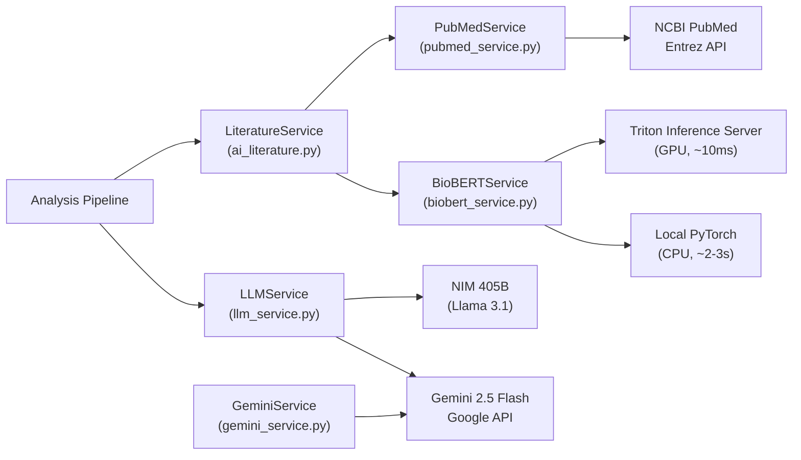
```mermaid
flowchart LR
    PIPELINE["Analysis Pipeline"]
    LIT["LiteratureService\n(ai_literature.py)"]
    PUBMED_SVC["PubMedService\n(pubmed_service.py)"]
    BIOBERT["BioBERTService\n(biobert_service.py)"]
    TRITON["Triton Inference Server\n(GPU, ~10ms)"]
    PYTORCH["Local PyTorch\n(CPU, ~2-3s)"]
    GEMINI_SVC["GeminiService\n(gemini_service.py)"]
    LLM_SVC["LLMService\n(llm_service.py)"]
    NIM["NIM 405B\n(Llama 3.1)"]
    GEMINI_API["Gemini 2.5 Flash\nGoogle API"]
    NCBI["NCBI PubMed\nEntrez API"]

    PIPELINE --> LIT
    PIPELINE --> LLM_SVC
    LIT --> PUBMED_SVC
    LIT --> BIOBERT
    PUBMED_SVC --> NCBI
    BIOBERT --> TRITON
    BIOBERT --> PYTORCH
    LLM_SVC --> NIM
    LLM_SVC --> GEMINI_API
    GEMINI_SVC --> GEMINI_API
```

---

### 9.2 Gemini Service (`gemini_service.py`)

**Purpose:** Generate structured clinical protein analysis using Google Gemini 2.5 Flash.

**Model:** `gemini-2.5-flash`

**Determinism settings:**
```python
generation_config = genai.GenerationConfig(
    temperature=settings.gemini_temperature,  # 0.0 — zero temperature
    top_k=1,                                  # Always picks the top token
)
```

`temperature=0.0` + `top_k=1` means the same input always produces the same output — **fully deterministic**. This is critical for report reproducibility (WS7: `SHA256(platform_version + acmg_rules + sorted_variants)` report hashing).

#### TOON format (Token-Oriented Object Notation)

Gemini prompts use TOON instead of JSON to reduce input token count by ~35%:

```
# JSON (verbose, ~50 tokens)
{"gene": "TP53", "protein": "Cellular tumor antigen p53", "uniprot": "P04637"}

# TOON (compact, ~15 tokens)
gene:TP53
protein:Cellular tumor antigen p53
uniprot:P04637
```

TOON rules: no quotes on keys, colon separator, no braces/commas, lists as comma-separated values, nested dicts as dot-notation.

#### `analyze_protein_structure()` function

**Input:** `(gene, uniprot_id, protein_name, sequence_length, organism, variant_position?, ref_aa?, alt_aa?)`

**Cache:** `@lru_cache(maxsize=512)` — LRU in-memory, process-lifetime. Key: all input parameters combined.

**Output:** Markdown-formatted protein analysis text containing:

| Section | Content |
|---|---|
| Protein Specifications | Gene symbol, protein name, UniProt ID, sequence length |
| Variant Analysis | Structural impact, functional consequences, domain context, conservation, physicochemical changes, predicted pathogenicity |
| Protein Function | Primary function, cellular processes, tissue expression, interactions, PTMs |
| Structural Architecture | Protein fold, functional regions, secondary/tertiary structure, domains, disordered regions |
| Molecular Mechanisms | Mechanism of action, cofactors, regulation, conformational changes |
| Clinical Significance | Associated diseases, known pathogenic variants, inheritance patterns, therapeutics, biomarkers |
| Additional Context | Research significance, isoforms, evolutionary conservation, drug targeting |

**Retry logic:** 3 attempts, exponential backoff (3s, 6s, 12s)

**Token tracking:** Records `prompt_token_count` and `candidates_token_count` from `response.usage_metadata` → logged via `metrics_service.record_request()`

**WS-12 translation hook:** After generation, text passes through `translation_formatter.format_text()` for multi-audience tier formatting (off by default until `TRANSLATION_FORMATTER_ENABLED=True`)

---

### 9.3 Unified LLM Service (`llm_service.py`)

**Purpose:** Provides a unified interface with PTCF prompting, model routing, and fallback logic.

#### PTCF Prompting Framework

PTCF (Problem, Task, Context, Format) is Google's recommended structured prompting approach:

```
=== PROBLEM ===
A missense variant has been identified at BRCA1:p.Arg1699Gln

=== TASK ===
Analyze the clinical significance and structural impact of this variant

=== CONTEXT ===
gene:BRCA1
uniprot:P38398
position:1699
ref_aa:R
alt_aa:Q
gnomad_af:0.00001
acmg_classification:Likely Pathogenic

=== OUTPUT FORMAT ===
Return a clinical narrative under 250 words with structural impact and recommendations

=== RESPONSE ===
Provide your analysis following the exact format specified above:
```

**`PTCFPrompt` class:** Takes `problem`, `task`, `context` (dict, converted to TOON), `output_format`, and optional `examples` (few-shot). `build_prompt()` assembles the full prompt string.

#### `analyze_protein_with_ptcf()` function

**Model routing (primary → fallback):**

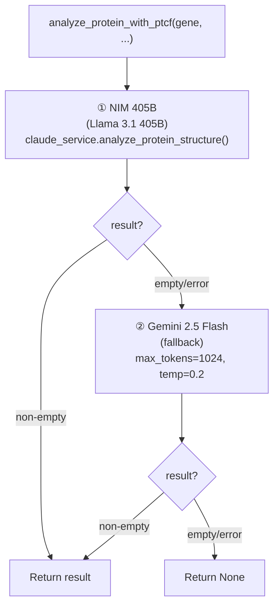
```mermaid
flowchart TD
    CALL["analyze_protein_with_ptcf(gene, ...)"]
    NIM["① NIM 405B\n(Llama 3.1 405B)\nclaude_service.analyze_protein_structure()"]
    NIM_OK{result?}
    GEMINI["② Gemini 2.5 Flash\n(fallback)\nmax_tokens=1024, temp=0.2"]
    GEM_OK{result?}
    NONE["Return None"]

    CALL --> NIM
    NIM --> NIM_OK
    NIM_OK -->|non-empty| RETURN["Return result"]
    NIM_OK -->|empty/error| GEMINI
    GEMINI --> GEM_OK
    GEM_OK -->|non-empty| RETURN
    GEM_OK -->|empty/error| NONE
```

**Fallback Gemini prompt** is shorter and more constrained than the full protein analysis prompt:
- Max output: 1024 tokens
- Temperature: 0.2 (slightly above zero for more natural language)
- Output: plain text paragraphs (no JSON, no bullets) — avoids PDF rendering bugs from malformed markup

**Cache:** `@lru_cache(maxsize=512)` — same as gemini_service

---

### 9.4 BioBERT Service (`biobert_service.py`)

**Purpose:** Clinical NLP — variant interpretation, semantic embeddings, and similar-variant retrieval.

**Model:** `dmis-lab/biobert-base-cased-v1.1` (420.5 MB)

**Loading:** Lazy — loaded on first call to `interpret_variant()` or explicitly via `load_model()`.

**Hardware:** CUDA if available, CPU fallback.

**Feature flag:** `BIOBERT_REQUIRED=False` — if False, import failures are warnings not errors. If True, startup fails if BioBERT cannot load.

#### Embedding path — Triton → PyTorch

```python
async def _get_real_embedding(text: str) -> Optional[List[float]]:
    # Path 1: Triton Inference Server (GPU-batched, TensorRT, ~10ms)
    triton = TritonInferenceClient(url="localhost:8001", model="biobert_embedding")
    if triton.is_server_live():
        return triton_embedding(text)  # INT64 input_ids → float embeddings

    # Path 2: Local PyTorch (CPU, ~2-3s per text)
    with torch.no_grad():
        outputs = model(**tokenized_inputs)
        return outputs.last_hidden_state[:, 0, :]  # CLS token
```

**Batch embeddings** (`get_batch_embeddings()`): tokenizes all texts in a single batch for GPU efficiency — one forward pass for N texts.

#### `interpret_variant()` — clinical significance pipeline

**Input:** `variant_text` (e.g. `"BRCA1 p.Arg1699Gln missense"`)

**Priority for clinical significance:**
1. ClinVar lookup via `clinvar_service.search_by_gene(gene)` — real clinical data
2. Consequence-based inference (`_infer_from_context()`) — uses VEP consequence keywords
3. Default: `UNCERTAIN`

**ClinVar confidence mapping:**

| ClinVar review status | Confidence |
|---|---|
| Practice guideline | 0.95 |
| Expert panel | 0.90 |
| Multiple submitters | 0.80 |
| Criteria provided | 0.70 |
| Conflicting | 0.50 |
| Other | 0.60 |

**Context-based inference rules:**
- Frameshift / nonsense / stop_gained / splice donor/acceptor / truncating → `LIKELY_PATHOGENIC` (0.75)
- Synonymous / benign / common / polymorphism → `LIKELY_BENIGN` (0.70)
- CYP2D6 / CYP2C19 / TPMT / DPYD etc. → `DRUG_RESPONSE` (0.72)
- Default → `UNCERTAIN` (0.50)

#### Similar variant retrieval (`find_similar_variants()`)

Uses real cosine similarity on BioBERT CLS-token embeddings:

```python
similarity = dot(query_emb, variant_emb) / (norm(query_emb) * norm(variant_emb))
```

Falls back to gene-match heuristic when embeddings unavailable:
- Same gene → 0.8
- Partial gene match → 0.5
- Different gene → 0.2

---

### 9.5 PubMed Service (`pubmed_service.py`)

**Purpose:** NCBI Entrez E-utilities integration for literature search and retrieval.

**Endpoints used:**
- `esearch.fcgi` — search for PMIDs by query
- `efetch.fcgi` — fetch full article XML by PMID list
- `esummary.fcgi` — fetch article summaries

**Rate limiting:** 400ms between requests (NCBI max = 3 req/s without API key). In `ai_literature.py`, a shared asyncio semaphore `_NCBI_PUBMED_SEMAPHORE(3)` enforces process-wide rate limiting.

**Cache:** In-memory dict, TTL 24h. Key: MD5 hash of `"{gene}:{variant}"`.

**Search query construction:**
```
("{gene}"[Gene] OR {gene}[Title/Abstract]) AND
("{variant}"[Title/Abstract] OR "variant"[Title/Abstract]) AND
("pathogenic" OR "clinical" OR "mutation")
```

**Article XML parsing** (`_parse_article_xml()`):
- Extracts: PMID, title, first 5 authors, journal, year, abstract (500 char limit), DOI
- Returns `PubMedArticle` dataclass

#### LiteratureEvidenceEngine

Higher-level analysis layer on top of `PubMedService`:

**`analyze_literature_evidence(gene, variant, max_articles=15)`:**
1. Fetches articles from PubMed
2. For each article: extracts key sentences, computes semantic similarity, classifies pathogenicity signal
3. Returns `LiteratureAnalysisResult` with aggregate scores for MoE integration

**Key sentence extraction** (`extract_key_sentences()`):
- Scores each sentence by: gene mention (+0.3), variant mention (+0.3), pathogenicity keyword (+0.15), conclusion indicator (+0.2), finding indicator (+0.15)
- Penalizes method-heavy sentences (-0.1)
- Returns top N sentences by score

**Semantic similarity** (`compute_semantic_similarity()`):
- Primary: BioBERT CLS-token cosine similarity
- Fallback: Jaccard similarity on word tokens

**Pathogenicity signal classification:**
- Counts pathogenic vs benign keyword occurrences in abstract + key sentences
- Returns `signal_score` (0=benign → 1=pathogenic) and `supports_pathogenicity` (True/False/None)

---

### 9.6 LiteratureService + MoE Integration (`ai_literature.py`)

**Purpose:** Top-level orchestrator for literature evidence. Integrates with the MoE ensemble as a weighted expert module.

**Global instance:** `literature_service = LiteratureService()`

**Cache layers:**
- `self.cache` — JSON file cache at `data/cache/literature/literature_cache.json` — persists across restarts
- `self._gene_literature_cache` — per-gene in-memory cache for within-batch deduplication (cleared after batch)
- `self._gene_locks` — per-gene asyncio locks preventing thundering herd (multiple variants for same gene triggering parallel PubMed searches)

#### MoE integration — `get_moe_literature_evidence()`

**MoE weight:** 0.10 (10% of ensemble score)

**Output (`LiteratureMoEResult`):**

| Field | Description |
|---|---|
| `normalized_score` | 0.0 (benign) → 1.0 (pathogenic), based on pathogenic/benign keyword ratio |
| `confidence` | 0.3 base + 0.05 per supporting paper, max 0.9 |
| `supporting_publications` | Count of papers with clear pathogenic/benign signal |
| `confidence_boost` | Extra 1% per paper if ≥3 supporting papers found, max 5% |
| `pmid_list` | PMIDs for PDF report citations |
| `key_findings` | Top 3 summary sentences for report display |

**Confidence boost formula:**
```python
if supporting_count >= 3:
    confidence_boost = min(0.05, supporting_count * 0.01)
# e.g., 12 papers → boost = min(0.05, 0.12) = 0.05 (5%)
```

**Ensemble contribution formula:**
```python
contribution = normalized_score * weight * confidence + confidence_boost
# e.g., score=0.8, weight=0.10, confidence=0.9, boost=0.05 → 0.072 + 0.05 = 0.122
```

**Per-gene deduplication (optimization 3.4):** Within a VCF batch, multiple variants for the same gene (e.g., BRCA1:var1, BRCA1:var2) share the same literature result. The first call fetches from PubMed; all subsequent calls for the same gene return cached result immediately. Per-gene asyncio lock prevents race when N worker coroutines all see a cache miss simultaneously.

**WS-12 translation formatting:** Summary text and citation text both pass through `translation_formatter.format_text()` before storage — currently off by default (`TRANSLATION_FORMATTER_ENABLED=False`).

#### `get_literature_summary()` — main retrieval function

**5-second timeout:** `asyncio.wait_for(..., timeout=5.0)` — PubMed searches that take too long return `status: "timeout"` with `pending: True` rather than blocking the pipeline.

**Output structure:**
```json
{
  "gene": "BRCA1",
  "variant": "p.Arg1699Gln",
  "literature": [
    {
      "source": "PMID:12345678",
      "pmid": "12345678",
      "title": "...",
      "summary": "...(500 char max)",
      "url": "https://pubmed.ncbi.nlm.nih.gov/12345678/"
    }
  ],
  "model_version": "BioBERT-v1.2",
  "timestamp": "2026-06-05T12:00:00",
  "status": "completed"
}
```

**Status values:** `completed | no_results | timeout | error`

---

### 9.7 LLM Service Summary

| Service | Model | Temperature | Cache | Typical latency |
|---|---|---|---|---|
| `gemini_service.py` | Gemini 2.5 Flash | 0.0 (deterministic) | LRU 512 | 2–5s per protein analysis |
| `llm_service.py` — NIM path | Llama 3.1 405B (NIM) | Varies | LRU 512 | 3–8s |
| `llm_service.py` — Gemini fallback | Gemini 2.5 Flash | 0.2 | Same | 2–4s |
| `biobert_service.py` — Triton | BioBERT via TensorRT | N/A (embedding) | None | ~10ms |
| `biobert_service.py` — PyTorch | BioBERT local | N/A (embedding) | None | ~2–3s |
| `ai_literature.py` | Gemini + BioBERT + PubMed | N/A | File + in-memory | 2–8s (5s timeout) |
| `pubmed_service.py` | NCBI Entrez | N/A | In-memory 24h | 1–3s (rate limited) |

**Retry policy across all LLM services:** 3 attempts, exponential backoff (3s → 6s → 12s), never throws on final failure — returns `None` and lets the pipeline continue.

---

*[Section 9 complete — Section 10 (V2 Enhancement Modules M1–M8) coming next]*

---

## 10. V2 Enhancement Modules (M1–M8)

### 10.1 Architecture & Design Principles

The V2 Enhancement Modules are 8 additive enrichment layers that bolt onto the core variant analysis pipeline. They are designed with three invariants:

1. **Additive-only:** No module modifies the existing ACMG classifier or the pipeline's core output. They append evidence as optional fields.
2. **Fail-safe:** Every module is wrapped in a try/except at the pipeline call site. A failing module never aborts the parent analysis.
3. **Feature-gated:** Every module has its own `V2_M#_*_ENABLED` flag that defaults to `False`.

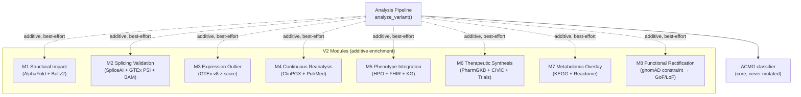
```mermaid
flowchart TB
    PIPELINE["Analysis Pipeline\nanalyze_variant()"]
    ACMG["ACMG classifier\n(core, never mutated)"]

    subgraph V2["V2 Modules (additive enrichment)"]
        M1["M1 Structural Impact\n(AlphaFold + Boltz2)"]
        M2["M2 Splicing Validation\n(SpliceAI + GTEx PSI + BAM)"]
        M3["M3 Expression Outlier\n(GTEx v8 z-score)"]
        M4["M4 Continuous Reanalysis\n(ClinPGX + PubMed)"]
        M5["M5 Phenotype Integration\n(HPO + FHIR + KG)"]
        M6["M6 Therapeutic Synthesis\n(PharmGKB + CIViC + Trials)"]
        M7["M7 Metabolomic Overlay\n(KEGG + Reactome)"]
        M8["M8 Functional Rectification\n(gnomAD constraint → GoF/LoF)"]
    end

    PIPELINE --> ACMG
    PIPELINE -.->|"additive, best-effort"| M1
    PIPELINE -.->|"additive, best-effort"| M2
    PIPELINE -.->|"additive, best-effort"| M3
    PIPELINE -.->|"additive, best-effort"| M4
    PIPELINE -.->|"additive, best-effort"| M5
    PIPELINE -.->|"additive, best-effort"| M6
    PIPELINE -.->|"additive, best-effort"| M7
    PIPELINE -.->|"additive, best-effort"| M8
```

**§8 conflict matrix rule:** All V2 modules surface results as `acmg_upgrade_candidates` (M2) or enrichment fields. None of them call `enhanced_acmg_classifier.py` or modify the `acmg_classification` field.

**Warning provenance:** Every module emits machine-readable warning tokens like `"binding_delta_source:precomputed_cache"` or `"baseline_source:gtex_v8_bundled"`. These propagate to the stored variant document and can be used to audit exactly which data source drove each field.

**Contracts:** All modules use typed Pydantic request/response schemas from `app/schemas/v2_module_contracts.py`:
- `M1Request` / `M1Response`
- `M2Request` / `M2Response`
- ... through `M8Request` / `M8Response`
- `V2RunStatus` enum: `COMPLETED | FAILED | SKIPPED`

---

### 10.2 M1 — Structural Impact

**File:** `app/services/v2_m1_structural_impact_service.py`  
**Flag:** `V2_M1_STRUCTURAL_IMPACT_ENABLED`  
**Pipeline field:** `m1_structural_impact`

**Purpose:** Classify site disruption caused by a missense variant using AlphaFold pLDDT scores, Boltz2 binding affinity delta, and amino acid change severity.

#### Input (`M1Request`)

| Field | Required | Description |
|---|---|---|
| `job_id` | Yes | Parent job identifier |
| `variant_id` | Yes | Canonical variant ID |
| `gene_symbol` | Yes | HGNC gene symbol |
| `hgvs_p` | Yes | HGVS protein notation (e.g. `p.Arg273Cys`) |
| `reference_protein_sequence` | Optional | WT protein sequence for Boltz2 |
| `run_binding_delta` | bool | Whether to run Boltz2 binding delta |
| `run_site_disruption` | bool | Whether to classify site type |

#### HGVS parsing

Parses both 3-letter (`p.Arg273Cys`) and 1-letter (`p.R273C`) HGVS protein notation. Extracts: `ref_aa`, `residue_index`, `alt_aa`.

#### pLDDT resolution

1. `get_uniprot_for_gene(gene_symbol)` → UniProt ID
2. `get_alphafold_model(uniprot_id)` → AlphaFold model dict with `global_metric` (pLDDT)
3. Fallback: `wt_plddt = 70.0` with `wt_plddt_fallback_used` warning

**Mutant pLDDT prediction:** `wt_plddt - penalty` where:
- Penalty = 2.0 if either ref or alt amino acid is G, P, or C (structurally disruptive)
- Penalty = 1.0 otherwise

#### Binding delta resolution

Priority chain:
1. **Pre-computed cache** (`data/m1/binding_delta_cache.json`) — key: `"{gene}_{hgvs_p}"`
2. **Boltz2 live call** — runs WT sequence and mutant sequence through `boltz2_service.predict_structural_impact()`, returns `mut_affinity - wt_affinity`
3. **Auto-fetch WT sequence** from UniProt if not provided in request (2s timeout)
4. **Deterministic fallback:** `round((residue_index % 17 - 8) / 8.0 + aa_component, 3)` — formula based on position and amino acid ASCII delta

#### Site disruption classification (depth-hardened)

Enabled when `V2_M1_SITE_DISRUPTION_DEPTH_ENABLED=True` (default).

**Candidate site types by residue position:**

| Residue range | Site type | pLDDT threshold |
|---|---|---|
| ≤ 80 or catalytic hit | `active_site` | 70.0 |
| 90–260 | `allosteric_site` | 60.0 |
| ≥ 260 or binding delta ≥ 1.8 | `interface` | 75.0 |

**Catalytic residue set** (configurable): `H,D,E,S,C,Y,K,N` via `V2_M1_CATALYTIC_RESIDUES`

**Impact score formula:**
```
score = 0.30
      + plddt_component (0.0–0.22, based on local pLDDT above threshold)
      + delta_component (0.0–0.30, from binding delta magnitude)
      + aa_severity (0.15–0.55, based on amino acid group change)
      + site_bonus (0.03–0.12, type-specific)
```

**Amino acid change severity:**
- Same group → 0.15
- Charge reversal (positive ↔ negative) → 0.55
- Proline/Glycine involved → 0.45
- Cross-group → 0.35

#### Output (`M1Response`)

```python
M1Response(
    wild_type_plddt_avg: float,      # 0-100
    mutant_plddt_avg: float,         # predicted
    binding_delta_kcal_mol: float,   # mutant - WT binding affinity
    site_disruptions: [M1SiteDisruption],  # sorted by impact_score desc
    wild_type_structure_uri: str,
    mutant_structure_uri: str,
    warnings: ["binding_delta_source:...", "site_disruption_source:..."]
)
```

---

### 10.3 M2 — Splicing Validation

**File:** `app/services/v2_m2_splicing_service.py`  
**Flag:** `V2_M2_SPLICING_VALIDATION_ENABLED`  
**Pipeline field:** `m2_splicing_validation`

**Purpose:** Validate splice-site impact using SpliceAI scores, GTEx junction PSI baseline, and optional BAM-level RNA-seq validation.

#### VEP gate (fast short-circuit)

Before SpliceAI lookup, VEP consequence is checked. If consequence is NOT in `{splice_donor_variant, splice_acceptor_variant, splice_region_variant}`, returns immediately with `mis_splicing_confirmed=False`. This short-circuits ~90% of variants.

#### SpliceAI score resolution

Three-tier:

| Source | Config | Tag |
|---|---|---|
| Pre-computed tabix VCF | `SPLICEAI_SCORES_PATH` (bgzipped + tbi) | `precomputed_spliceai_tabix` |
| Tabix miss | — | `splice_score_tabix_miss:fallback` |
| Deterministic fallback | — | `splice_score_source:deterministic_fallback` |

**SpliceAI output channels:**
- `donor_loss`, `donor_gain`, `acceptor_loss`, `acceptor_gain` — delta scores 0–1
- `pos_donor_loss`, `pos_acceptor_gain` etc. — signed distance (bp) to nearest splice boundary

**Deterministic fallback formula:** Based on `pos % 97` + amino acid ASCII delta, normalized to 0–1.

#### Distance-to-boundary

- If real SpliceAI DP_* positions available → `min(abs(positions))`
- From VEP consequence: `splice_donor/acceptor_variant` → 1bp, `splice_region_variant` → 5bp

#### ACMG upgrade candidates

ClinGen SVI splicing thresholds:
- `delta_PSI ≥ 0.5` + canonical splice site → `["PVS1", "PS3_Moderate"]`
- `delta_PSI ≥ 0.5` + non-canonical → `["PS3_Moderate"]`
- `delta_PSI ≥ 0.2` → `["PS3_Supporting"]`

#### RNA-seq validation (async BackgroundTask)

Triggered when `rna_bam_uri` is provided. Runs asynchronously via FastAPI `BackgroundTasks` — does not block the M2 sync response.

**BAMJunctionCounter:** Uses `pysam.AlignmentFile` to count junction-spanning reads in a window around the variant. Supports S3 URIs and HTTPS URLs via htslib byte-range reads.

**PSI formula:**
```
PSI(j) = junction_reads(j) / (junction_reads(j) + flanking_exon_reads(j))
```

**GTEx junction PSI baseline** (`_GTExJunctionPSIBackend`): 3-tier resolver (env override → bundled `data/m2/gtex_v8_junction_psi.json` → deterministic `(0.95, 0.05)`). Returns `(mean_psi, std_psi, source_tag)`.

**Persist:** Results written to `db["m2_rna_validation"]` (upsert by `job_id`). Polling endpoint reads from the same collection.

#### Output (`M2Response`)

```python
M2Response(
    mis_splicing_confirmed: bool,      # delta_PSI >= 0.5 for any channel
    splice_events: [M2SpliceEvent],    # channels above moderate threshold
    acmg_upgrade_candidates: ["PVS1", "PS3_Moderate"],
    rna_validation_status: "pending" | "completed" | "skipped",
    warnings: [...]
)
```

---

### 10.4 M3 — Expression Outlier Detection

**File:** `app/services/v2_m3_expression_outlier_service.py`  
**Flag:** `V2_M3_EXPRESSION_OUTLIER_ENABLED`  
**Pipeline field:** `m3_expression_outlier`

**Purpose:** Detect expression outliers from patient RNA-seq vs GTEx v8 reference distribution. Produces z-score, percentile, and outlier direction.

#### Input

| Field | Description |
|---|---|
| `rna_counts_uri` | Path to patient RNA count matrix (file://, local path) |
| `gene_symbol` | Gene to evaluate |
| `control_cohort` | Reference cohort (default `GTEx_v8`) |

**Supported matrix formats:** TSV, CSV, JSON (dict or list[dict]). Required columns: gene column (`gene`, `gene_symbol`, `name`) + value column (`zscore`, `z_score`, `log2fc`, `log2_fc`, `value`, `abundance`).

**Remote URIs:** S3 and HTTPS URIs degrade to a warning + neutral response (not yet implemented).

#### Reference baseline resolution (`_GTExBaselineBackend`)

3-tier per `(gene, tissue)`:

| Source | Config | Tag |
|---|---|---|
| Env override file | `GTEX_V8_LOCAL_PATH` | `gtex_v8_local` |
| Bundled JSON | `data/m3/gtex_v8_baselines.json` | `gtex_v8_bundled` |
| Hardcoded deterministic | Per-gene defaults (13 genes) | `deterministic_fallback` |

**Hardcoded deterministic baselines** (log-TPM, whole blood):
BRCA1 (μ=2.40, σ=0.42), BRCA2 (1.85, 0.38), TP53 (5.80, 0.55), MYBPC3 (4.20, 0.60), MLH1 (3.10, 0.45), MSH2 (3.05, 0.42), GJB2 (4.85, 0.70), CYP2C19 (3.50, 0.80), DMD (1.50, 0.95), CFTR (1.65, 0.55). Unknown genes → (μ=3.00, σ=0.75).

#### Classification thresholds (ClinGen SVI)

| |z-score| | Direction | Functional evidence |
|---|---|---|
| ≥ 2.0 | `underexpressed` | `True` (PS3-supporting) |
| ≥ 2.0 | `overexpressed` | `False` (over-expression ≠ inactivation) |
| 1.5–2.0 | Either | Warning only (supporting tier) |
| < 1.5 | `none` | `False` |

**Note:** `functional_evidence_supported=True` is set **only** for underexpression beyond the strong threshold (|z| ≥ 2.0, direction=underexpressed). Overexpression is reported but does not trigger functional evidence.

#### Output (`M3Response`)

```python
M3Response(
    z_score: float,                      # patient vs reference
    percentile: float,                   # 0–100
    outlier_direction: "underexpressed" | "overexpressed" | "none",
    functional_evidence_supported: bool,
    warnings: ["baseline_source:gtex_v8_bundled", ...]
)
```

---

### 10.5 M4 — Continuous Reanalysis (VUS Monitoring)

**File:** `app/services/v2_m4_continuous_reanalysis_service.py`  
**Scheduler:** `app/core/scheduler.py` — cron at 02:00 UTC daily  
**Flag:** `V2_M4_CONTINUOUS_REANALYSIS_ENABLED`  
**Pipeline field:** `m4_continuous_reanalysis`

**Purpose:** Monitor VUS variants for classification changes. Polls ClinPGX (for reclassification events) and PubMed (for new publications) on a configurable interval.

#### Monitor ID

Deterministic SHA-1 of `"{job_id}:{variant_id}"`, first 12 hex chars: `"m4-monitor-{digest}"`. Stable across re-submissions of the same variant.

#### Evidence sources

**ClinPGX:**
- Gated by `CLINPGX_INTEGRATION_ENABLED=true` env var
- Queries `https://api.clinpgx.org/v1/data/variant/?symbol={rsid}` (only by rsID — gene name queries cause false misses)
- Rate-limited: 0.51s delay between calls (`CLINPGX_RATE_LIMIT_DELAY`)
- Maps free-text ClinVar significance to ACMG standard terms
- Emits `M4ChangeEvent` only on **change** from prior classification
- Change direction: `upgrade` (toward Pathogenic) / `downgrade` / `neutral`

**PubMed:**
- Queries NCBI Entrez `esearch.fcgi` with NCBI API key if set
- Search term uses the most specific identifier available: rsID > HGVS_C > genomic position
- Date-bounded: first call covers last 365 days; subsequent calls since `last_pubmed_check`
- Returns `M4ChangeEvent` with first 3 PMIDs and count in `event_ref`

#### Queue management (`vus_monitoring_queue` collection)

| Field | Description |
|---|---|
| `variant_id` | VCF variant ID |
| `status` | `monitoring` → `pending_reeval` on change |
| `last_checked_at` | UTC timestamp of last check |
| `next_check_at` | Next scheduled check time |
| `prior_clinpgx_classification` | Last known ClinPGX classification |
| `last_pubmed_check` | UTC timestamp of last PubMed search |
| `last_change_detected` | When a change event was last detected |

**VUS enrollment** (`vus_monitoring_enrollment.py`): Called after analysis completes when `VUS_MONITORING_ENROLLMENT_ENABLED=True`. Inserts variants classified as VUS into the queue with `next_check_at = now + VUS_MONITORING_POLL_INTERVAL_HOURS`. Idempotent — uses upsert, never overwrites an in-flight monitoring record.

#### Safety envelope

When change events are detected:
1. Status → `pending_reeval`
2. Notification written to `m4_notification_outbox` (for downstream delivery)
3. Warnings: `["do_not_render_without_clinician_review", "m4_evidence_pending:reclassification_unverified"]` — prevents auto-rendering without human review

#### Output (`M4Response`)

```python
M4Response(
    monitor_id: "m4-monitor-abc123",
    next_check_at: datetime,
    change_events: [M4ChangeEvent(source, event_type, event_ref)],
    warnings: ["do_not_render_without_clinician_review", ...]
)
```

---

### 10.6 M5 — Phenotype Integration

**File:** `app/services/v2_m5_phenotype_integration_service.py`  
**Flag:** `V2_M5_PHENOTYPE_INTEGRATION_ENABLED`  
**Pipeline field:** `m5_phenotype_integration`

**Purpose:** Map patient phenotype (HPO terms, clinical notes, or FHIR bundle) to variant-disease associations. Scores variant relevance against the patient's phenotype profile.

#### Three input modes

| Mode | Field | Processing |
|---|---|---|
| Direct HPO | `provided_hpo_terms` | Normalize via alias map, de-duplicate |
| Clinical note | `clinical_note_text` | AWS Comprehend Medical → ICD-10 → HPO crosswalk |
| FHIR bundle | `fhir_bundle_uri` | Parse FHIR R4 Condition/Observation → HPO codes |

**HPO normalization** (`_normalize_hpo_term()`): Redirects deprecated/alt HPO IDs via `data/m5/hpo_aliases.json`. Rejects malformed tokens (non `HP:*` format) with a warning count.

**ICD-10 → HPO crosswalk:** `data/m5/icd10_to_hpo.json` — static bundled crosswalk.

**FHIR extraction:** Walks `Bundle.entry[].resource` for `Condition` and `Observation` resources. Extracts HPO codes from `code.coding[]` where system is `http://purl.obolibrary.org/obo/hp.owl` or equivalent. Phase 1: local file URIs only. Remote (s3://, https://) → warning + empty result.

**FHIR bundle sandbox path:** `M5_FHIR_BUNDLE_LOCAL_ROOT` env var — if set, rejects paths outside this root for security.

#### Phenotype similarity scoring

**Primary:** Neo4j KG traversal (when `NEO4J_KG_ENABLED` is not `false`):
```cypher
MATCH (v:Variant {variant_id: $variant_id})
OPTIONAL MATCH (v)-[:LOCATED_IN]->(g:Gene)
OPTIONAL MATCH (v)-[:ASSOCIATED_WITH]->(direct_h:HPOTerm)
OPTIONAL MATCH (v)-[:CAUSES]->(d:Disease)-[:MANIFESTS_AS]->(disease_h:HPOTerm)
RETURN g.gene_symbol, direct + via_disease AS hpo_ids
```
Scores with Jaccard similarity: `|A ∩ B| / |A ∪ B|` between patient HPO set and gene-associated HPO set.

**Fallback:** Deterministic Jaccard against bundled `data/m5/gene_hpo_baseline.json`. Returns top 20 genes sorted by score.

**Provenance:** `"phenotype_similarity_source:neo4j_kg"` or `":deterministic_fallback"` in warnings.

#### Output (`M5Response`)

```python
M5Response(
    normalized_hpo_terms: ["HP:0001250", "HP:0002077"],   # canonical
    phenotype_similarity_score: 0.4285,                    # Jaccard
    prioritized_genes: ["BRCA1", "BRCA2", "TP53"],         # top 20
    warnings: ["phenotype_similarity_source:neo4j_kg"]
)
```

---

### 10.7 M6 — Therapeutic Synthesis

**File:** `app/services/v2_m6_therapeutic_synthesis_service.py`  
**Flag:** `V2_M6_THERAPEUTIC_SYNTHESIS_ENABLED`  
**Pipeline field:** `m6_therapeutic_synthesis`

**Purpose:** Surface evidence-tagged therapeutic options from real clinical databases. No hardcoded therapy tables — all data is live.

#### Evidence sources

| Source | Method | Data |
|---|---|---|
| **PharmGKB / CPIC** | In-memory (`pharmgkb_service`, eager-loaded) | Clinical annotations by gene + variant (rsID). CPIC tag when CPIC dosing guideline exists. Evidence levels 1A–4. |
| **OpenFDA** | Sync via `openfda_service.get_label_data()` | FDA mechanism-of-action text folded into rationale |
| **CIViC** | Live GraphQL `https://civicdb.org/api/graphql` | PREDICTIVE, ACCEPTED evidence items. Gene → variants → molecular profiles → evidence items. |
| **ClinicalTrials.gov** | Live REST v2 `https://clinicaltrials.gov/api/v2/studies` | Active trials (RECRUITING / ENROLLING) for gene + optional diagnosis |

**Best-evidence deduplication:** For each drug name (lowercased), only the strongest evidence-level annotation is kept (`1A > 1B > 2A > 2B > 3 > 4`). Variant-specific PharmGKB annotations take priority over gene-level ones on ties.

**Trial filter:** Only RECRUITING, NOT_YET_RECRUITING, ENROLLING_BY_INVITATION, AVAILABLE trials returned — closed/terminated trials excluded.

**Fail-safe per source:** Any source raising an HTTP error gets a warning (`m6_civic_unavailable`, `m6_clinicaltrials_unavailable`) — the other sources still contribute.

#### Output (`M6Response`)

```python
M6Response(
    therapy_options: [M6TherapyOption(
        source: "CPIC" | "PharmGKB" | "CIViC",
        therapy: "Warfarin",
        rationale: "PharmGKB clinical annotation (gene CYP2C9) — reduced metabolism | FDA MoA: ...",
        evidence_level: "1A"
    )],
    trial_matches: ["NCT04123456", "NCT04567890"],
    warnings: ["m6_civic_unavailable"]
)
```

---

### 10.8 M7 — Metabolomic Overlay

**File:** `app/services/v2_m7_metabolomic_overlay_service.py`  
**Flag:** `V2_M7_METABOLOMIC_OVERLAY_ENABLED`  
**Pipeline field:** `m7_metabolomic_overlay`

**Purpose:** Score KEGG/Reactome pathway disruption using patient metabolomics profile.

#### Metabolomics profile loading

Reads CSV/TSV/JSON from `metabolomics_input_uri` (local file, HTTPS, or S3). Required columns: compound ID (`kegg_id`, `compound_id`, `metabolite_id`) + signal (`zscore`, `log2fc`, `value`).

KEGG compound IDs normalized: `cpd:C00031` → `C00031`. Only `C######` format retained.

S3 support: uses `boto3.client("s3")` via `asyncio.to_thread` — non-blocking.

#### Pathway membership resolution

- **KEGG:** `https://rest.kegg.jp/link/compound/{pathway_id}`. Organism-specific IDs (e.g. `hsa00010`) normalized to map IDs (`map00010`) since organism-specific entries don't list compounds.
- **Reactome:** `https://reactome.org/ContentService/data/participants/{pathway_id}` → ChEBI compound IDs.

**Pathway seeding order:**
1. `request.pathway_ids` (caller-provided)
2. KEGG gene→pathway: `hsa:<entrez_id>` via `KEGG/find/genes/{symbol}` → `KEGG/link/pathway/{gene_id}`
3. Profile-derived: rank pathways by how many of the profile's own compounds they contain (max 8)

#### Scoring

```python
impact_score = min(1.0, mean(abs(overlapping_signals)) / 4.0)  # saturates at z=4
direction = "upstream_accumulation"  if net >= 0.5
          = "downstream_depletion"   if net <= -0.5
          = "mixed"                  otherwise
```

#### Output (`M7Response`)

```python
M7Response(
    pathway_disruptions: [M7PathwayDisruption(
        pathway_id: "hsa00010",
        impact_score: 0.72,
        direction: "downstream_depletion"
    )],
    warnings: ["m7_no_metabolite_overlap:hsa04110"]
)
```

---

### 10.9 M8 — Functional Rectification

**File:** `app/services/v2_m8_functional_rectification_service.py`  
**Flag:** `V2_M8_FUNCTIONAL_RECTIFICATION_ENABLED`  
**Pipeline field:** `m8_functional_rectification`

**Purpose:** Classify variant mechanism as Gain-of-Function (GoF) or Loss-of-Function (LoF) using live gnomAD gene-constraint metrics, then recommend evidence-tagged therapeutic interventions.

#### Mode resolution

```mermaid
flowchart TD
    HINT{mode_hint = GoF/LoF?}
    USE_HINT["Use caller-provided hint\nevidence = 'caller_provided_mode_hint'"]
    GNOMAD["Query gnomAD GraphQL\n(pLI, oe_lof_upper, mis_z)\nfor GRCh38"]
    AVAIL{constraint\navailable?}
    LOF_CHECK{pLI >= 0.9\nOR LOEUF < 0.35?}
    GOF_CHECK{mis_z >= 3.09?}
    LOF["LoF\nevidence: gnomad_lof_intolerant(pLI=...,LOEUF=...)"]
    GOF["GoF\nevidence: gnomad_missense_constrained(mis_z=...)"]
    UNC["uncertain\nevidence: gnomad_unconstrained(...)"]
    WARN["warning: m8_gnomad_unavailable\nmode = uncertain"]

    HINT -->|Yes| USE_HINT
    HINT -->|No| GNOMAD
    GNOMAD --> AVAIL
    AVAIL -->|Yes| LOF_CHECK
    AVAIL -->|No| WARN
    LOF_CHECK -->|Yes| LOF
    LOF_CHECK -->|No| GOF_CHECK
    GOF_CHECK -->|Yes| GOF
    GOF_CHECK -->|No| UNC
```

**gnomAD constraint thresholds:**

| Metric | Threshold | Interpretation |
|---|---|---|
| `pLI` | ≥ 0.9 | LoF-intolerant → haploinsufficiency → LoF |
| `oe_lof_upper` (LOEUF) | < 0.35 | LoF-intolerant → haploinsufficiency → LoF |
| `mis_z` | ≥ 3.09 | Missense-constrained but not LoF-intolerant → GoF |

#### Evidence-tagged interventions

| Mode | Interventions |
|---|---|
| **GoF** | ① `small_molecule_inhibitor` — selective inhibitor of activated product; ② `competitive_antagonist` — allosteric modulator |
| **LoF** | ① `chaperone_or_corrector` — restore folding/trafficking; ② `protein_replacement` — recombinant/gene therapy/mRNA |
| **uncertain** | `conservative_monitoring` — functional follow-up before therapeutic action |

#### Safety flags

All modes: `["mechanism_evidence:{evidence}", "do_not_render_without_clinician_review"]`

Uncertain mode: adds `"mode_uncertain:no_therapeutic_action_advised"`

#### Output (`M8Response`)

```python
M8Response(
    predicted_mode: "GoF" | "LoF" | "uncertain",
    interventions: [M8Intervention(
        intervention_type: "small_molecule_inhibitor",
        recommendation: "Evaluate selective inhibitor...",
        evidence_level: "gnomad_lof_intolerant(pLI=0.97,LOEUF=0.12)"
    )],
    safety_flags: ["mechanism_evidence:...", "do_not_render_without_clinician_review"],
    warnings: ["m8_mode_resolved_from:gnomad_lof_intolerant(...)"]
)
```

---

### 10.10 V2 Module Summary Table

| Module | Flag | Data sources | Output key | Additive to ACMG |
|---|---|---|---|---|
| M1 Structural Impact | `V2_M1_STRUCTURAL_IMPACT_ENABLED` | AlphaFold pLDDT, Boltz2, binding delta cache | `m1_structural_impact` | Evidence only |
| M2 Splicing Validation | `V2_M2_SPLICING_VALIDATION_ENABLED` | SpliceAI tabix, GTEx PSI, BAM RNA-seq | `m2_splicing_validation` | `acmg_upgrade_candidates` |
| M3 Expression Outlier | `V2_M3_EXPRESSION_OUTLIER_ENABLED` | Patient RNA matrix, GTEx v8 baselines | `m3_expression_outlier` | `functional_evidence_supported` |
| M4 Continuous Reanalysis | `V2_M4_CONTINUOUS_REANALYSIS_ENABLED` | ClinPGX (rsID), PubMed Entrez | `m4_continuous_reanalysis` | Change events flagged for clinician |
| M5 Phenotype Integration | `V2_M5_PHENOTYPE_INTEGRATION_ENABLED` | HPO terms, FHIR bundle, ICD-10→HPO, KG | `m5_phenotype_integration` | Prioritized gene list |
| M6 Therapeutic Synthesis | `V2_M6_THERAPEUTIC_SYNTHESIS_ENABLED` | PharmGKB/CPIC, CIViC, OpenFDA, ClinicalTrials.gov | `m6_therapeutic_synthesis` | Ranked therapy options |
| M7 Metabolomic Overlay | `V2_M7_METABOLOMIC_OVERLAY_ENABLED` | Patient metabolomics, KEGG REST, Reactome | `m7_metabolomic_overlay` | Pathway disruption scores |
| M8 Functional Rectification | `V2_M8_FUNCTIONAL_RECTIFICATION_ENABLED` | gnomAD constraint (pLI, LOEUF, mis_z) | `m8_functional_rectification` | GoF/LoF interventions |

---

*[Section 10 complete — Section 11 (Knowledge Graph Layer) coming next]*

---

## 11. Knowledge Graph Layer

### 11.1 Overview

GeneGenius maintains a multi-layer knowledge graph (KG) that links genomic variants to genes, diseases, drugs, phenotypes, clinical trials, publications, and patients. The KG enables 4-hop transitive reasoning — e.g., `Variant → Gene → Disease → Drug → Clinical Trial` — that cannot be expressed in a flat relational schema.

```
KG_BACKEND config:
  "networkx"  → in-memory NetworkX (default, no infra required)
  "neo4j"     → Neo4j graph database (production, bolt driver)
  "disabled"  → KG features disabled entirely
```

**Files:**

```
app/db/
├── graph_networkx.py          — NetworkX in-memory backend
├── neo4j.py                   — Neo4j bolt driver integration
├── neo4j_extended.py          — Extended Neo4j queries (transitive reasoning)
├── neo4j_http_driver.py       — HTTP fallback for Neo4j
└── kg_schema.py               — 4-layer schema (node + relationship dataclasses)

app/models/
├── kg_enhanced_nodes.py       — Pydantic node models (10 types, enhanced)
├── kg_enhanced_relationships.py — Pydantic relationship models (14 types)
└── kg_enhanced.py             — Combined KG model definitions

app/services/knowledge_graph/
├── knowledge_graph_service.py
├── kg_analysis_service.py
├── kg_enhanced_queries.py
├── enhanced_kg_service.py
├── gene_disease_service.py
├── kg_stats_service.py
├── kg_visualization_service.py
├── kg_export_service.py
├── vcf_kg_integration.py
└── analysis_service_with_kg.py
```

---

### 11.2 4-Layer Architecture

The KG is organized in 4 semantic layers:

```mermaid
graph TB
    subgraph L1["Layer 1 — Genomic"]
        V["Variant\nchrom:pos:ref>alt\n+ ACMG, gnomAD AF,\nAlphaMissense score"]
        G["Gene\nHGNC symbol, Ensembl ID\npLI, LOEUF, druggable"]
        PW["Pathway\nKEGG/Reactome ID\ngene count, disease links"]
    end

    subgraph L2["Layer 2 — Phenotypic"]
        HPO["HPO Term\nhpo_id, hierarchy\nfrequency, category"]
        D["Disease\nOMIM/MONDO/ICD-10\ninheritance, prevalence"]
    end

    subgraph L3["Layer 3 — Therapeutic"]
        DR["Drug\nDrugBank/PharmGKB\nMoA, PGx variants"]
        CT["Clinical Trial\nNCT ID, phase\ntargeted genes/variants"]
    end

    subgraph L4["Layer 4 — Immunity"]
        HLA["HLA Allele\nIPD-IMGT/HLA\nautoimmune/drug risk"]
        IG["Immune Gene\nImmPort\nfunction, pathways"]
        IP["Immunity Profile\npatient-level\ncomponent scores"]
    end

    V -- LOCATED_IN --> G
    G -- PART_OF_PATHWAY --> PW
    V -- CAUSES --> D
    V -- ASSOCIATED_WITH --> HPO
    D -- MANIFESTS_AS --> HPO
    DR -- TREATS --> D
    DR -- TARGETS --> G
    V -- AFFECTS_EFFICACY/TOXICITY --> DR
    DR -- TESTED_IN --> CT
    HLA -- RISK_FOR --> D
    HLA -- HYPERSENSITIVITY_RISK_FOR --> DR
    V -- AFFECTS_IMMUNITY --> IP
```

---

### 11.3 Node Types — Schema Reference

#### Enhanced nodes (`app/models/kg_enhanced_nodes.py`)

All nodes are Pydantic `BaseModel` instances. Field counts indicate the richness of each model:

| Node type | Class | Key fields | Approximate field count |
|---|---|---|---|
| `Variant` | `EnhancedVariantNode` | variant_id, chrom/pos/ref/alt, gene_symbol, acmg_classification, pathogenicity_score, confidence_score, clinvar_significance, gnomad_af, alphamissense_score, classification_history, patient_ids, pmid_references, is_actionable | ~40 |
| `Gene` | `EnhancedGeneNode` | gene_symbol, ensembl_id, entrez_id, hgnc_id, chromosome, start/end position, biotype, omim_phenotypes, inheritance_patterns, pli_score, oe_lof_score, druggable, drug_targets, acmg_gene_list | ~25 |
| `Protein` | `EnhancedProteinNode` | uniprot_id, alphafold_model_url, plddt_score, length, domains, active_sites, binding_sites, phosphorylation_sites, pathogenic_hotspots, drug_targets | ~20 |
| `Disease` | `EnhancedDiseaseNode` | omim_id, mondo_id, orpha_id, icd10_codes, inheritance_pattern, prevalence, hpo_terms, causal_genes, acmg_guidelines, genetic_testing_criteria | ~25 |
| `Drug` | `EnhancedDrugNode` | drugbank_id, chembl_id, approval_status, mechanism_of_action, target_proteins, pgx_variants, dosing_genes, contraindications, drug_interactions | ~20 |
| `Phenotype` | `EnhancedPhenotypeNode` | hpo_id, definition, category, parent_terms, child_terms, synonyms, associated_diseases, associated_genes | ~15 |
| `Pathway` | `EnhancedPathwayNode` | pathway_id, source (KEGG/Reactome), category, gene_count, disease_associations, upstream/downstream pathways | ~15 |
| `Publication` | `EnhancedPublicationNode` | pmid, title, authors, journal, year, citation_count, study_type, evidence_level, biobert_relevance_score, mentioned_genes/diseases/drugs | ~15 |
| `ClinicalTrial` | `EnhancedClinicalTrialNode` | nct_id, status, phase, conditions, interventions, targeted_genes, targeted_variants | ~15 |
| `Patient` | `EnhancedPatientNode` | anonymous_id, age_range, sex, ethnicity, variant_count, hpo_terms, primary_diagnosis (all anonymized, HIPAA/GDPR) | ~12 |

**Schema-layer nodes** (`app/db/kg_schema.py` — dataclass versions for Neo4j serialization):

| Node | Layer |
|---|---|
| `VariantNode`, `GeneNode`, `PathwayNode` | Layer 1 — Genomic |
| `HPOTermNode`, `DiseaseNode` | Layer 2 — Phenotypic |
| `DrugNode`, `ClinicalTrialNode` | Layer 3 — Therapeutic |
| `HLAAlleleNode`, `ImmuneGeneNode`, `ImmunityProfileNode` | Layer 4 — Immunity |
| `ClinicalOutcomeNode`, `InterpretationNode` | Outcome / Provenance |

**`InterpretationNode`** (GG-Insight Ledger): Immutable interpretation record with `previous_hash` and `current_hash` fields — blockchain-inspired audit trail for classification history.

---

### 11.4 Relationship Types

Defined in both `app/db/kg_schema.py` (`RelationshipType` class) and `app/models/kg_enhanced_relationships.py` (`RelationshipType` enum):

| Category | Relationships |
|---|---|
| **Genomic** | `LOCATED_IN` (Variant→Gene), `PART_OF_PATHWAY` / `PARTICIPATES_IN` (Gene→Pathway), `INTERACTS_WITH` (Gene↔Gene), `REGULATES` (Gene→Gene), `ENCODES` |
| **Phenotypic** | `CAUSES` (Variant→Disease), `ASSOCIATED_WITH` (Variant→HPO), `MANIFESTS_AS` (Disease→HPO), `HAS_PHENOTYPE`, `PREDISPOSES_TO`, `MODIFIES_DISEASE` |
| **Therapeutic** | `TREATS` (Drug→Disease), `TARGETS` (Drug→Gene/Protein), `AFFECTS_EFFICACY` / `AFFECTS_TOXICITY` (Variant→Drug), `TESTED_IN` (Drug→Trial), `METABOLIZED_BY` (Drug→Gene), `CONTRAINDICATED_FOR`, `DRUG_INTERACTS_WITH` |
| **Immunity** | `AFFECTS_IMMUNITY` (Variant→ImmunityProfile), `ENCODES_HLA` (Gene→HLA), `RISK_FOR` (HLA→Disease), `PROTECTS_AGAINST` (HLA→Disease), `HYPERSENSITIVITY_RISK_FOR` / `CAUSES_HYPERSENSITIVITY_TO` (HLA→Drug) |
| **Outcome** | `PREDICTS` (Variant→Outcome), `RESULTS_IN` (Drug→Outcome), `INTERPRETED_BY`, `SUPPORTS` |
| **Patient** | `HAS_VARIANT` (Patient→Variant), `DIAGNOSED_WITH`, `TREATED_WITH`, `RESPONDS_TO` |

**`EnhancedRelationship`** base model adds rich provenance to every edge:
- `confidence_score` (0–1), `evidence_level` (Strong/Moderate/Supporting/Limited/Conflicting)
- `pmids` — supporting publications
- `established_date`, `last_validated`, `validation_count`
- `patient_cohort_size`, `effect_size`, `p_value`, `confidence_interval`
- `has_conflicting_evidence` + `conflicting_evidence_notes`

---

### 11.5 NetworkX Backend (`graph_networkx.py`)

**Default backend** (`KG_BACKEND=networkx`)

**Data structure:** `nx.MultiDiGraph()` — directed multigraph supporting multiple parallel edges between the same pair of nodes (e.g. a gene can both `REGULATES` and `INTERACTS_WITH` another gene).

**Node storage:** Each node stores all fields as key-value attributes on the NetworkX node object. Node IDs are prefixed strings: `"variant:{id}"`, `"phenotype:{id}"`, `"drug:{id}"`, `"outcome:{id}"`.

**Persistence:**
- Serialized as a Python `pickle` file to `data/cache/knowledge_graph.pkl` (configurable via `NETWORKX_PERSIST_PATH`)
- Loaded at startup if file exists
- Written after every node/edge creation

**Key methods:**

| Method | Description |
|---|---|
| `create_variant_node(VariantNode)` | Add variant with all fields as node attributes |
| `create_phenotype_node(PhenotypeNode)` | Add disease/phenotype node |
| `create_drug_node(DrugNode)` | Add drug node |
| `create_relationship(source, target, type, props)` | Add typed directed edge |
| `query_variant_clinical_context(variant_id)` | BFS to retrieve linked diseases, drugs, outcomes |
| `query_gene_drugs(gene)` | Variant→Phenotype→Drug traversal for a gene |
| `visualize_variant_subgraph(variant_id, depth=2)` | Returns `{nodes, edges}` for D3.js/Cytoscape |
| `batch_create_variants(variants)` | Bulk node creation with error isolation |
| `get_statistics()` | Node/edge counts, type distributions, connectivity |
| `export_to_json(filepath)` | `nx.node_link_data` format |
| `import_from_json(filepath)` | Restore from JSON |

**Graph health check:** Always returns `True` (in-memory, always available).

**Minimum edge requirement:** `KG_MIN_EDGES_REQUIRED=3000` — the `knowledge_graph.py` API endpoint checks this threshold before returning KG data. If below threshold, a warning is returned.

---

### 11.6 Neo4j Backend

**Files:** `app/db/neo4j.py`, `app/db/neo4j_extended.py`, `app/db/neo4j_http_driver.py`

**Config:** `KG_BACKEND=neo4j` + `NEO4J_URI`, `NEO4J_USER`, `NEO4J_PASSWORD`, `NEO4J_DATABASE`

**Connection:** Bolt protocol (`neo4j://` or `bolt://`), motor-async compatible.

**Memory tuning** (docker-compose):
- `pagecache_size`: 512MB (dev) / 4GB (prod)
- `heap_initial_size` / `heap_max_size`: 512MB/2GB (dev) / 4GB/8GB (prod)
- APOC + GDS plugins enabled

**Extended queries** (`neo4j_extended.py`): Implements complex Cypher traversals including the M5 variant-disease-HPO traversal:
```cypher
MATCH (v:Variant {variant_id: $variant_id})
OPTIONAL MATCH (v)-[:LOCATED_IN]->(g:Gene)
OPTIONAL MATCH (v)-[:ASSOCIATED_WITH]->(direct_h:HPOTerm)
OPTIONAL MATCH (v)-[:CAUSES]->(d:Disease)-[:MANIFESTS_AS]->(disease_h:HPOTerm)
RETURN g.gene_symbol, direct + via_disease AS hpo_ids
```

**HTTP fallback** (`neo4j_http_driver.py`): Used when bolt is unavailable — queries via Neo4j's HTTP API endpoint.

---

### 11.7 KG Build & Ingestion

**Batch config:**
- `KG_BATCH_SIZE=100` — nodes per batch write
- `KG_MIN_EDGES_REQUIRED=3000` — minimum edges before KG queries are served

**VCF → KG integration** (`vcf_kg_integration.py`): After variant analysis completes, results are ingested into the KG:
1. Create `VariantNode` for each analyzed variant
2. Resolve `GeneNode` (create or merge existing)
3. Create `LOCATED_IN` relationship
4. Resolve disease associations from ClinVar → create `DiseaseNode` + `CAUSES` relationships
5. Resolve HPO terms from M5 phenotype integration → `ASSOCIATED_WITH` relationships
6. Resolve drug interactions from PharmGKB → `DrugNode` + `AFFECTS_EFFICACY`/`AFFECTS_TOXICITY`
7. Link to publications from BioBERT literature → `PublicationNode` + `CITED_IN`

**API trigger:** `POST /api/v1/knowledge-graph/ingest/job/{job_id}` — explicit ingestion trigger. Can also be called automatically post-analysis.

---

### 11.8 KG Query Services

#### `gene_disease_service.py`

Used by the variant report builder and M5 module for static gene-disease lookups.

**`format_for_report(gene_symbol)`** — returns disease associations formatted for PDF:
```python
{
  "diseases": [
    {"disease_id": "OMIM:113705", "disease_name": "Breast cancer", "confidence": 0.9}
  ]
}
```

#### `kg_analysis_service.py`

**4-layer impact analysis** (called by `GET /knowledge-graph/impact-analysis/{variant_id}`):
- Layer 1: Genomic impact (VEP consequence, population frequency)
- Layer 2: Phenotypic associations (HPO terms, diseases)
- Layer 3: Therapeutic implications (drugs, trials)
- Layer 4: Immunity effects (HLA associations)

#### `kg_enhanced_queries.py`

Advanced graph traversal including:
- Multi-hop paths (up to 4 hops)
- Shortest-path between variant and drug
- Disease cluster analysis
- Pharmacogenomic subgraph extraction

#### `kg_stats_service.py`

Real-time graph statistics: node counts by type, edge counts by type, degree distribution, connectivity metrics.

#### `kg_visualization_service.py`

Returns subgraph data formatted for frontend D3.js / Cytoscape.js visualization:
```json
{
  "nodes": [{"id": "variant:7:117559593:C>T", "type": "Variant", "label": "CFTR p.Phe508del"}],
  "edges": [{"source": "...", "target": "...", "type": "CAUSES"}]
}
```

#### `kg_export_service.py`

Export KG to JSON or CSV for external analysis.

---

### 11.9 KG-Enhanced Analysis

**File:** `app/services/knowledge_graph/analysis_service_with_kg.py`  
**API:** `app/api/v1/analysis_kg_enhanced.py`

Augments the core variant analysis result with KG-derived reasoning:
- Transitive disease connections (2–4 hops)
- Drug-variant interaction paths
- Phenotypic convergence (multiple variants affecting same disease)
- Pathway burden analysis

Output is appended to the variant report as `kg_reasoning` field (see Section 5.4 for `VariantInterpretation.kg_reasoning`).

---

### 11.10 MongoDB Collections

**File:** `app/db/database.py`

All MongoDB operations use `motor` (async MongoDB driver for Python).

**Connection config:**
- Pool: `maxPoolSize=50`, `minPoolSize=5`
- `maxIdleTimeMS=30000`, `waitQueueTimeoutMS=10000`
- Database name: `gene_genius` (configurable via `DATABASE_NAME`)

**Collections initialized at startup:**

| Collection | Purpose | Indexes |
|---|---|---|
| `jobs` | Analysis job documents | `job_id` (unique), `owner_email`, `status` |
| `variants` | Per-variant analysis results (compact format) | `job_id`, `variant_id` |
| `audit_logs` | HIPAA audit trail | `timestamp` (TTL 7yr), `user`, `endpoint` |
| `credit_events` | Per-user API usage tracking | `user_email`, `timestamp` |
| `user_sessions` | JWT session tracking | `session_id`, `user_email`, `login_at` |
| `alphamissense_cache` | API-fetched AlphaMissense scores | `uniprot_id + position + ref + alt` |
| `gnomad_cache` | API-fetched gnomAD frequencies | `variant_id` |
| `vus_monitoring_queue` | M4 VUS monitoring queue | `variant_id`, `status`, `next_check_at` |
| `m2_rna_validation` | M2 RNA-seq validation results | `job_id` |
| `m4_notification_outbox` | M4 change event notifications | `variant_id`, `processed_for_delivery` |
| `data_versions` | ClinVar/gnomAD refresh timestamps | `source` |
| `report_versions` | SHA256 report snapshots | `job_id`, `version_hash` |
| `benchmark_metrics` | Pipeline performance timing | `job_id`, `created_at` |
| `users` | User accounts (hashed passwords) | `email` (unique) |
| `kg_nodes` | KG node documents (if MongoDB-backed KG) | `node_id`, `type` |
| `kg_relationships` | KG edge documents | `source`, `target`, `type` |
| `feedback` | User feedback submissions | `timestamp` |
| `reports` | Cached PDF binary blobs | `job_id` |

**Access helpers** (module-level functions):
```python
get_database()            → AsyncIOMotorDatabase
get_jobs_collection()     → AsyncIOMotorCollection
get_variants_collection() → AsyncIOMotorCollection
get_annotations_collection()
get_reports_collection()
get_feedback_collection()
get_benchmark_metrics_collection()
```

---

*[Section 11 complete — Section 12 (Data Layer) coming next]*

---

## 12. Data Layer

### 12.1 Overview

GeneGenius uses three tiers of data storage:
- **EBS local files** — large genomic reference datasets requiring sub-millisecond access (gnomAD tabix, AlphaMissense SQLite)
- **MongoDB Atlas** — operational documents (jobs, variants, audit logs, caches) — see Section 11.10
- **Bundled app data** — small static reference files packaged with the application

```
Data storage summary:

EBS (~2TB total, ~558GB used):
├── data/gnomad/           ~526 GB    gnomAD v4.1 tabix (.bgz + .tbi per chromosome)
├── data/alpha/            ~6.8 GB    AlphaMissense SQLite (71M variants)
├── data/drugbank/         ~200 MB    DrugBank CSVs (polypeptide IDs, target links)
├── data/pharmgkb/         ~100 MB    PharmGKB TSVs (clinical annotations, genes, drugs)
├── data/hla/              ~50 MB     HLA allele data (IPD-IMGT/HLA)
├── data/cache/            Variable   NetworkX KG pickle, literature JSON cache
└── Parabricks I/O         Variable   FASTQ → BAM → VCF processing files

Bundled app data (app/data/):
├── m1/binding_delta_cache.json     Pre-computed M1 Boltz2 binding deltas
├── m2/gtex_v8_junction_psi.json    GTEx v8 junction PSI (5 genes × 6 tissues)
├── m3/gtex_v8_baselines.json       GTEx v8 expression baselines (~35 genes × 6 tissues)
├── m5/gene_hpo_baseline.json       Gene → HPO term mapping
├── m5/hpo_aliases.json             Deprecated HPO ID → canonical ID map
├── m5/icd10_to_hpo.json            ICD-10 code → HPO term crosswalk
├── reference_genome/               GRCh38 chromosome lengths
├── mitomap_variants.csv            Known pathogenic MT variants
├── omim_organ_system_map.yaml      OMIM phenotype → organ system mapping
├── translation_templates.yaml      WS-12 multi-audience translation DSL
└── validated_sources.yaml          Evidence tier registry (Tier 1–3 sources)
```

---

### 12.2 gnomAD v4.1 — Local Tabix

**Location:** `data/gnomad/` (configurable via `GNOMAD_DATA_DIR`)  
**Version:** v4.1 (configurable via `GNOMAD_SOURCE_VERSION`)  
**Size:** ~526 GB total across all chromosomes  
**Format:** bgzipped VCF + tabix index (`.bgz` + `.tbi`), one file pair per chromosome  
**Toggle:** `GNOMAD_USE_LOCAL_TABIX=True` (default)

**Why EBS over S3:** Tabix reads require sub-millisecond random access. S3 adds 10–50ms per query, which would add ~1–5s to every VCF analysis job that queries gnomAD.

**Download (production — all chromosomes):**
```bash
# Download all chromosomes from gnomAD v4.1
# https://gnomad.broadinstitute.org/downloads#v4
# Full download: ~700 GB compressed

# Chr22 only (testing — 8.1 GB):
curl -L -o data/gnomad/gnomad.genomes.v4.1.sites.chr22.vcf.bgz \
  "https://storage.googleapis.com/gcp-public-data--gnomad/release/4.1/vcf/genomes/gnomad.genomes.v4.1.sites.chr22.vcf.bgz"
```

**Auto-discovery:** `gnomad_local.py` scans `GNOMAD_DATA_DIR` for `.bgz` files at startup. Files are indexed and available chromosome-by-chromosome. A chromosome not found locally falls through to the gnomAD GraphQL API.

**Population sub-fields extracted per variant:**
- `AC`, `AN`, `AF` — allele count/number/frequency
- `AC_hom`, `AC_hemi` — homozygous / hemizygous counts
- `FAF95.popmax`, `FAF95.popmax_population` — filtering allele frequency, 95th percentile
- Per-population AFs: `AF_afr`, `AF_amr`, `AF_eas`, `AF_sas`, `AF_eur`, `AF_fin`, `AF_oth`

---

### 12.3 AlphaMissense — Local SQLite

**Location:** `data/alpha/alphamissense.db` (configurable via `ALPHAMISSENSE_SQLITE_PATH`)  
**Source:** [DeepMind AlphaMissense](https://console.cloud.google.com/storage/browser/dm_alphamissense) — `AlphaMissense_hg38.tsv.gz`  
**Reference:** Cheng et al., Science 2023 (PMID: 37733863)  
**Size:** ~6.8 GB SQLite  
**Records:** ~71 million missense variants (all human missense variants covered)  
**Toggle:** `ALPHAMISSENSE_USE_LOCAL_SQLITE=True` (default)  

**Why SQLite over MongoDB:** SQLite delivers <1ms random-access lookups on indexed queries. MongoDB adds 5–20ms network overhead per variant query — unacceptable when analyzing hundreds of variants in a batch.

**Build script:** `scripts/build_alphamissense_sqlite.py` (or `scripts/load_alphamissense_db.py`)  
**Download:**
```bash
curl -L -o data/alpha/AlphaMissense_hg38.tsv.gz \
  "https://storage.googleapis.com/dm_alphamissense/AlphaMissense_hg38.tsv.gz"
python scripts/load_alphamissense_db.py
```

**Lookup key:** `(uniprot_id, protein_position, ref_aa, alt_aa)`

---

### 12.4 DrugBank

**Location:** `data/drugbank/` (configurable via `DRUGBANK_DATA_DIR`)  
**Source:** [DrugBank](https://go.drugbank.com/releases/latest) — requires free academic registration  
**Format:** CSV files (extracted from `drugbank_all_full_database.xml`)  
**Size:** ~200 MB total  
**Load script:** `python -m app.scripts.load_drugbank_data --xml-path data/drugbank/drugbank_all_full_database.xml`

**CSV files present:**

| File | Content |
|---|---|
| `drug_links.csv` | DrugBank ID → drug name, accession, CAS number |
| `target_polypeptide_ids.csv` | Drug → target gene/protein |
| `target_uniprot_links.csv` | Target → UniProt ID |
| `enzyme_polypeptide_ids.csv` | Drug → metabolizing enzyme |
| `enzyme_uniprot_links.csv` | Enzyme → UniProt |
| `carrier_polypeptide_ids.csv` | Drug → carrier protein |
| `carrier_uniprot_links.csv` | Carrier → UniProt |
| `transporter_polypeptide_ids.csv` | Drug → transporter |
| `transporter_uniprot_links.csv` | Transporter → UniProt |
| `diffdock_50_drugbank_like.json` | 50-drug DiffDock benchmark set |
| `molmim_contraindication_validation_set.json` | MolMIM contraindication validation set |

**Eager loading:** DrugBank is loaded into memory at startup via `drugbank_service._ensure_loaded()` in `startup_event()`. This prevents multi-worker race conditions where workers that never received a drug-response API call would have an empty singleton, causing `drug_impacts` to be missing from stored variants.

---

### 12.5 PharmGKB

**Location:** `data/pharmgkb/` (configurable via `PHARMGKB_DATA_DIR`)  
**Source:** [PharmGKB](https://www.pharmgkb.org/downloads) — requires academic license registration  
**Format:** TSV files  
**Size:** ~100 MB  
**Load script:** `python -m app.scripts.load_pharmgkb_data --data-dir data/pharmgkb`

**TSV files present:**

| File | Content |
|---|---|
| `genes.tsv` | Gene symbols, PharmGKB IDs, CPIC dosing guideline flag |
| `drugs.tsv` | Drug names, PharmGKB IDs, RxNorm IDs |
| `variants.tsv` | Variant rsIDs, associated gene, functional significance |
| `clinical_annotations.tsv` | Clinical PGx annotations (level 1A–4) per gene+drug |
| `clinicalVariants.tsv` | Variant-level clinical annotations |
| `var_drug_ann.tsv` | Variant-drug annotation summaries |
| `relationships.tsv` | Gene–drug–disease relationship graph |

**Eager loading:** Same pattern as DrugBank — loaded at startup via `pharmgkb_service._ensure_loaded()`.

---

### 12.6 HLA Data

**Location:** `data/hla/`  
**Source:** [IPD-IMGT/HLA](https://ftp.ebi.ac.uk/pub/databases/ipd/imgt/hla/hla_gen.fasta) — EBI FTP  
**Format:** FASTA (allele sequences)  
**Size:** ~50 MB (loaded)  
**Load script:** `python -m app.scripts.load_hla_data --data-dir data/hla`  
**Expected after load:** ~12,645 HLA alleles + 12 drug hypersensitivity relationships in Neo4j

---

### 12.7 Bundled Reference Files (`app/data/`)

These files are packaged with the application and require no download:

#### M1 — Binding Delta Cache (`m1/binding_delta_cache.json`)

Pre-computed Boltz2 binding delta values for common variants. Key format: `"{gene}_{hgvs_p}"`. Loaded at M1 service module init. Used as the first lookup tier in M1's binding delta resolution chain (avoids Boltz2 API calls for known variants).

#### M2 — GTEx v8 Junction PSI (`m2/gtex_v8_junction_psi.json`)

**Schema:**
```json
{
  "BRCA1": {
    "whole_blood": {
      "chr17:43094692-43095922": [0.97, 0.02],
      "chr17:43082404-43091393": [0.95, 0.03]
    }
  }
}
```

**Coverage:** 5 genes (BRCA1, BRCA2, TP53, ATM, MYBPC3) × 6 tissues × 3–4 canonical junctions  
**Tissues:** `whole_blood`, `muscle_skeletal`, `heart_left_ventricle`, `liver`, `brain_cortex`, `kidney_cortex`  
**Source:** GTEx v8 junction reads (`GTEx_Analysis_2017-06-05_v8_STARv2.5.3a_junctions.gct.gz`)  
**Production extension:** Add genes to JSON without any service code changes. Override path via `M2_GTEX_JUNCTION_PSI_PATH` env var.  
**Fallback for unknown junctions:** deterministic `(mean_psi=0.95, std_psi=0.05)` — canonical-splicing assumption

#### M3 — GTEx v8 Expression Baselines (`m3/gtex_v8_baselines.json`)

**Schema:**
```json
{
  "BRCA1": {
    "whole_blood": [2.40, 0.42],
    "liver":       [2.85, 0.38]
  }
}
```

Values in `log10(TPM+1)` space.

**Coverage:** ~35 high-value clinical genes × 6 tissues  
**Source:** GTEx v8 per-tissue medians (`GTEx_Analysis_2017-06-05_v8_RNASeQCv1.1.9_gene_median_tpm.gct.gz`)  
**Default tissue:** `whole_blood`  
**Hardcoded fallback:** 10 genes with exact values in the service code (BRCA1, BRCA2, TP53, MYBPC3, MLH1, MSH2, GJB2, CYP2C19, DMD, CFTR). Unknown genes → `(μ=3.00, σ=0.75)`.

#### M5 — HPO + Phenotype Data (`m5/`)

| File | Content | Size |
|---|---|---|
| `gene_hpo_baseline.json` | Gene → set of associated HPO terms (curated gene-phenotype map) | Small |
| `hpo_aliases.json` | Deprecated/alt HPO ID → canonical HP:XXXXXXX redirect map | Small |
| `icd10_to_hpo.json` | ICD-10 code → list of HPO terms (crosswalk for Comprehend Medical output) | Small |

#### Reference Genome (`reference_genome/chromosome_lengths_GRCh38.json`)

GRCh38 chromosome lengths used by M1 pre-validation (`_pre_validate_variant()`) to reject variants with positions outside chromosome bounds.

**Format:** `{"chr1": 248956422, "chr2": 242193529, ...}`

#### MITOMAP Variants (`mitomap_variants.csv`)

Curated list of known pathogenic mitochondrial variants from [MITOMAP](https://www.mitomap.org/). Used by `mitomap_service.py` as the first fallback tier for MT chromosome variants when VEP fails.

**Fields:** position, ref, alt, gene_symbol, gene, clinvar_significance, disease_association

#### OMIM Organ System Map (`omim_organ_system_map.yaml`)

Maps OMIM phenotype entries to organ system categories (cardiovascular, neurological, metabolic, etc.). Used by the actionability orchestrator for organ-system-based actionability scoring.

#### Translation Templates (`translation_templates.yaml`)

WS-12 multi-audience formatting DSL. Template definitions for converting technical genomics output to patient-level (Tier 1), clinician (Tier 2), and researcher (Tier 3) language. Consumed by `translation_formatter.py`.  
**Toggle:** `TRANSLATION_FORMATTER_ENABLED=False` (default — active only when Amina's template batch is finalized)

#### Validated Sources Registry (`validated_sources.yaml`)

Evidence quality tier system for all data sources cited in GeneGenius reports. Used by `source_registry.py` and `claim_verifier.py` during hallucination mitigation gate checks.

**Three tiers:**

| Tier | Type | Examples |
|---|---|---|
| 1 | Clinical practice guidelines | ACMG/AMP 2015, CPIC Level 1A, FDA PGx table, gnomAD v4, ClinVar, PharmGKB, ClinGen |
| 2 | Systematic reviews / meta-analyses | AlphaMissense 2023, VEP 2016, BioBERT 2020, HPO 2021 |
| 3 | Individual peer-reviewed studies | Minimum acceptable tier; must have PMID |

**Rejection policy:** Sources below Tier 3 (grey literature, preprints, vendor white papers) are automatically rejected. Unregistered sources are also rejected (`reject_unregistered: true`).

**Static seeds:** 16 Tier 1 sources, 8 Tier 2 sources. Tier 3 is extended dynamically via PubMed lookup during claim verification.

---

### 12.8 Runtime Caches

**Literature cache** (`data/cache/literature/literature_cache.json`):
- JSON file persisting PubMed search results across restarts
- Key: MD5 hash of `"{gene}:{variant}"`
- TTL: 24 hours (enforced in code, not at file level)
- Used by `LiteratureService` in `ai_literature.py`

**KG pickle** (`data/cache/knowledge_graph.pkl`):
- Serialized NetworkX `MultiDiGraph`
- Written after every node/edge creation
- Loaded at startup if exists
- Path configurable via `NETWORKX_PERSIST_PATH`

---

### 12.9 Data Refresh Strategy

| Dataset | Refresh mechanism | Default interval | Toggle |
|---|---|---|---|
| ClinVar | `data_refresh_service.py` background scheduler | Weekly (168h) | `ENABLE_AUTO_REFRESH=False` |
| gnomAD | Manual — re-download and re-index tabix files | Major version releases (1–2×/year) | N/A |
| AlphaMissense | Manual — rebuild SQLite from new TSV | Annually | N/A |
| DrugBank | Manual — re-download XML and re-load | Quarterly (DrugBank release cycle) | N/A |
| PharmGKB | Manual — re-download TSVs and re-load | Monthly (PharmGKB continuous updates) | N/A |
| HLA data | Manual — re-download FASTA from EBI FTP | Annually (IPD-IMGT/HLA releases) | N/A |
| Bundled app data (m2, m3, m5) | Static — extend JSON files as needed | No scheduled refresh | N/A |

**Manual refresh trigger** (ClinVar):
```bash
POST /api/v1/data/refresh/clinvar
GET  /api/v1/data/freshness    # hours since last refresh per source
GET  /api/v1/data/versions     # current data source version timestamps
```

---

### 12.10 One-Time Setup Summary

| Priority | Dataset | Access | Download size | Loaded size | Required for |
|---|---|---|---|---|---|
| **Required** | gnomAD v4.1 (chr22 for dev) | Public | 8.1 GB | ~20 GB | ACMG PM2/BA1/BS1 criteria |
| **Required** | AlphaMissense SQLite | Public | 613 MB | 6.8 GB | AlphaMissense pathogenicity |
| **Needed** | DrugBank CSVs | Academic registration | 300 MB | 200 MB | Drug response, M6 |
| **Needed** | PharmGKB TSVs | Academic license | 50 MB | 100 MB | Drug response, M6 |
| **Optional** | HLA alleles | Public | 123 MB | 50 MB | Immunity layer, M5 |
| **Bundled** | All `app/data/` files | In repo | ~5 MB | ~5 MB | M1, M2, M3, M5 modules |

**Day-to-day startup after initial setup:**
```bash
docker-compose up -d neo4j          # Start graph DB (data persists in volume)
uvicorn app.main:app --reload        # Start backend (gnomAD + AlphaMissense auto-loaded)
```

---

*[Section 12 complete — Section 13 (Security & Compliance Layer) coming next]*

---

## 13. Security & Compliance Layer

### 13.1 Overview

GeneGenius is designed for clinical genomic use — patient genetic data is Protected Health Information (PHI) under HIPAA. The security architecture is layered and defense-in-depth:

```mermaid
flowchart TB
    subgraph Network["Network Layer"]
        TLS["TLS 1.2/1.3\n(NGINX)"]
        RATE["Rate Limiting\n(per-IP token bucket)"]
    end

    subgraph Auth["Authentication & Authorization"]
        JWT["JWT HS256\n(24h expiry)"]
        MFA["TOTP MFA\n(mandatory admin/analyst)"]
        RBAC["RBAC\n(admin / analyst / viewer)"]
        HIBP["HIBP k-anonymity\n(pwned password check)"]
    end

    subgraph Audit["Audit & Compliance"]
        AUDIT["HIPAA Audit Logging\n(every request → audit_logs\n7-year TTL)"]
        PHI_ENC["PHI Field Encryption\n(Fernet AES-128-CBC)"]
        REPORT_HASH["Report Versioning\nSHA256 reproducibility"]
    end

    subgraph LLM_SAFETY["LLM Safety"]
        CLAIM["Claim Verifier\n(hallucination detection)"]
        SOURCE["Source Registry\n(Tier 1-3 validation)"]
        ETHOS["ETHOS Engine\n(bias / confidence calibration)"]
        HALLUC["Hallucination Gate\nmonitor / soft_fail / hard_fail"]
    end

    subgraph Infra["Infrastructure Security"]
        SECRETS["Secret Scanning\n(.gitleaks.toml + GitHub CI)"]
        CORS["CORS\n(allowed origins list)"]
        DEBUG_GUARD["Debug bypass guard\n(DEBUG=True requires ENV=local)"]
    end
```

---

### 13.2 JWT Authentication

**File:** `app/core/security.py`

| Setting | Value |
|---|---|
| Algorithm | `HS256` (configurable via `JWT_ALGORITHM`) |
| Secret | `SECRET_KEY` env var — **required**, no default, startup fails if absent |
| Expiry | 1440 minutes (24 hours) by default (`ACCESS_TOKEN_EXPIRE_MINUTES`) |
| Payload | `{"sub": email, "role": role, "jti": session_uuid, "exp": timestamp}` |
| Library | `python-jose[cryptography]` |

**Token flow:**
1. `POST /auth/login` → validates credentials, creates `user_sessions` record, returns JWT with `jti = session_uuid`
2. Every protected endpoint: `Depends(get_current_user)` → decodes JWT, fetches user from MongoDB, checks `is_active`
3. `POST /auth/logout` → marks `user_sessions.logout_at`, closes session server-side

**`jti` (JWT ID) claim:** Every token carries the session UUID as `jti`. This enables server-side session tracking and explicit logout without waiting for token expiry.

**Refresh:** `POST /auth/refresh` issues a new token with the same `jti` — same session continues.

**Debug bypass:** Three guards must ALL be true simultaneously before the dev bypass activates:
- `settings.debug == True`
- `ENV` (or `APP_ENV`) env var == `"local"`
- Request originates from `127.0.0.1`, `::1`, `localhost`, or `testclient`

`assert_debug_mode_safety()` is called at startup — raises `RuntimeError` if `DEBUG=True` with non-local `ENV`.

---

### 13.3 Password Security

**Hashing:** bcrypt via `passlib[bcrypt]` with auto work-factor.

**HIBP k-anonymity check** (WS-6 T-6.3): At registration, the password's SHA-1 hash prefix (first 5 characters) is sent to `api.pwnedpasswords.com`. Only the prefix travels over the network — the full hash never leaves the system. If the password suffix appears in the breach response, registration is rejected with HTTP 400.

```python
# Only 5 hex chars leave the process — k-anonymity preserved
sha1_prefix = hashlib.sha1(password.encode()).hexdigest()[:5].upper()
response = requests.get(f"https://api.pwnedpasswords.com/range/{sha1_prefix}")
# Check if full hash suffix is in the response
```

---

### 13.4 Multi-Factor Authentication (MFA)

**File:** `app/services/mfa.py`

**Algorithm:** TOTP (RFC 6238) via `pyotp` — 6-digit codes, 30-second window.

**Mandatory roles:** `admin`, `analyst` — login is blocked with HTTP 403 if MFA is not enrolled.  
**Optional role:** `viewer` — MFA can be enrolled voluntarily.

**Enrollment flow:**
1. `POST /auth/mfa/enroll` → generates TOTP secret + `otpauth://` provisioning URI for QR code
2. Client scans QR code in authenticator app
3. `POST /auth/mfa/verify` (first call) → verifies code, sets `mfa_enabled=True`

**Login flow with MFA:**
1. `POST /auth/login` → password valid + `mfa_enabled=True` → issues short-lived "pre-MFA" token (`scope: mfa-pending`)
2. `POST /auth/mfa/verify` → verifies TOTP code against secret → issues full session JWT

**Admin MFA reset:** `POST /auth/mfa/reset` with `target_email` — admin-only, for lost-device account recovery.

---

### 13.5 Role-Based Access Control (RBAC)

Three roles enforced via `require_role([UserRole.ADMIN])` dependency factory:

| Role | MFA | Capabilities |
|---|---|---|
| `admin` | Mandatory | Full access including MFA reset for other users |
| `analyst` | Mandatory | Clinical analysis, report generation |
| `viewer` | Optional | Read-only access to results |

Role is stored in the JWT payload and the `users` MongoDB document. The `require_role()` factory creates a FastAPI `Depends()` that checks the current user's role — used as `dependencies=[Depends(require_role([UserRole.ADMIN]))]` on protected endpoints.

---

### 13.6 PHI Encryption

**File:** `app/middleware/phi_encryption.py`  
**Algorithm:** Fernet symmetric encryption (AES-128-CBC + HMAC-SHA256)  
**Key:** `PHI_ENCRYPTION_KEY` env var (base64-encoded 32-byte key)  
**Compliance:** HIPAA Safe Harbor de-identification, 45 CFR §164.514(b)(2)

**PHI fields encrypted on MongoDB writes:**
```
patient_name, date_of_birth, mrn, ssn, clinical_indication, diagnosis,
referring_physician, patient_address, patient_phone, patient_email,
insurance_id, emergency_contact
```

**Collections with PHI:** `jobs`, `variants`, `feedback`, `audit_logs`

**Scope:** Top-level fields + one level of nesting (e.g. `patient_info.patient_name`). The `_phi_encrypted: True` flag on documents prevents double-encryption.

**Passthrough mode:** When `PHI_ENCRYPTION_KEY` is not set, all encrypt/decrypt calls return input unchanged with a startup warning. The system runs without PHI encryption in dev environments.

---

### 13.7 HIPAA Audit Logging

**File:** `app/middleware/audit_middleware.py`  
**Compliance:** HIPAA 45 CFR §164.530(j) — 7-year retention

Every non-exempt request generates an `audit_logs` MongoDB document:
```json
{
  "user": "user@example.com",
  "endpoint": "/api/v1/analysis/analyze/abc-123",
  "method": "POST",
  "ip_address": "203.0.113.42",
  "timestamp": "2026-06-05T12:00:00Z",
  "status_code": 200,
  "duration_ms": 4231.5,
  "query_params": "include_gemini=true",
  "user_agent": "Mozilla/5.0 ...",
  "data_classification": "PHI",
  "retention_days": 2555
}
```

**PHI path classification:** Endpoints containing `upload`, `analysis`, `results`, `report`, or `analytics` in their path are tagged `"PHI"`. All others tagged `"non-PHI"`.

**7-year TTL index:** MongoDB TTL index created idempotently on first request after startup:
```
db.audit_logs.createIndex("timestamp", { expireAfterSeconds: 220752000 })
```

**Failure handling:** Audit log failures are caught and logged at DEBUG level. They never surface as HTTP 500 — the request completes regardless.

---

### 13.8 Rate Limiting

**File:** `app/middleware/rate_limiter.py`

Token bucket algorithm per `(IP, tier)`:

| Tier | Limit | Endpoints |
|---|---|---|
| `analysis` | 5 req/min | `/analysis/analyze` — brute-force/DOS protection on heavy pipeline |
| `upload` | 10 req/min | Upload endpoints |
| `auth` | 20 req/min | Login/register — brute-force protection |
| `report` | 10 req/min | PDF generation |
| `default` | 60 req/min | All other API endpoints |

Returns `HTTP 429` with `Retry-After` header. Health check and progress-polling endpoints are exempt.

---

### 13.9 Report Reproducibility (WS-7)

**File:** `app/services/report_versioning_service.py`

Every generated report has a SHA-256 version hash:

```python
hash_input = platform_version + acmg_rules_version + sorted(variant_data)
version_hash = hashlib.sha256(hash_input.encode()).hexdigest()
```

**Stored in:** `report_versions` MongoDB collection with snapshot.  
**Comparison endpoint:** `GET /report-versions/compare/{hash1}/{hash2}` — diffs two report snapshots.  
**Purpose:** Identical inputs always produce identical reports (`temperature=0, seed=42` for Gemini; deterministic ACMG classifier). Enables regulatory audit of classification decisions over time.

---

### 13.10 Hallucination Mitigation Gate

**Files:** `app/services/claim_verifier.py`, `app/services/source_registry.py`  
**Reference:** "GeneGenius Engineering Plan: Hallucination Risk Mitigation" (Phase 0/4)

The hallucination gate intercepts every generated report before it is returned to the caller. It runs deterministic post-generation validation — no LLM calls, no network requests.

#### Claim extraction (`extract_claims()`)

Extracts `EvidenceClaim` objects from every variant interpretation in the report:
- `CLASSIFICATION` — ACMG classification with evidence codes (pipeline-computed, always verified)
- `PATHOGENICITY_ASSERTION` — LLM-generated pathogenicity assertion (checked for consistency with ACMG)
- `NARRATIVE` — Free-form clinical interpretation (polarity check vs ACMG)
- `RECOMMENDATION` — Clinical recommendations (must have evidence basis)
- `LITERATURE` — Literature summaries (must have PMID)

#### Verification rules (`ClaimVerifier`)

| Claim type | Failure conditions | Severity |
|---|---|---|
| `CLASSIFICATION` | No ACMG evidence codes attached | MAJOR |
| `PATHOGENICITY_ASSERTION` | Narrative says "pathogenic" but ACMG = Benign (or vice versa) | **CRITICAL** |
| `NARRATIVE` | Narrative direction contradicts ACMG classification | **CRITICAL** |
| `RECOMMENDATION` | No literature PMIDs, no ClinVar record, no pharmacogenomics, no pathogenic classification | MAJOR |
| `LITERATURE` | Missing PMID, malformed PMID (not 1-8 digits), empty summary | CRITICAL/MAJOR |

**Contradiction detection** (`_classify_narrative_direction()`): Uses token matching with negation awareness — detects "not pathogenic" → benign direction, prevents "likely benign" matching as "pathogenic".

#### Metrics computed per report

| Metric | Formula | Gate threshold |
|---|---|---|
| `citation_coverage` | cited evidence-bearing claims / total evidence-bearing claims | `≥ 0.95` |
| `unsupported_claim_rate` | failed claims / total claims | `≤ 0.01` |
| `critical_count` | count of CRITICAL severity findings | `= 0` |

#### Three gating modes

| Mode | Setting | Behavior |
|---|---|---|
| `monitor` | `HALLUCINATION_MODE=monitor` (default) | Records all findings, never blocks. `is_valid=True` always. |
| `soft_fail` | `HALLUCINATION_MODE=soft_fail` | Records and sets `is_valid=False` on threshold breach. Caller decides whether to block. |
| `hard_fail` | `HALLUCINATION_MODE=hard_fail` | Same as soft_fail; caller rejects with HTTP 422. |

**Rollout safety guard:** `soft_fail` and `hard_fail` modes are gated behind `HALLUCINATION_ALLOW_BLOCKING_MODES=True` (default: False). If a blocking mode is configured but the guard is not explicitly enabled, it silently falls back to `monitor`. This prevents accidental blocking during the monitoring rollout phase.

**Fallback text application** (`apply_fallbacks()`): In `soft_fail`/`hard_fail` mode, failing LLM-generated fields (narrative, pathogenicity assertion, recommendations) are replaced with `INSUFFICIENT_EVIDENCE_TEXT` rather than serving potentially incorrect clinical content.

---

### 13.11 Validated Source Registry

**File:** `app/services/source_registry.py`  
**Data:** `app/data/validated_sources.yaml`

Singleton registry enforcing evidence tier policy across all citation claims:

```python
valid, reason = source_registry.validate("alphamissense_2023")  # Tier 2 — passes
valid, reason = source_registry.validate("vendor_blog_2024")    # Not registered — rejected
valid, reason = source_registry.validate_pmid("37733863")       # PMID check
```

**Rejection rules:**
- Sources not in registry → rejected when `reject_unregistered=True` (default)
- Source tier < 3 → rejected (grey literature, preprints, vendor white papers)
- Dynamic PMIDs from PubMed → accepted as Tier 3 unless `reject_unregistered=True`

**Thread safety:** Singleton `__new__` pattern; loaded once from YAML at first use.

---

### 13.12 ETHOS Engine

**File:** `app/services/infrastructure/ethos_engine.py`

Ethical reasoning layer that applies Platt calibration to variant pathogenicity scores and monitors for bias across demographic groups.

**Key classes:**
- `BiasCategory` — demographic dimensions monitored for disparity
- `ConfidenceLevel` — `HIGH / MEDIUM / LOW / INSUFFICIENT`
- `EscalationPriority` — determines which findings require clinical escalation
- `PlattCalibrator` — sigmoid calibration: `1 / (1 + exp(A×score + B))` to correct overconfident raw ML scores

**Role:** ETHOS mediates the MoE ensemble conflict resolution (cited in variant report as "Weight-averaged consensus with ETHOS mediation") and is referenced in the §8 conflict matrix rule that all V2 modules must obey.

---

### 13.13 ACMG / Clinical Compliance

**ACMG rules version:** `2015-v1.3` (`ACMG_RULES_VERSION`)  
**Reference:** ACMG/AMP 2015 (PMID: 25741868), Tier 1 in validated sources registry

28 criteria implemented in `enhanced_acmg_classifier.py`:

| Evidence category | Criteria |
|---|---|
| Pathogenic Very Strong | PVS1 |
| Pathogenic Strong | PS1, PS2, PS3, PS4 |
| Pathogenic Moderate | PM1, PM2, PM3, PM4, PM5, PM6 |
| Pathogenic Supporting | PP1, PP2, PP3, PP4, PP5 |
| Benign Stand-Alone | BA1 |
| Benign Strong | BS1, BS2, BS3, BS4 |
| Benign Supporting | BP1, BP2, BP3, BP4, BP5, BP6, BP7 |

Every evidence code carries `trigger_data` — the actual values that triggered the rule (e.g. `"gnomAD AF: 0.00001 (threshold: 0.0001)"`) for audit trail.

---

### 13.14 Regulatory Posture

| Standard | Implementation | Status |
|---|---|---|
| **HIPAA** | Audit logging (7-year TTL), PHI encryption (Fernet), JWT auth, role-based access | ✅ Implemented |
| **ACMG 2015** | 28-criteria classifier, trigger data audit trail | ✅ Implemented |
| **FDA LDT** | Regulatory PDF sections (Methodology, Analytical Validity, Clinical Validity, Limitations, Lab Info), 21 CFR Part 11 sign-off | ✅ Implemented |
| **CLIA / CAP** | Lab info in config (`LAB_CLIA_NUMBER`, `LAB_CAP_NUMBER`, `LAB_MEDICAL_DIRECTOR`) | ✅ Config ready |
| **GDPR** | Anonymized patient nodes in KG, consent fields on user documents (`service_delivery`, `deidentified_research`, `third_party_sharing`) | ✅ Implemented |
| **ETHOS** | Bias monitoring, confidence calibration, conflict mediation | ✅ Implemented |
| **ACMG Secondary Findings v3.1** | SF gene list, incidental findings category | ✅ Implemented |
| **Report reproducibility** | SHA-256 version hashing, deterministic Gemini (temp=0) | ✅ Implemented |
| **Hallucination mitigation** | 5-category claim verification, 3-mode gate (monitor/soft_fail/hard_fail) | ✅ Implemented (monitor default) |

**Lab information** (required for CLIA/CAP regulatory PDFs):
```env
LAB_NAME=GeneGenius Clinical Genomics Laboratory
LAB_ADDRESS=
LAB_CLIA_NUMBER=
LAB_CAP_NUMBER=
LAB_MEDICAL_DIRECTOR=
LAB_MEDICAL_DIRECTOR_LICENSE=
LAB_PHONE=
```

---

### 13.15 Secret Scanning

**Files:** `.gitleaks.toml`, `.github/workflows/secret-scan.yml`

GitHub Actions CI runs `gitleaks` on every push and PR, scanning for:
- API keys (Gemini, NVIDIA NIM, NCBI)
- JWT secrets
- Database credentials
- Custom patterns for genomics-specific API keys

All secrets are stored in environment variables / `.env` files (gitignored). The `.env.example` file contains placeholder values only.

---

*[Section 13 complete — Section 14 (FHIR & External Integrations) coming next]*

---

## 14. FHIR & External Integrations

### 14.1 Overview

GeneGenius integrates with a broad set of external systems for variant annotation, clinical data exchange, GPU computing, and literature retrieval.

```
External integrations:

Clinical data exchange:
├── SMART on FHIR / Epic sandbox     — bidirectional patient record integration
├── UCSC Genome Browser              — gene structure visualization

Variant annotation:
├── Ensembl VEP REST API             — primary annotation (GRCh38)
├── NCBI ClinVar                     — clinical significance
├── gnomAD v4 GraphQL API            — population frequencies (remote fallback)
├── AlphaMissense Hegelab API        — pathogenicity (remote fallback)
├── AlphaFold EBI API                — protein structure
├── CADD API                         — computational pathogenicity scores
├── HPO API (JAX)                    — Human Phenotype Ontology
├── UniProt REST API                 — protein/gene metadata
├── NCBI Entrez (PubMed)             — literature search + retrieval

AI/ML compute:
├── NVIDIA BioNeMo NIM               — EVO2, ESM2, DiffDock, Boltz2, RNAPro
├── Google Gemini API                — clinical narrative generation
├── Triton Inference Server          — BioBERT (self-hosted, GPU)
├── Clara Parabricks (NGC)           — FASTQ→VCF GPU pipeline

Therapeutics:
├── CIViC GraphQL API                — predictive clinical evidence
├── ClinicalTrials.gov REST v2       — active trial matching
├── OpenFDA                          — FDA drug labels (mechanism of action)

Genomics cloud:
├── AWS HealthOmics                  — sequence store, DeepVariant
├── AlphaGenome API                  — non-coding regulatory (research only)
```

---

### 14.2 SMART on FHIR / Epic

**Files:** `app/services/fhir/`, `app/api/v1/fhir.py`  
**Standard:** SMART App Launch Framework v2.0, FHIR R4  
**Feature flag:** `EPIC_SANDBOX_ENABLED=False` (default)  
**Scope:** Epic sandbox only — no production Epic credentials

#### OAuth2 Flow

```mermaid
sequenceDiagram
    participant GG as GeneGenius
    participant Epic as Epic EHR
    participant User

    Note over GG,Epic: EHR Launch Mode
    Epic->>GG: GET /fhir/launch?iss={fhir_base}&launch={token}
    GG->>GG: Build PKCE auth URL + generate state
    GG-->>User: Redirect to Epic authorization endpoint
    User->>Epic: Consent + authenticate
    Epic->>GG: GET /fhir/callback?code={code}&state={state}
    GG->>Epic: POST token endpoint (code + PKCE verifier)
    Epic-->>GG: { access_token, patient, scope, expires_in }
    GG->>GG: Store SmartTokenResponse in _token_store[user:patient]
```

**Config keys:**

| Key | Default | Description |
|---|---|---|
| `EPIC_CLIENT_ID` | None | Epic sandbox app client ID from developer.epic.com |
| `EPIC_REDIRECT_URI` | `http://localhost:8000/api/v1/fhir/callback` | OAuth2 redirect URI |
| `EPIC_FHIR_BASE` | `https://fhir.epic.com/interconnect-fhir-oauth/api/FHIR/R4` | Epic sandbox FHIR R4 base URL |

#### Endpoints

| Method | Path | Description |
|---|---|---|
| `GET` | `/fhir/launch` | EHR launch entry — receives `iss` + `launch`, redirects to Epic auth |
| `GET` | `/fhir/standalone-launch` | Standalone launch — returns auth URL for client redirect |
| `GET` | `/fhir/callback` | OAuth2 callback — exchanges code for token, stores `SmartTokenResponse` |
| `GET` | `/fhir/patient/{patient_id}` | Pull FHIR R4 Patient resource from Epic |
| `POST` | `/fhir/report/{job_id}` | Round-trip: GeneGenius report → FHIR DiagnosticReport → POST to Epic |

**Token storage:** In-memory `Dict[str, SmartTokenResponse]` keyed by `"{user_id}:{patient_id}"`. Tokens are validated for expiry (60-second buffer) before every FHIR call. This is a spike-scope implementation — a production deployment would use an encrypted session store.

#### FHIR DiagnosticReport builder (`fhir_report_builder.py`)

`build_diagnostic_report(patient_id, job_id, report_data)` assembles a FHIR R4 DiagnosticReport bundle from GeneGenius variant analysis results:

- **Observation resources:** One per variant — includes coded variant ID, ACMG classification mapped to LOINC interpretation codes
- **ACMG → LOINC mapping** (`_acmg_to_loinc_interpretation()`): Maps ACMG classifications to standardized LOINC interpretation codes for interoperability
- **ConclusionCodes:** Primary findings encoded as LOINC codes in `conclusionCode[]`

**Full round-trip** (`POST /fhir/report/{job_id}`):
1. Pull Patient resource from Epic (validates token access)
2. Load GeneGenius job + variant documents from MongoDB
3. Build FHIR DiagnosticReport
4. POST DiagnosticReport to Epic → returns `diagnostic_report_id`
5. Optionally generate PDF → POST as `DocumentReference` linked to DiagnosticReport

#### FHIRClient (`fhir_client.py`)

Async HTTP client wrapping Epic FHIR R4 API:
- `get_patient(patient_id)` → FHIR Patient resource
- `get_observations(patient_id, category)` → FHIR Observation resources
- `post_diagnostic_report(patient_id, payload)` → creates DiagnosticReport, returns resource ID
- `post_document_reference(patient_id, pdf_bytes, title, diagnostic_report_id)` → attaches PDF

Headers: `Authorization: Bearer {access_token}`, `Accept: application/fhir+json`

---

### 14.3 Ensembl VEP REST API

**URL:** `https://rest.ensembl.org` (GRCh38), `https://grch37.rest.ensembl.org` (GRCh37)  
**Endpoint patterns:**
- Single variant: `GET /vep/human/region/{region}`
- Batch: `POST /vep/human/region` (up to 200 variants/request)

**Parameters:** CADD, dbSNP, variant class, HGVS, protein, canonical transcript, SIFT, PolyPhen, gnomAD AF

**Rate limiting:** 1.0s between GET requests; batch POST uses no delay per-variant (key optimization).

**Error handling:** 429 → sleep 5s, retry; 400 "matches reference" → query actual reference, swap alleles, retry; TLS/SSL EOF → recreate `httpx.AsyncClient`, retry once.

**Cache:** `TTLCache(maxsize=5000, ttl=86400)` — 24h per-variant in-memory cache.

---

### 14.4 NCBI ClinVar

**Remote API:** NCBI Entrez E-utilities  
**Local index:** Pre-built in-process index from local ClinVar VCF  
**Lookup priority:** Local index → Remote Entrez API  
**Cache TTL:** 7 days  
**Config:** `NCBI_EMAIL=genegenius@example.com` (required for Entrez)

Covered in detail in Section 8.4.

---

### 14.5 gnomAD v4 GraphQL API

**URL:** `https://gnomad.broadinstitute.org/api/`  
**Dataset:** `gnomad_r4` (genome + exome combined)  
**Rate limiting:** 0.5s between requests, semaphore of 3 concurrent  
**Retry:** Exponential backoff, max 3 attempts, 429 handling  
**Used as:** Remote fallback when local tabix file doesn't have the chromosome

Covered in detail in Section 8.3.

---

### 14.6 AlphaMissense Hegelab API

**URL:** `https://alphamissense.hegelab.org/api/variant/{uniprot_id}/{pos}/{ref_aa}/{alt_aa}`  
**Config:** `ALPHAMISSENSE_API_URL`, `ALPHAMISSENSE_TIMEOUT=30`  
**Used as:** Tier 4 fallback when local SQLite + MongoDB cache both miss  
**Response caching:** Results persisted to MongoDB `alphamissense_cache` after API hit

Covered in detail in Section 8.5.

---

### 14.7 AlphaFold EBI API

**URL:** `https://alphafold.ebi.ac.uk/api` (configurable via `ALPHAFOLD_API_URL`)  
**Config:** `ALPHAFOLD_TIMEOUT=30`, `ALPHAFOLD_MAX_RETRIES=3`, `ALPHAFOLD_CACHE_TTL=86400`  
**Cache:** MongoDB, 24h TTL per `uniprot_id`

**Key operations:**
- `GET /prediction/{uniprot_id}` → pLDDT scores, PAE matrix URLs, PDB download URL
- Download PDB file → Biopython parse → matplotlib 3D backbone rendering (for PDF report)

Covered in detail in Section 8.15.

---

### 14.8 CADD API

**URL:** `https://cadd.gs.washington.edu/api/v1.0` (configurable via `CADD_API_URL`)  
**Config:** `CADD_TIMEOUT=30`  
**Purpose:** Computational pathogenicity scores (CADD Phred) for variants not covered by other sources. CADD Phred score returned in VEP annotation as `cadd_phred` field.

---

### 14.9 HPO API (JAX)

**URL:** `https://hpo.jax.org/api` (configurable via `HPO_API_URL`)  
**Config:** `HPO_TIMEOUT=15`  
**Purpose:** Human Phenotype Ontology lookups for M5 phenotype integration — term names, definitions, hierarchy, synonyms.  
**Primary data source:** Bundled `app/data/m5/hpo_aliases.json` (offline lookup for HPO aliases); live API used for real-time term resolution.

---

### 14.10 UniProt REST API

**URL:** `https://rest.uniprot.org` (configurable via `UNIPROT_API_URL`)  
**Config:** `UNIPROT_TIMEOUT=15`  
**Purpose:** Gene symbol → UniProt accession mapping. Used by AlphaMissense service to resolve the `uniprot_id` needed for SQLite lookup and Hegelab API calls.

**Query format:**
```
GET /uniprotkb/search?query=gene_exact:{gene}&organism_id:9606&reviewed:true&format=json&size=1&fields=accession
```

**Caching:** Per-gene in-memory dict, process-lifetime. Async lock prevents concurrent duplicate lookups for the same gene.

---

### 14.11 NCBI Entrez (PubMed)

**URLs:** `https://eutils.ncbi.nlm.nih.gov/entrez/eutils/esearch.fcgi`, `/efetch.fcgi`, `/esummary.fcgi`  
**Config:** `NCBI_EMAIL=genegenius@example.com`  
**Rate limiting:** 3 req/s without API key (`_NCBI_MIN_INTERVAL=0.35s`), 8 req/s with `NCBI_API_KEY`  
**Concurrency:** asyncio semaphore (`_NCBI_PUBMED_SEMAPHORE(3)` or 8 with API key)  
**Retry:** 429 handling with 2s sleep, then retry once

**Used by:**
- `LiteratureService.search_pubmed()` — literature synthesis for report section
- `V2M4ContinuousReanalysisService._check_pubmed()` — VUS monitoring new publication detection
- `PubMedService` in `pubmed_service.py` — `LiteratureEvidenceEngine`

**XML parsing:** `xml.etree.ElementTree` — extracts PMID, title, first 5 authors, journal, year, abstract (500 char limit), DOI.

---

### 14.12 NVIDIA BioNeMo NIM

**Base URL:** `https://health.api.nvidia.com/v1` (configurable via `BIONEMO_API_BASE`)  
**Auth:** `NVIDIA_NIM_BIO_API_KEY` (Bearer token)  
**Config:** `MODEL_REQUEST_TIMEOUT_SECONDS=30`

| Model | NIM Endpoint | Config key | Status (2026-04-18) |
|---|---|---|---|
| EVO2 40B | `BIONEMO_EVO2_40B_URL` | `evo2_primary_model` | Available via NIM |
| EVO2 7B | `BIONEMO_EVO2_7B_URL` | `evo2_fallback_model` | Available via NIM (fallback) |
| ESM2 650M | `https://health.api.nvidia.com/v1/biology/meta/esm2-650m` | `ESM2_TRITON_URL` | ✅ Verified hosted |
| Geneformer 100M | `GENEFORMER_TRITON_URL` | — | ❌ NOT hosted on NIM (self-host only) |
| RNAPro | Via BioNeMo | `BIONEMO_RNAPRO_ENABLED` | Available |
| Boltz2 | Via BioNeMo | `BIONEMO_BOLTZ2_ENABLED` | Available |
| DiffDock | Via BioNeMo | `BIONEMO_DIFFDOCK_ENABLED` | Available (probe routing) |
| OpenFold3 | Via BioNeMo | `BIONEMO_OPENFOLD3_ENABLED` | Available (contract probing) |
| ProteinMPNN | Via BioNeMo | `BIONEMO_PROTEINMPNN_ENABLED` | Off by default |
| RFDiffusion | Via BioNeMo | `BIONEMO_RFDIFFUSION_ENABLED` | Off by default |
| MolMIM | Via BioNeMo | `BIONEMO_MOLMIM_ENABLED` | Off by default |

**All models gated behind `BIONEMO_SPRINT_ENABLED=True`** (master toggle).

**EVO2 fallback logic:** Primary model (`evo2_40b`) attempted first; if it returns an error and `EVO2_FALLBACK_ENABLED=True`, automatically retries with `evo2_fallback_model` (`evo2_7b`).

**DiffDock probe routing:** Probes the DiffDock endpoint schema before first call (max 10 attempts). Schema version cached via `BIONEMO_PROBE_ROUTE_CACHE_ENABLED`.

---

### 14.13 Google Gemini API

**Library:** `google-generativeai`  
**Model:** `gemini-2.5-flash`  
**Config:** `GEMINI_API_KEY`, `GEMINI_TEMPERATURE=0.0`, `GEMINI_SEED=42`  
**Retry:** 3 attempts, exponential backoff (3s → 6s → 12s)  
**Cache:** `@lru_cache(maxsize=512)` — process-lifetime LRU

Covered in detail in Section 9.2.

---

### 14.14 Triton Inference Server (BioBERT)

**Container:** `nvcr.io/nvidia/tritonserver:24.01-py3`  
**Local ports:** HTTP `:8000`, gRPC `:8001`, Prometheus metrics `:8002`  
**Model:** `biobert_embedding` (pytorch_libtorch, INT64 input, float embeddings output)  
**Batching:** Dynamic batching, preferred `[8, 16, 32]`, max queue delay 100ms  
**Health check:** `GET http://localhost:8000/v2/health/ready`

Used by BioBERT service as the preferred embedding path (~10ms GPU-batched vs ~2-3s local PyTorch).

---

### 14.15 Clara Parabricks (FASTQ → VCF)

**Container:** `nvcr.io/nvidia/clara/clara-parabricks:4.3.2-1` (configurable via `PARABRICKS_IMAGE`)  
**Reference genome:** `PARABRICKS_REF` — path to GRCh38 FASTA on EBS  
**Output dir:** `PARABRICKS_OUTPUT_DIR`  
**Memory mode:** `PARABRICKS_LOW_MEMORY=True` (conservative mode for smaller GPU instances)

**Pipeline:** `pbrun germline` — GPU-accelerated FASTQ → BAM → VCF:
- Replaces BWA-MEM (alignment)
- Replaces GATK HaplotypeCaller (variant calling)
- Replaces DeepVariant (optional)

**Rice FASTQ support:** `stage-rice-reference.sh` stages the IRGSP-1.0 rice reference from S3 for rice organism FASTQ jobs. Fails closed if `PARABRICKS_RICE_REF` is not staged.

---

### 14.16 CIViC GraphQL API

**URL:** `https://civicdb.org/api/graphql`  
**Timeout:** 8s  
**Query:** Gene → variants → molecular profiles → evidence items (PREDICTIVE + ACCEPTED only, filtered client-side)  
**Used by:** M6 Therapeutic Synthesis  
**Failure mode:** `_SourceUnavailable` exception → `"m6_civic_unavailable"` warning, other sources continue

---

### 14.17 ClinicalTrials.gov REST v2

**URL:** `https://clinicaltrials.gov/api/v2/studies`  
**Timeout:** 8s  
**Filter:** RECRUITING, NOT_YET_RECRUITING, ENROLLING_BY_INVITATION, AVAILABLE (closed trials excluded)  
**Query params:** `query.term={gene}`, `query.cond={diagnosis}`, `pageSize=5`  
**Used by:** M6 Therapeutic Synthesis  
**Returns:** Real NCT IDs from live ClinicalTrials.gov

---

### 14.18 OpenFDA

**URL:** Configured via `openfda_service`  
**Used by:** M6 — enriches drug therapy rationale with FDA mechanism-of-action text  
**Failure mode:** Best-effort; failure does not block M6 from returning other evidence

---

### 14.19 UCSC Genome Browser

**API:** `https://api.genome.ucsc.edu`  
**Browser:** `https://genome.ucsc.edu/cgi-bin/hgTracks`  
**Genome:** `hg38`  
**Config:** `app/services/ucsc_service.py`

**Gene structure visualization pipeline:**
1. `GET /search?search={gene}&genome=hg38` → gene coordinates (`chrom:start-end`)
2. `GET /getData/track?genome=hg38&track=ncbiRefSeq&chrom={c}&start={s}&end={e}` → RefSeq transcripts
3. Select canonical transcript: longest-CDS NM_ transcript
4. Render matplotlib figure (7.5 × 2.8 inches, 150 DPI):
   - Coordinate axis with human-readable tick intervals
   - Black gene body bar
   - Blue transcript with UTR (thin) and CDS (thick) exons, strand arrows
   - Red vertical line + inverted triangle at variant position
5. Export to PNG bytes → embedded in PDF report

**In-memory caches:** `_gene_region_cache` and `_transcript_cache` (process-lifetime, no TTL — gene structures don't change).

**`build_ucsc_browser_url()`:** Generates a clickable UCSC browser link for a gene region, optionally centered on a variant position.

---

### 14.20 AWS HealthOmics

**Files:** `app/services/storage/healthomics_sequence_store.py`, `app/services/annotation/healthomics_deepvariant_client.py`  
**Purpose:** Cloud-hosted sequence storage and DeepVariant-based variant calling

- **Sequence store:** Upload FASTQ files to AWS HealthOmics; retrieve variants via HealthOmics variant store
- **DeepVariant client:** Submits FASTQ → VCF jobs to AWS HealthOmics, polls for completion, downloads VCF result
- **Run IDs tagged:** When a variant is classified using HealthOmics DeepVariant output, the `source` field on ACMG evidence entries is prefixed with `"healthomics:"` — picked up by `claim_verifier.py` for audit trail completeness

---

### 14.21 AlphaGenome (Research Only)

**URL:** `ALPHAGENOME_API_URL` (configurable)  
**Config:** `ALPHAGENOME_ENABLED=False`, `RESEARCH_MODE_ONLY=True` (must be True), `ALPHAGENOME_TIMEOUT_SECONDS=120`  
**Purpose:** Non-coding regulatory variant impact prediction  
**Architecture decision (locked 2026-04-20):** Fire-and-forget async only, never blocks the clinical report critical path

Covered in detail in Section 8.16.

---

### 14.22 External Integration Summary

| System | Protocol | Auth | Timeout | Rate limit | Failure mode |
|---|---|---|---|---|---|
| Epic FHIR | HTTPS REST + OAuth2 PKCE | SMART Bearer token | — | — | 502 propagated to caller |
| Ensembl VEP | HTTPS REST | None | 30s | 1 req/s (single), none (batch POST) | `None` returned, fallback chain |
| gnomAD | HTTPS GraphQL | None | 30s | 0.5 req/s, semaphore 3 | `None` returned, tabix fallback |
| ClinVar (remote) | NCBI Entrez | Email header | 30s | 3 req/s | `None` returned |
| AlphaMissense Hegelab | HTTPS REST | None | 30s | 0.5 req/s | `None` returned |
| AlphaFold EBI | HTTPS REST | None | 30s | — | `None` returned, cache miss |
| NVIDIA NIM | HTTPS REST | Bearer API key | 30s | — | `None` returned, EVO2 7B fallback |
| Gemini | gRPC/HTTPS | API key | — | — | `None` returned after 3 retries |
| PubMed Entrez | HTTPS REST | Email/API key | 30s | 3–8 req/s | Empty list, timeout handled |
| CIViC | HTTPS GraphQL | None | 8s | — | `_SourceUnavailable`, warning emitted |
| ClinicalTrials.gov | HTTPS REST | None | 8s | — | `_SourceUnavailable`, warning emitted |
| OpenFDA | HTTPS REST | None | — | — | Best-effort, skip on error |
| UCSC | HTTPS REST | None | 15–20s | — | `None` returned |
| AWS HealthOmics | AWS SDK | IAM credentials | — | — | Error logged |
| AlphaGenome | HTTPS REST | API key | 120s | — | Async only, never blocks |

---

*[Section 14 complete — Section 15 (Input Processing) coming next]*
